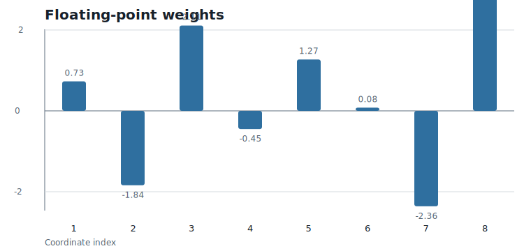
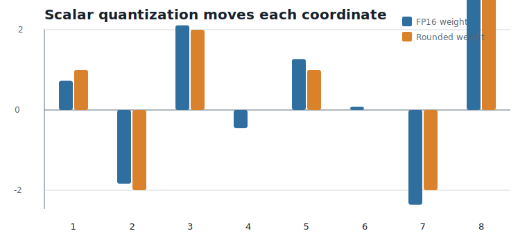
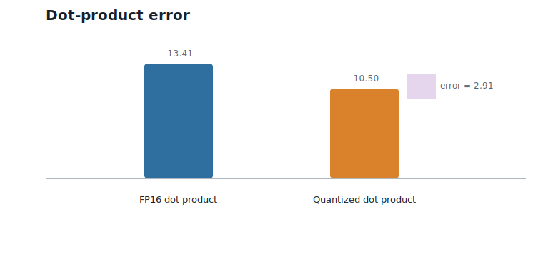

# Why Quantization?

**Question.** Why do modern neural networks need quantization?

## Learning Objectives

By the end of this chapter, you should be able to:

- explain why model inference is often limited by memory movement, not only arithmetic;
- compute the storage cost of FP16 weights and low-bit weights;
- distinguish scalar quantization from vector quantization;
- measure dot-product error caused by quantization;
- explain why vector codebooks naturally appear.

## Prerequisites

This chapter assumes only basic arithmetic, vectors, and dot products. No lattice theory, coding theory, or abstract algebra is used.

## Running Example

The whole book uses one running example. We begin with an eight-value weight vector made from two blocks of four values:

$$
w = (0.73,\;-1.84,\;2.11,\;-0.45,\;1.27,\;0.08,\;-2.36,\;3.14).
$$

Interpretation:

- Verbal: $w$ is a short slice of neural-network weights.
- Geometric: $w$ is a point in eight-dimensional space, or two points in four-dimensional block space.
- Engineering: if these are FP16 weights, storing them costs $8 \times 16 = 128$ bits before any compression.

The corresponding activation vector is:

$$
x = (2,\;1,\;-1,\;3,\;-2,\;0.5,\;1,\;-1.5).
$$

Interpretation:

- Verbal: $x$ is the input vector used in a dot product with the weights.
- Geometric: the dot product measures how strongly $w$ points in the direction of $x$.
- Engineering: during inference, weights and activations repeatedly meet in dot products and matrix multiplications.

The quantization block size is 4, so the two weight blocks are:

- block 1: $(0.73,\;-1.84,\;2.11,\;-0.45)$;
- block 2: $(1.27,\;0.08,\;-2.36,\;3.14)$.

The first chapters will use these blocks before introducing the `D4` lattice.

## The Cost of Moving Numbers

Modern language models contain billions of weights. A single FP16 value is small, but billions of FP16 values are not small. They must be stored, transferred from memory, loaded into caches, and fed to arithmetic units.

For the running example, the eight FP16 weights cost 128 bits. A four-bit representation would cost only 32 bits for the same eight positions, ignoring small pieces of metadata such as scales. That is a $4\times$ reduction in raw weight storage.

This is the first reason quantization exists: it reduces the number of bits that inference must move.

@fig-ch01-floating-weights shows the uncompressed floating-point weights in the running example.

{#fig-ch01-floating-weights fig-alt="Bar chart of eight floating-point weights."}

The question is not only whether we can store fewer bits. The real question is whether we can store fewer bits while preserving the computations that the model performs.

## Scalar Quantization: The Simplest Idea

The simplest way to reduce storage is to quantize one number at a time. For this chapter, use the deliberately simple rule "round each weight to the nearest integer":

| Coordinate | FP16 weight | Scalar-quantized weight |
|---:|---:|---:|
| 1 | 0.73 | 1 |
| 2 | -1.84 | -2 |
| 3 | 2.11 | 2 |
| 4 | -0.45 | 0 |
| 5 | 1.27 | 1 |
| 6 | 0.08 | 0 |
| 7 | -2.36 | -2 |
| 8 | 3.14 | 3 |

This gives the quantized vector:

$$
\hat{w} = (1,\;-2,\;2,\;0,\;1,\;0,\;-2,\;3).
$$

Interpretation:

- Verbal: $\hat{w}$ is a lower-precision replacement for $w$.
- Geometric: the original point has moved to a nearby point with integer coordinates.
- Engineering: every entry lies in the signed four-bit range $-8, \ldots, 7$, so the raw storage drops from 128 bits to 32 bits.

@fig-ch01-quantized-weights compares the original and scalar-quantized values.

{#fig-ch01-quantized-weights fig-alt="Grouped bar chart comparing eight floating-point weights with rounded integer weights."}

Scalar quantization is attractive because it is simple. Each coordinate is handled independently. That independence is also its weakness: it ignores the fact that neural-network computations combine many weights at once.

## Dot Products Matter More Than Individual Coordinates

Neural-network inference is built from dot products. For the running example, the original dot product is:

$$
w^\top x = -13.41.
$$

Interpretation:

- Verbal: multiplying each weight by the matching activation and summing gives $-13.41$.
- Geometric: this is the signed projection of $w$ along $x$, scaled by the length of $x$.
- Engineering: this is the kind of value that feeds the next layer of a network.

After scalar quantization, the dot product becomes:

$$
\hat{w}^\top x = -10.50.
$$

Interpretation:

- Verbal: the quantized weights produce a different result on the same activations.
- Geometric: moving $w$ to $\hat{w}$ changed its projection along $x$.
- Engineering: downstream layers see $-10.50$ instead of $-13.41$, so quantization has changed the computation.

The dot-product error is:

$$
\hat{w}^\top x - w^\top x = (\hat{w} - w)^\top x = 2.91.
$$

Interpretation:

- Verbal: the quantized dot product is $2.91$ larger than the original — an error of roughly $22\%$ of the original magnitude.
- Geometric: the output error is exactly the displacement $\hat{w} - w$ projected onto $x$. Quantization error only matters through its component in the direction of the activations.
- Engineering: no single coordinate moved by more than $0.5$, yet the output moved by $2.91$. Once the activations weight each coordinate error, the signed contributions need not cancel.

@fig-ch01-dot-error visualizes this output-level change.

{#fig-ch01-dot-error fig-alt="Bar chart comparing original and quantized dot products, with an error annotation."}

This is the second reason quantization is subtle: the model does not care about weights in isolation. It cares about computations.

## Why Quantize Vectors Jointly?

Scalar quantization asks one small question eight times:

> What is the nearest low-precision value for this coordinate?

Vector quantization asks a different question:

> What is a good low-precision representative for this whole block?

For block size 4, the two running blocks are treated as four-dimensional vectors. Instead of storing four separate quantized coordinates, we can store one index into a codebook:

| Index | Codeword |
|---:|---|
| 0 | $(0, 0, 0, 0)$ |
| 1 | $(1, -2, 2, 0)$ |
| 2 | $(1, 0, -2, 3)$ |
| 3 | $(1, -1, 2, -1)$ |

With this toy codebook, block 1 can be represented by index 1, and block 2 can be represented by index 2.

Be suspicious of how well that worked: this codebook was written down *after* looking at the two blocks, so of course it contains good matches for them. A real codebook must be fixed in advance and shared across millions of blocks it has never seen. Designing such a codebook is exactly the problem the coming chapters solve.

The important shift is conceptual. We are no longer choosing each coordinate separately. We are choosing a whole four-dimensional pattern.

This is useful because weights inside a block are not arbitrary independent numbers. They can have structure. If a codebook captures common block patterns, one index can represent several coordinated choices at once.

## Why Codebooks Become a Problem

Vector quantization sounds powerful, but it creates a new engineering problem.

A codebook with 4 entries is easy to store, but it is too small to represent many possible blocks. A codebook with 256 entries is more expressive: each block costs one eight-bit index. For block size 4, that is two bits per weight before codebook overhead.

But larger and higher-dimensional codebooks become expensive. If the codebook is unstructured, we must store the codewords and search them during encoding. In dimension $d$, a brute-force nearest-codeword search over $K$ entries costs $K$ distance computations per block.

This is the first place where the rest of the book begins to appear. We want codebooks that behave like vector quantizers but do not require us to store and search enormous unstructured tables.

Lattices will eventually give us structured codebooks. Hierarchical Nested Lattice Quantization (HNLQ) will then build large effective codebooks from small reusable pieces. We are not ready to define either idea yet. For now, we only need the engineering pressure that makes them necessary.

## Worked Example

Start with the two `D4`-sized blocks:

| Block | Floating-point weights | Scalar-quantized weights |
|---:|---|---|
| 1 | $(0.73, -1.84, 2.11, -0.45)$ | $(1, -2, 2, 0)$ |
| 2 | $(1.27, 0.08, -2.36, 3.14)$ | $(1, 0, -2, 3)$ |

The original dot product is $-13.41$. The scalar-quantized dot product is $-10.50$. The error is $2.91$.

Storage changes as follows:

| Representation | Raw bits for 8 weights | Comment |
|---|---:|---|
| FP16 | 128 | 8 weights times 16 bits |
| Scalar int4 | 32 | 8 weights times 4 bits |
| Toy vector codebook indices | 4 | two block indices, 2 bits each, excluding shared codebook storage |

The toy vector-codebook number is intentionally incomplete because it excludes the codebook itself. That is the point: vector quantization can make per-block storage very small, but only if the codebook cost is shared and the codebook does not become too expensive to search.

## Algorithms

This chapter introduces no formal algorithm. The computations are simple enough to do directly:

- round each coordinate to obtain a scalar-quantized vector;
- compute the original dot product;
- compute the quantized dot product;
- compare the two outputs.

The executable version of this numerical example is in `code/python/chapter_01_quantization.py`.

## Engineering Insight

Quantization is useful when moving fewer bits saves more time or energy than the extra quantization logic costs.

On current accelerators, inference often moves weights from memory far more often than it changes them. Reducing weight precision can improve throughput by reducing bandwidth pressure and cache footprint. But the reduction is only valuable if the quantized computation remains accurate enough.

Scalar quantization is simple and hardware-friendly, but it ignores block structure. Vector quantization can exploit block structure, but naive vector quantization creates large codebooks and expensive search. The rest of the book is about resolving that tension: keep the benefits of vector quantization while making the codebook structured enough to implement.

## Historical Note and Further Reading

Quantization long predates neural networks; it is a basic idea in signal processing, compression, and communication systems. Neural-network quantization adds a systems constraint: the quantized values must run efficiently on real inference hardware while preserving model quality.

For an influential modern treatment of integer-only neural-network inference, see @jacob_2018. Later chapters connect the codebook view used here to lattice and coset-code references such as @conway_sloane_1999 and @forney_1988.

## Exercises

### Conceptual Exercises

1. Why can a model be memory-bandwidth limited even if the arithmetic units are fast?
2. Why is coordinate-wise error not the only quantity that matters during inference?
3. What is the difference between asking for a low-precision value per coordinate and asking for a representative per block?

### Worked Numerical Exercises

1. Recompute $w^\top x$ for the running example by hand.
2. Recompute $\hat{w}^\top x$ after scalar quantization.
3. Change only coordinate 8 of $\hat{w}$ from $3$ to $4$. What happens to the dot product?
4. Compute the displacement $\hat{w} - w$ and verify that $(\hat{w} - w)^\top x = 2.91$.

### Programming Exercises

1. Run `python code/python/chapter_01_quantization.py` and confirm the reported dot products.
2. Modify the script to use eight-bit rounding instead of four-bit storage assumptions.
3. Add a function that computes the absolute dot-product error for any pair of vectors $w$ and $x$.

### Research Questions

1. In which layers of a transformer would dot-product error be most damaging?
2. When might scalar quantization be preferable to vector quantization despite lower representational power?
3. What hardware measurements would you collect to decide whether quantization is actually improving inference speed?

## Common Mistakes

- Confusing compression ratio with model quality.
- Measuring only weight error and ignoring output error.
- Forgetting that vector codebooks have their own storage and search costs.
- Assuming that a smaller representation is automatically faster on every hardware target.

## Summary

Quantization reduces the number of bits used to store and move neural-network weights. Scalar quantization is the simplest form: it treats each coordinate independently. Dot products show why this is not enough to reason about model behavior, because small coordinate changes can accumulate into output error.

Vector quantization treats a block of weights as one object and represents it by a codebook index. This can exploit structure inside blocks, but naive codebooks become expensive. That problem motivates the structured codebooks developed in the rest of the book.

## Preview of Next Chapter

Next we ask how infinitely many objects can be grouped into finitely many categories. That question leads to remainders, modular arithmetic, equivalence classes, and eventually cosets.
