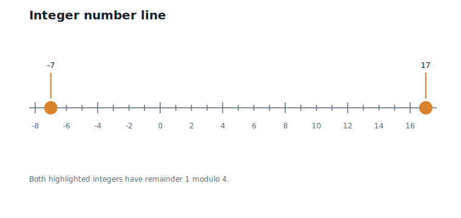
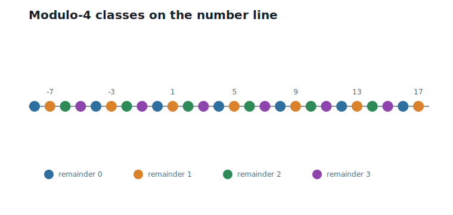
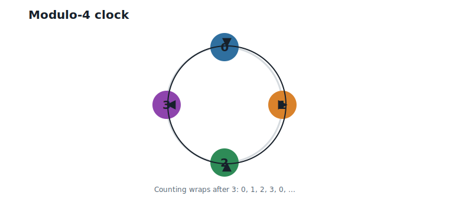
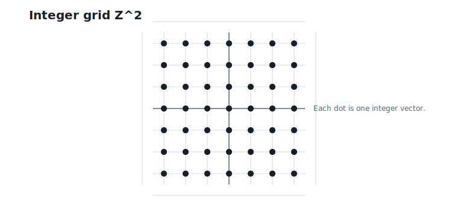
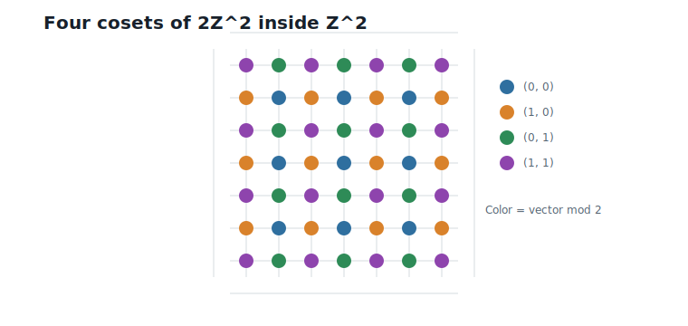

# Numbers, Modular Arithmetic, and Cosets

**Question.** How can infinitely many objects become finite?

## Learning Objectives

By the end of this chapter, you should be able to:

- compute remainders for positive and negative integers;
- explain why modulo arithmetic groups infinitely many integers into finitely many classes;
- describe equivalence classes without using abstract algebra;
- explain a coset as a shifted copy of a regular pattern;
- reduce vectors coordinate by coordinate modulo 2;
- explain why a four-dimensional modulo-2 signature has exactly 16 possible values.

## Prerequisites

This chapter assumes integer arithmetic, division with remainder, and the running weight blocks from Chapter 1. No abstract algebra is assumed.

## Running Example

Chapter 1 ended with two scalar-quantized weight blocks:

$$
(1,\;-2,\;2,\;0)
\qquad\text{and}\qquad
(1,\;0,\;-2,\;3).
$$

Interpretation:

- Verbal: these are two four-coordinate blocks after simple scalar quantization.
- Geometric: each block is an integer point in four-dimensional space.
- Engineering: if we can assign each block a small label, then the label can become part of a compact representation.

In this chapter, we do not quantize again. We ask a simpler question:

> If integers can be arbitrarily large or small, how can we group them into a fixed number of labels?

We begin with integers modulo 2, 4, and 8. Then we apply modulo 2 to vectors.

## The Finite-Label Problem

Suppose an encoder is only allowed to emit 16 possible labels. That is exactly what four binary choices give us:

$$
2^4 = 16.
$$

Interpretation:

- Verbal: four yes/no decisions create 16 possible patterns.
- Geometric: in four dimensions, each coordinate can be assigned one of two parity labels.
- Engineering: a four-coordinate block can be assigned a four-bit signature.

This is not yet a good quantizer. It does not know which vector is near which other vector. But it gives us the first tool we need: a way to turn infinitely many integer values into finitely many categories.

@fig-ch02-number-line shows the integer line we will use for the first examples.

{#fig-ch02-number-line fig-alt="Integer number line from -8 to 17 with -7 and 17 highlighted."}

## Remainders Turn Integers into Labels

Start with 17. Dividing by 4 gives four full groups of 4 and a remainder of 1:

$$
17 = 4\cdot 4 + 1.
$$

Interpretation:

- Verbal: after removing four copies of 4, one unit remains.
- Geometric: walking along the number line in steps of 4 from 1 reaches 17.
- Engineering: if only the remainder matters, then 17 receives label 1.

Negative integers work the same way. The integer -7 also leaves remainder 1 modulo 4:

$$
-7 = 4\cdot (-2) + 1.
$$

Interpretation:

- Verbal: subtracting two copies of 4 from 1 reaches -7.
- Geometric: on the number line, -7 and 17 sit on the same every-fourth-integer pattern.
- Engineering: both values receive the same finite label, even though they are far apart.

Now we can name the operation.

**Definition.** Modulo $q$ returns the remainder after removing an integer multiple of $q$, using one of the labels $0, 1, \ldots, q - 1$.

For example:

$$
17 \bmod 4 = 1,
\qquad
-7 \bmod 4 = 1.
$$

Interpretation:

- Verbal: both numbers have remainder 1 after division by 4.
- Geometric: both numbers lie on the same remainder track on the number line.
- Engineering: a potentially unbounded integer has been mapped to one of four labels.

@fig-ch02-modulo-classes colors the integers by their remainder modulo 4.

{#fig-ch02-modulo-classes fig-alt="Number line with integers colored by their remainder modulo 4."}

## Modulo 2, 4, and 8

The modulus controls how many labels are available.

Modulo 2 gives two labels:

| Remainder | Integers in the class |
|---:|---|
| 0 | $\ldots, -4, -2, 0, 2, 4, \ldots$ |
| 1 | $\ldots, -3, -1, 1, 3, 5, \ldots$ |

Modulo 4 gives four labels:

| Remainder | Example integers |
|---:|---|
| 0 | $\ldots, -8, -4, 0, 4, 8, \ldots$ |
| 1 | $\ldots, -7, -3, 1, 5, 9, \ldots$ |
| 2 | $\ldots, -6, -2, 2, 6, 10, \ldots$ |
| 3 | $\ldots, -5, -1, 3, 7, 11, \ldots$ |

Modulo 8 gives eight labels. It keeps more information than modulo 4 because it distinguishes more cases before numbers repeat. For example, 13 and 17 receive the same label modulo 4 (both leave remainder 1), but modulo 8 they separate: $13 \bmod 8 = 5$ while $17 \bmod 8 = 1$. Increasing the modulus splits classes apart; decreasing it merges them.

@fig-ch02-modulo-clock shows another way to think about modulo 4: after label 3, the labels wrap back to 0.

{#fig-ch02-modulo-clock fig-alt="Clock diagram with labels 0, 1, 2, 3 arranged in a cycle."}

The key idea is simple: modulo arithmetic keeps the cyclic label and discards how many full cycles were used.

## Equivalence Classes

The remainder label is finite, but it stands for infinitely many integers. For modulo 4, the label 1 represents:

$$
\ldots,\;-7,\;-3,\;1,\;5,\;9,\;13,\;17,\;\ldots
$$

Interpretation:

- Verbal: every number in this list has remainder 1 modulo 4.
- Geometric: the numbers form an evenly spaced pattern on the number line.
- Engineering: one stored label can stand for many possible original integers.

Now we can name the idea.

**Definition.** An equivalence class modulo $q$ is the set of all integers that have the same remainder modulo $q$.

For this chapter, an equivalence class is just a bucket. The bucket labeled 1 modulo 4 contains every integer whose remainder is 1. A representative is one chosen member of the bucket, such as 1.

This matters because compression often replaces a large set of possible values by one finite label. The label does not remember the exact original value. It remembers the class.

## Cosets: Shifted Copies of a Pattern

Look at the multiples of 4:

$$
\ldots,\;-8,\;-4,\;0,\;4,\;8,\;12,\;16,\;\ldots
$$

Interpretation:

- Verbal: these are exactly the integers with remainder 0 modulo 4.
- Geometric: they are a regular grid on the number line with spacing 4.
- Engineering: this is the base pattern for modulo-4 grouping.

Now shift the entire pattern by 1:

$$
\ldots,\;-7,\;-3,\;1,\;5,\;9,\;13,\;17,\;\ldots
$$

Interpretation:

- Verbal: every multiple of 4 has been moved one step to the right.
- Geometric: the spacing is unchanged, but the whole pattern is offset.
- Engineering: this shifted pattern is the class labeled 1.

Now we can name the idea.

**Definition.** A coset is a shifted copy of a regular pattern.

For integers modulo 4, the regular pattern is the set of multiples of 4. The four shifted copies are the classes labeled 0, 1, 2, and 3.

This definition is intentionally concrete. Later, when lattices enter the book, the same idea will appear in higher dimensions: a coarse lattice pattern plus a shift.

## Vectors Modulo 2

The same idea works coordinate by coordinate. Before looking at four-dimensional blocks, start with the integer grid in two dimensions.

@fig-ch02-integer-grid shows a small patch of $\mathbb{Z}^2$, the grid of integer coordinate pairs.

{#fig-ch02-integer-grid fig-alt="Two-dimensional integer grid with dots at integer coordinate pairs."}

Modulo 2 assigns each coordinate its parity. In two dimensions, that gives four possible parity labels:

| Vector modulo 2 | Meaning |
|---|---|
| $(0, 0)$ | both coordinates even |
| $(1, 0)$ | first coordinate odd, second even |
| $(0, 1)$ | first coordinate even, second odd |
| $(1, 1)$ | both coordinates odd |

The first row of this table is special. The vectors labeled $(0, 0)$ — both coordinates even — form a regular pattern of their own:

$$
2\mathbb{Z}^2 = \{(2a,\;2b) : a, b \text{ integers}\}.
$$

Interpretation:

- Verbal: $2\mathbb{Z}^2$ is the set of integer pairs whose coordinates are both even.
- Geometric: it is the integer grid stretched by a factor of 2 — a coarser grid sitting inside $\mathbb{Z}^2$.
- Engineering: it plays the same role the multiples of 4 played on the number line: the base pattern that the other classes are shifts of.

Now repeat the shifting story from the number line, one dimension up. Shifting every point of $2\mathbb{Z}^2$ by $(1, 0)$ produces exactly the class labeled $(1, 0)$; shifting by $(0, 1)$ and by $(1, 1)$ produces the remaining two classes. Four shifts of one coarse grid give the four parity classes — so each class is a coset of $2\mathbb{Z}^2$, in precisely the sense defined earlier: a shifted copy of a regular pattern.

@fig-ch02-cosets-z2 colors the integer grid by these four shifted copies.

{#fig-ch02-cosets-z2 fig-alt="Integer grid colored by four coordinate-wise modulo-2 parity patterns."}

The running weight blocks are four-dimensional, but the same coordinate-wise rule applies:

$$
(1,\;-2,\;2,\;0) \bmod 2 = (1,\;0,\;0,\;0).
$$

Interpretation:

- Verbal: only the first coordinate is odd.
- Geometric: the block lies in the parity class labeled $(1, 0, 0, 0)$.
- Engineering: four integer coordinates have been reduced to four binary labels.

For the second block:

$$
(1,\;0,\;-2,\;3) \bmod 2 = (1,\;0,\;0,\;1).
$$

Interpretation:

- Verbal: the first and fourth coordinates are odd.
- Geometric: this block lies in a different shifted copy of the even-coordinate grid.
- Engineering: the parity signature distinguishes it from the first block using four bits.

Because each of the four coordinates has two possible parity labels, there are:

$$
2^4 = 16
$$

possible modulo-2 signatures for a four-dimensional block.

Interpretation:

- Verbal: four coordinates, two choices each, gives 16 labels.
- Geometric: integer four-space is split into 16 parity classes.
- Engineering: this is the first concrete example of exactly 16 labels for block size 4.

One observation to file away: the first signature, $(1, 0, 0, 0)$, has an odd number of ones, while the second, $(1, 0, 0, 1)$, has an even number. Equivalently, the coordinates of block 1 sum to an odd integer and those of block 2 to an even integer. The parity of the *whole block* — not just of each coordinate — will take center stage when the `D4` lattice appears in Chapter 6.

## What Modulo Does Not Do

Modulo arithmetic gives finite labels, but it does not solve quantization by itself.

For example, 1, 17, and -7 all have the same remainder modulo 4. They receive the same label, but they are not close on the number line. Modulo arithmetic groups by periodic structure, not by distance.

This limitation is useful. It tells us what is missing. To build a quantizer, we need both:

- finite labels, which this chapter introduced;
- a notion of distance, which Chapter 3 introduces.

Later, lattice quantization will combine these two ideas: geometric closeness from vectors and finite structure from cosets.

## Worked Example

Compute the two required integer examples:

| Integer | Modulus | Decomposition | Remainder |
|---:|---:|---|---:|
| 17 | 4 | $17 = 4 \cdot 4 + 1$ | 1 |
| -7 | 4 | $-7 = 4 \cdot (-2) + 1$ | 1 |

Now compute the modulo-2 signatures of the scalar-quantized running blocks:

| Block | Integer block | Modulo-2 signature |
|---:|---|---|
| 1 | $(1, -2, 2, 0)$ | $(1, 0, 0, 0)$ |
| 2 | $(1, 0, -2, 3)$ | $(1, 0, 0, 1)$ |

The two blocks get different signatures. This does not mean one is nearer to the other. It only means they fall in different parity classes.

## Algorithms

### Algorithm 2.1: Compute an Integer Remainder

**Input:** an integer value and a positive modulus $q$.

**Output:** one remainder label in $0, 1, \ldots, q - 1$.

```text
function integer_mod(value, q):
    require q > 0
    quotient = floor(value / q)
    remainder = value - q * quotient
    return remainder
```

**Complexity and implementation notes:**

| Property | Cost |
|---|---|
| Time | $O(1)$ |
| Memory | $O(1)$ |
| Offline preprocessing | None |
| Online inference cost | One integer modulo or equivalent bit operation when $q$ is a power of two |
| Parallelism | Independent values can be processed independently |
| GPU suitability | Excellent for power-of-two moduli; general integer division can be slower |
| SIMD suitability | Excellent for power-of-two moduli using bit masks |
| Possible optimization | For $q = 2$, use the least significant bit |

**Language note.** The pseudocode uses floor division, so the remainder always lands in $0, 1, \ldots, q - 1$. This matches Python's `%` operator. In C, C++, and Rust, `%` truncates toward zero and can return *negative* remainders for negative inputs; normalize with `((value % q) + q) % q` when porting the algorithms in this book.

### Algorithm 2.2: Group Integers by Remainder

**Input:** a list of integers and a positive modulus $q$.

**Output:** $q$ buckets, one for each remainder label.

```text
function group_by_remainder(values, q):
    buckets = q empty lists
    for value in values:
        label = integer_mod(value, q)
        append value to buckets[label]
    return buckets
```

**Complexity and implementation notes:**

| Property | Cost |
|---|---|
| Time | $O(N)$ for $N$ integers |
| Memory | $O(N + q)$ |
| Offline preprocessing | None |
| Online inference cost | One label assignment per value |
| Parallelism | Values can be labeled independently; bucket writes need coordination |
| GPU suitability | Good for labeling; bucket construction may need scatter or histogram primitives |
| SIMD suitability | Good for labeling contiguous arrays |
| Possible optimization | If only labels are needed, skip materializing buckets |

### Algorithm 2.3: Reduce a Vector Coordinate-Wise

**Input:** an integer vector of dimension $d$ and a positive modulus $q$.

**Output:** a vector of $d$ remainder labels.

```text
function vector_mod(vector, q):
    labels = empty vector
    for coordinate in vector:
        append integer_mod(coordinate, q) to labels
    return labels
```

**Complexity and implementation notes:**

| Property | Cost |
|---|---|
| Time | $O(d)$ |
| Memory | $O(d)$ for the output labels |
| Offline preprocessing | None |
| Online inference cost | One modulo operation per coordinate |
| Parallelism | Coordinates are independent |
| GPU suitability | Excellent for dense vectors, especially when $q$ is a power of two |
| SIMD suitability | Excellent for fixed-width integer vectors |
| Possible optimization | For $q = 2$, pack the $d$ parity bits into one small integer |

The executable reference implementation is in `code/python/chapter_02_modulo.py`.

## Engineering Insight

Modulo arithmetic is useful because it separates a value from its finite label. That is exactly the kind of separation compression needs.

For power-of-two moduli such as 2, 4, and 8, the operation is especially hardware-friendly: the remainder is stored in the low-order bits. This is why parity, bit masks, and packed binary signatures appear constantly in low-level systems code.

The limitation is just as important. Modulo labels do not measure closeness. They tell us which periodic class a value belongs to. Quantization also needs a geometry, because replacing one vector by another only makes sense after we can say which vectors are near each other.

## Historical Note and Further Reading

The modern notation and systematic study of congruences goes back to Gauss's *Disquisitiones Arithmeticae* @gauss_1801. This chapter uses only the computational part of that idea: numbers with the same remainder can be treated as members of the same class.

Later, the same finite-label idea will reappear as cosets of lattices and quotient codebooks. For the coding-theoretic viewpoint that becomes important later in the book, see @forney_1988.

## Exercises

### Conceptual Exercises

1. Explain why modulo 4 has exactly four labels even though there are infinitely many integers.
2. Explain why -7 and 17 have the same remainder modulo 4.
3. Explain why modulo labels alone do not define a good quantizer.

### Worked Numerical Exercises

1. Compute $23 \bmod 8$, $-9 \bmod 8$, and $14 \bmod 2$.
2. List the equivalence class labeled 3 modulo 4 between -12 and 16.
3. Compute $(2,\;1,\;3,\;4) \bmod 2$.
4. Find two integers that share a label modulo 4 but receive different labels modulo 8.

### Programming Exercises

1. Run `python code/python/chapter_02_modulo.py` and confirm the integer and vector examples.
2. Write a function that groups all integers from -20 to 20 by remainder modulo 8.
3. Pack the modulo-2 signature of a four-dimensional block into one integer between 0 and 15.

### Research Questions

1. Where do parity bits appear in computer systems outside quantization?
2. Why are power-of-two moduli usually cheaper than other moduli on hardware?
3. How might modulo labels and distance information be combined in a vector quantizer?

## Common Mistakes

- Treating the representative of a class as the whole class.
- Forgetting that negative integers have well-defined nonnegative remainders.
- Thinking modulo arithmetic measures distance.
- Confusing a coset with an arbitrary subset; here it is a shifted copy of a regular pattern.

## Summary

Modulo arithmetic maps infinitely many integers to finitely many remainder labels. Integers with the same label form an equivalence class. A coset is a shifted copy of a regular pattern, such as the multiples of 4 shifted by 1.

The same idea works for vectors coordinate by coordinate. In four dimensions, modulo 2 gives exactly $2^4 = 16$ parity signatures. This gives the first concrete answer to the chapter question: infinitely many integer vectors can be grouped into a finite set of labels.

## Preview of Next Chapter

Modulo arithmetic gives finite categories, but quantization also needs a way to say which vectors are close. Next we introduce vectors, norms, distances, inner products, and nearest-neighbor search.
