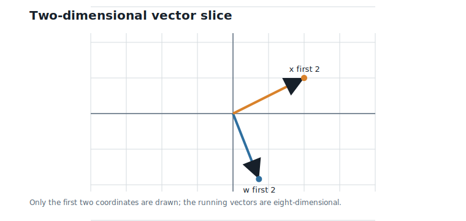
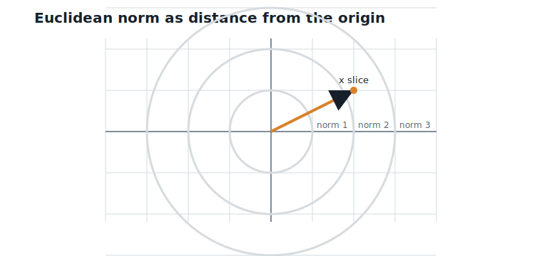
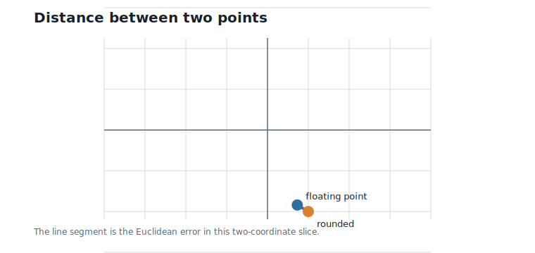
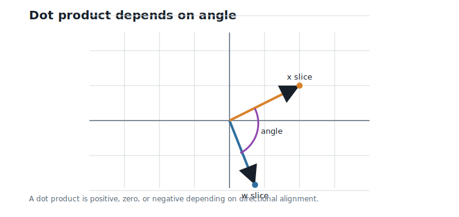
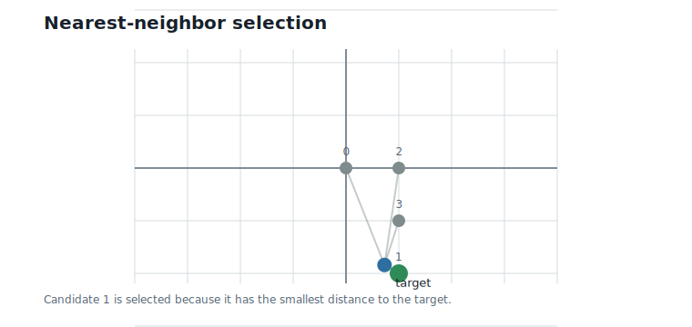

# Vectors and Euclidean Geometry

**Question.** How do we measure similarity between vectors?

## Learning Objectives

By the end of this chapter, you should be able to:

- treat weights and activations as vectors rather than isolated scalars;
- compute vector norms and Euclidean distances;
- explain why distance turns quantization into a nearest-neighbor problem;
- compute dot products and interpret their geometric meaning;
- relate dot products, vector lengths, and angles;
- perform brute-force nearest-neighbor search over a small codebook.

## Prerequisites

This chapter assumes arithmetic, square roots, and the modulo labels from Chapter 2. No linear algebra beyond basic vectors is required.

## Running Example

Chapter 1 introduced the floating-point weight vector:

$$
w = (0.73,\;-1.84,\;2.11,\;-0.45,\;1.27,\;0.08,\;-2.36,\;3.14),
$$

and the activation vector:

$$
x = (2,\;1,\;-1,\;3,\;-2,\;0.5,\;1,\;-1.5).
$$

Interpretation:

- Verbal: $w$ and $x$ are two lists of numbers with the same length.
- Geometric: each list is a point, or an arrow from the origin, in eight-dimensional space.
- Engineering: inference repeatedly combines these vectors through dot products and nearest-representative choices.

Chapter 2 looked at finite labels. This chapter adds geometry: we need a way to say that one candidate vector is closer to $w$ than another.

## From Lists to Vectors

A vector is a list of coordinates that we treat as one object. The first four coordinates of the running weight vector form the first weight block:

$$
(0.73,\;-1.84,\;2.11,\;-0.45).
$$

Interpretation:

- Verbal: this is one block of four weights.
- Geometric: it is one point in four-dimensional space.
- Engineering: later chapters will quantize this whole block at once.

We cannot draw four-dimensional or eight-dimensional space directly, so @fig-ch03-2d-vectors shows the first two coordinates of $w$ and $x$ as two-dimensional arrows. The picture is not the full example; it is the slice we can see.

{#fig-ch03-2d-vectors fig-alt="Two arrows from the origin showing the first two coordinates of the weight and activation vectors."}

The habit to build now is important: a vector should feel like one geometric object, not a bag of unrelated scalars.

## Vector Length

The length of a vector is called its norm. For a vector $v$, the Euclidean norm is:

$$
\|v\|_2 =
\sqrt{v_1^2 + v_2^2 + \cdots + v_d^2}.
$$

Interpretation:

- Verbal: square each coordinate, add the squares, and take a square root.
- Geometric: this is the straight-line length of the arrow from the origin to $v$.
- Engineering: the norm measures the scale of a vector block.

For the running vectors:

$$
\|w\|_2 = 5.06,
\qquad
\|x\|_2 = 4.74.
$$

Interpretation:

- Verbal: the weight vector and activation vector have comparable lengths.
- Geometric: their arrows from the origin are of similar scale.
- Engineering: vector scale affects both dot products and quantization error.

@fig-ch03-norm-circles shows the two-dimensional version of this idea. Points on the same circle have the same distance from the origin.

{#fig-ch03-norm-circles fig-alt="Coordinate axes with concentric circles centered at the origin."}

## Distance Between Vectors

Quantization replaces one vector by another. To decide whether a replacement is good, we need a distance.

For two vectors of the same dimension, Euclidean distance is:

$$
\operatorname{distance}(u,\;v)
=
\sqrt{(u_1-v_1)^2 + (u_2-v_2)^2 + \cdots + (u_d-v_d)^2}.
$$

Interpretation:

- Verbal: subtract matching coordinates, square the differences, add them, and take a square root.
- Geometric: this is the straight-line distance between two points.
- Engineering: in vector quantization, the closest candidate is often chosen by minimizing this distance.

Chapter 1 rounded the weights to:

$$
\hat{w} = (1,\;-2,\;2,\;0,\;1,\;0,\;-2,\;3).
$$

Interpretation:

- Verbal: $\hat{w}$ is the scalar-quantized replacement for $w$.
- Geometric: quantization moved the original point to a nearby integer point.
- Engineering: the movement from $w$ to $\hat{w}$ is the quantization error vector.

The full eight-dimensional quantization error has length:

$$
\|\hat{w} - w\|_2 = 0.74.
$$

Interpretation:

- Verbal: the scalar-quantized vector is about 0.74 units away from the original vector.
- Geometric: this is the straight-line distance from $w$ to $\hat{w}$.
- Engineering: this is a compact summary of coordinate-wise weight error.

For the two four-dimensional blocks, the distances are:

| Block | Floating-point block | Rounded block | Euclidean distance |
|---:|---|---|---:|
| 1 | $(0.73, -1.84, 2.11, -0.45)$ | $(1, -2, 2, 0)$ | 0.56 |
| 2 | $(1.27, 0.08, -2.36, 3.14)$ | $(1, 0, -2, 3)$ | 0.48 |

@fig-ch03-distance illustrates distance in two dimensions.

{#fig-ch03-distance fig-alt="Two points connected by a line segment showing Euclidean distance."}

Distance is useful, but it is not the whole story. Chapter 1 showed that the dot-product error was 2.91 even though the Euclidean error was only 0.74.

## Dot Products

The dot product multiplies matching coordinates and sums the results:

$$
w^\top x
=
w_1x_1 + w_2x_2 + \cdots + w_dx_d.
$$

Interpretation:

- Verbal: multiply coordinate by coordinate, then add.
- Geometric: the dot product measures how much one vector points along another.
- Engineering: this is the primitive operation inside matrix multiplication.

For the running example:

$$
w^\top x = -13.41.
$$

Interpretation:

- Verbal: the weighted sum is negative.
- Geometric: $w$ points more against $x$ than with it.
- Engineering: this signed value is the output that the next layer receives.

The dot product can also be written in terms of vector lengths and the angle between them:

$$
w^\top x = \|w\|_2 \|x\|_2 \cos(\theta).
$$

Interpretation:

- Verbal: the dot product is large when the vectors are long and point in similar directions.
- Geometric: $\theta$ is the angle between the two vectors.
- Engineering: dot-product error depends on the direction of the quantization error, not only its length.

For the running vectors, the angle is about 124 degrees. That is why the dot product is negative: the vectors point more than 90 degrees apart.

@fig-ch03-dot-angle shows the two-dimensional version of this relationship.

{#fig-ch03-dot-angle fig-alt="Two arrows from the origin with an angle arc and a projection line."}

## Distance Error and Dot-Product Error

The quantization error vector is:

$$
\hat{w} - w.
$$

Interpretation:

- Verbal: this is how far each coordinate moved during quantization.
- Geometric: it is the displacement from the original point to the quantized point.
- Engineering: this displacement is what changes downstream computations.

The dot-product error is:

$$
\hat{w}^\top x - w^\top x
=
(\hat{w} - w)^\top x
=
2.91.
$$

Interpretation:

- Verbal: output error is the quantization error dotted with the activation vector.
- Geometric: only the component of the quantization error in the direction of $x$ changes the dot product.
- Engineering: a small Euclidean error can still matter if it aligns with an important activation direction.

The angle formula makes this quantitative. Since $\cos(\theta)$ never exceeds 1 in magnitude, the dot-product error is bounded by the two lengths:

$$
|(\hat{w} - w)^\top x|
\;\leq\;
\|\hat{w} - w\|_2 \, \|x\|_2
= 0.74 \times 4.74 = 3.49.
$$

Interpretation:

- Verbal: an error vector of length 0.74 can change this dot product by at most 3.49.
- Geometric: the worst case happens when the error points exactly along $x$; a perpendicular error would change the dot product not at all.
- Engineering: our actual error of 2.91 is 83% of the worst case — the rounding errors happened to align strongly with the activations, which is exactly why Chapter 1's output error looked so large for such a small weight perturbation.

This is the first major warning of the chapter: nearest by Euclidean distance is a useful default, but neural-network quality is ultimately about the computations that follow.

## Nearest Neighbors

Now return to the toy codebook from Chapter 1:

| Index | Codeword |
|---:|---|
| 0 | $(0, 0, 0, 0)$ |
| 1 | $(1, -2, 2, 0)$ |
| 2 | $(1, 0, -2, 3)$ |
| 3 | $(1, -1, 2, -1)$ |

To encode a block by nearest neighbor, compute the distance to each codeword and choose the smallest distance.

For block 1, $(0.73, -1.84, 2.11, -0.45)$, the distances are:

| Index | Codeword | Distance to block 1 |
|---:|---|---:|
| 0 | $(0, 0, 0, 0)$ | 2.93 |
| 1 | $(1, -2, 2, 0)$ | 0.56 |
| 2 | $(1, 0, -2, 3)$ | 5.68 |
| 3 | $(1, -1, 2, -1)$ | 1.05 |

The nearest codeword is index 1.

For block 2, $(1.27, 0.08, -2.36, 3.14)$, the distances are:

| Index | Codeword | Distance to block 2 |
|---:|---|---:|
| 0 | $(0, 0, 0, 0)$ | 4.13 |
| 1 | $(1, -2, 2, 0)$ | 5.77 |
| 2 | $(1, 0, -2, 3)$ | 0.48 |
| 3 | $(1, -1, 2, -1)$ | 6.11 |

The nearest codeword is index 2.

@fig-ch03-nearest-point shows the two-dimensional version: a target point and several candidates, with the nearest candidate selected by distance.

{#fig-ch03-nearest-point fig-alt="Target point surrounded by candidate points, with the nearest candidate highlighted."}

This is the bridge to vector quantization. Once we can measure distance, encoding becomes a search problem.

## Worked Example

Take block 1:

$$
(0.73,\;-1.84,\;2.11,\;-0.45).
$$

Interpretation:

- Verbal: this is the first four-coordinate block from the running weights.
- Geometric: it is a point in four-dimensional space.
- Engineering: this block is the object that a vector quantizer will encode.

Compute its distance to codeword index 1:

$$
\sqrt{
(0.73-1)^2
 + (-1.84+2)^2
 + (2.11-2)^2
 + (-0.45-0)^2
}
= 0.56.
$$

Interpretation:

- Verbal: subtract each coordinate, square, add, and take a square root.
- Geometric: the codeword at index 1 is close to the target block.
- Engineering: if this codebook is fixed, index 1 is the best encoding among the four listed candidates.

The same search gives index 2 for block 2. Chapter 4 will turn this procedure into classical vector quantization.

## Algorithms

### Algorithm 3.1: Euclidean Distance

**Input:** two vectors of the same dimension $d$.

**Output:** their Euclidean distance.

```text
function euclidean_distance(left, right):
    require length(left) = length(right)
    total = 0
    for i in 1 to d:
        difference = left[i] - right[i]
        total = total + difference * difference
    return sqrt(total)
```

**Complexity and implementation notes:**

| Property | Cost |
|---|---|
| Time | $O(d)$ |
| Memory | $O(1)$ beyond the inputs |
| Offline preprocessing | None |
| Online inference cost | One subtract, multiply, and add per coordinate, plus one square root |
| Parallelism | Coordinates can be processed independently and reduced |
| GPU suitability | Excellent for batched distances; reductions need care |
| SIMD suitability | Excellent for contiguous vectors |
| Possible optimization | Compare squared distances and skip the square root when only ordering matters |

### Algorithm 3.2: Brute-Force Nearest Neighbor

**Input:** one target vector and a finite list of candidate vectors.

**Output:** the index and distance of the nearest candidate.

```text
function nearest_neighbor(target, candidates):
    best_index = none
    best_squared_distance = infinity
    for index, candidate in candidates:
        squared_distance = squared_euclidean_distance(target, candidate)
        if squared_distance < best_squared_distance:
            best_index = index
            best_squared_distance = squared_distance
    return best_index, sqrt(best_squared_distance)
```

**Complexity and implementation notes:**

| Property | Cost |
|---|---|
| Time | $O(Kd)$ for $K$ candidates in dimension $d$ |
| Memory | $O(1)$ beyond the codebook |
| Offline preprocessing | Store or generate candidate vectors |
| Online inference cost | $K$ distance computations per encoded block |
| Parallelism | Candidates and coordinates can both be parallelized |
| GPU suitability | Good for large batches, but memory traffic can dominate |
| SIMD suitability | Good when candidates are stored contiguously |
| Possible optimization | Use squared distances; stop early only when a valid lower-bound test is available |

The executable reference implementation is in `code/python/chapter_03_geometry.py`.

## Engineering Insight

Euclidean distance is the default geometry for vector quantization because it is simple, fast, and easy to optimize. It turns encoding into a nearest-neighbor search and gives a clear objective: choose the representative with the smallest distance to the target block.

But distance is not the same as model quality. A quantized block can be close in Euclidean distance and still create a large dot-product error if its error points in an important activation direction. This is why later chapters keep returning to dot products, lookup tables, and inference cost rather than stopping at geometric distance alone.

## Historical Note and Further Reading

Euclidean geometry gives the distance formula used throughout this chapter. For a modern machine-learning introduction to vectors, norms, inner products, and angles, see @deisenroth_2020.

Later chapters use these ideas to define Voronoi regions, nearest lattice points, and vector quantizers.

## Exercises

### Conceptual Exercises

1. Why does a vector norm measure scale but not direction?
2. Why can the nearest vector by Euclidean distance still produce a noticeable dot-product error?
3. Why can nearest-neighbor search become expensive when the codebook grows?

### Worked Numerical Exercises

1. Compute the Euclidean norm of $(3, 4)$.
2. Compute the distance between $(1, -2)$ and $(0.73, -1.84)$.
3. Compute the dot product of $(1, -2, 2, 0)$ and $(2, 1, -1, 3)$.
4. Verify the bound $|(\hat{w} - w)^\top x| \leq \|\hat{w} - w\|_2 \|x\|_2$ for the running example, and compute what fraction of the bound the actual error 2.91 reaches.

### Programming Exercises

1. Run `python code/python/chapter_03_geometry.py` and confirm the reported distances.
2. Add a function that returns squared distance without taking a square root.
3. Extend the nearest-neighbor function to return all distances, sorted from nearest to farthest.

### Research Questions

1. When is Euclidean distance a good proxy for neural-network quality?
2. How might activation statistics change the distance measure used for quantization?
3. What data layout would make brute-force nearest-neighbor search faster on a GPU?

## Common Mistakes

- Confusing a vector norm with a dot product.
- Assuming distance and dot-product error measure the same thing.
- Taking square roots during nearest-neighbor search when squared distances would give the same ordering.
- Forgetting that the two-dimensional figures are only visual slices of higher-dimensional vectors.

## Summary

Vectors let us treat a block of weights as one geometric object. Norms measure vector length. Euclidean distance measures how far two vectors are from each other. Dot products measure directional alignment and are the computation used in neural-network inference.

Nearest-neighbor search chooses the candidate vector with the smallest distance to a target vector. This gives the geometric foundation for vector quantization, but it also exposes the next engineering problem: brute-force search over large codebooks costs $O(Kd)$ per block.

## Preview of Next Chapter

Next we use this geometry to define classical vector quantization: finite codebooks, nearest codewords, encoding, decoding, bit rate, and the storage/search tradeoff that motivates structured lattice codebooks.

