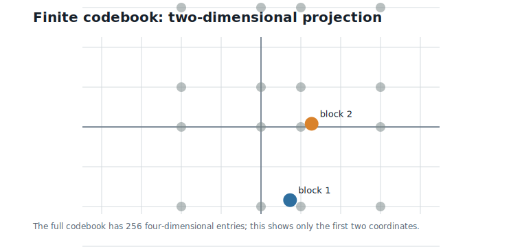
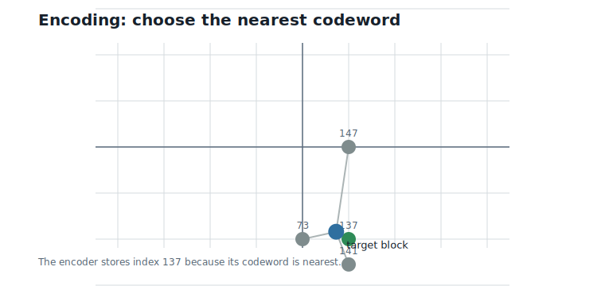
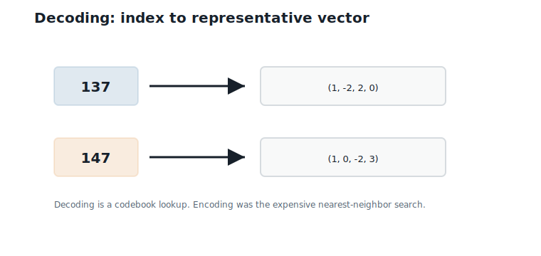
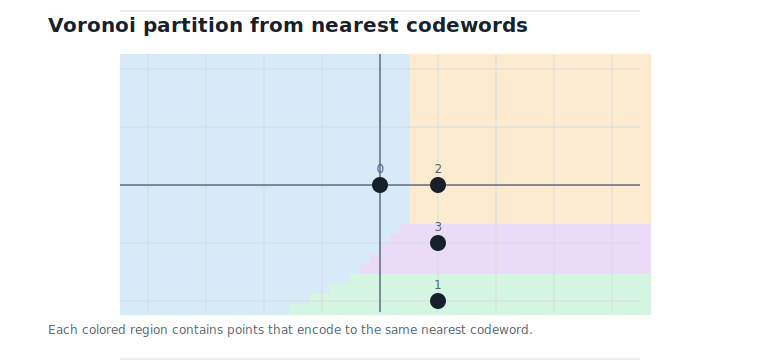
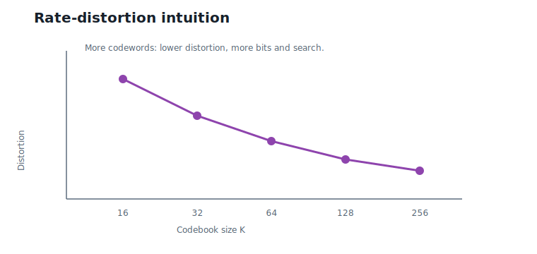

# Classical Vector Quantization

**Question.** How do we compress vectors?

## Learning Objectives

By the end of this chapter, you should be able to:

- explain what a finite vector codebook is;
- encode a vector by choosing its nearest codeword;
- decode an index back into a representative vector;
- compute the bit rate of a codebook-based representation;
- compute distortion from reconstruction error;
- explain why brute-force vector quantization costs $O(Kd)$;
- explain why large unstructured codebooks motivate structured codebooks.

## Prerequisites

This chapter assumes the vector geometry from Chapter 3: Euclidean distance, dot products, and nearest-neighbor search. No lattice theory is used.

## Running Example

We keep the same two four-dimensional weight blocks:

$$
v_1 = (0.73,\;-1.84,\;2.11,\;-0.45),
\qquad
v_2 = (1.27,\;0.08,\;-2.36,\;3.14).
$$

Interpretation:

- Verbal: $v_1$ and $v_2$ are the two blocks cut from the running weight vector $w$.
- Geometric: each block is one point in four-dimensional space.
- Engineering: a vector quantizer will replace each block by a short codebook index.

The full pedagogical codebook in this chapter has:

$$
K = 256
$$

codewords, each in dimension:

$$
d = 4.
$$

Interpretation:

- Verbal: there are 256 possible representatives for each four-coordinate block.
- Geometric: the codebook is a finite set of 256 points in four-dimensional space.
- Engineering: 256 choices require 8 bits per block, or 2 bits per weight before codebook overhead.

## Why Scalar Quantization Is Not the Whole Story

Scalar quantization treats each coordinate independently. It asks:

> Which low-precision value should replace this one number?

Vector quantization asks:

> Which representative vector should replace this whole block?

This distinction matters because a block has shape. The coordinates can move together. A codeword can capture a common pattern that would be invisible if every coordinate were quantized separately.

@fig-ch04-codebook-points shows a two-dimensional projection of the 256-entry codebook. The actual codebook is four-dimensional; the figure shows only the first two coordinates so we can see the idea.

{#fig-ch04-codebook-points fig-alt="Two-dimensional projection of codebook points with two target vectors highlighted."}

The price is that the encoder must choose among codewords. That choice is the heart of vector quantization.

## Codebooks

A finite vector codebook is a list of representative vectors:

$$
C = \{c_0,\;c_1,\;\ldots,\;c_{K-1}\}.
$$

Interpretation:

- Verbal: the codebook stores $K$ candidate replacements.
- Geometric: the codebook is a finite set of points.
- Engineering: each codeword gets an integer index that can be stored instead of the full vector.

For the running example, the full codebook has 256 entries. The entries nearest to our two blocks include:

| Index | Codeword |
|---:|---|
| 73 | $(0, -2, 2, 0)$ |
| 137 | $(1, -2, 2, 0)$ |
| 141 | $(1, -2, 3, 0)$ |
| 147 | $(1, 0, -2, 3)$ |
| 163 | $(1, 1, -2, 3)$ |

Where do these 256 entries come from? This chapter's codebook is built deliberately simply: each coordinate is allowed four integer levels — $\{-2, 0, 1, 3\}$ for coordinates 1, 2, and 4, and $\{-2, 0, 2, 3\}$ for coordinate 3 — and the codebook contains every combination of them, $4^4 = 256$ codewords in a fixed order. Because the construction is deterministic, index 137 always names the same codeword. The executable example in `code/python/chapter_04_vector_quantization.py` constructs all 256 entries.

We should be honest about what this construction is. A codebook made of *all combinations* of per-coordinate levels is called a **product codebook**, and squared Euclidean distance splits into a sum over coordinates. So the nearest codeword in this particular codebook can be found one coordinate at a time: encoding here is really per-coordinate scalar quantization to a non-uniform grid, wearing a codebook costume. It is ideal for demonstrating the machinery of vector quantization — indices, bit rate, distortion, Voronoi cells — but it cannot capture any pattern *across* coordinates. A codebook that exploits joint block structure must couple its coordinates: either by training on data (see the historical note) or by imposing mathematical structure — beginning with the tilted lattices of Chapter 5 and, for our four-dimensional running blocks, the parity constraint of the `D4` lattice in Chapter 6.

## Encoding

Encoding means choosing the nearest codeword:

$$
\operatorname{encode}(v)
=
\arg\min_{0 \leq b < K}
\|v - c_b\|_2.
$$

Interpretation:

- Verbal: try every codeword and return the index with the smallest distance.
- Geometric: choose the codebook point closest to the target point.
- Engineering: store the index $b$, not the full vector $v$.

For block $v_1$, the nearest codeword is:

$$
\operatorname{encode}(v_1) = 137.
$$

Interpretation:

- Verbal: codeword 137 is closest to the first block.
- Geometric: among all 256 codebook points, $c_{137}$ is nearest to $v_1$.
- Engineering: the first four weights can be represented by the 8-bit index 137.

For block $v_2$, the nearest codeword is:

$$
\operatorname{encode}(v_2) = 147.
$$

Interpretation:

- Verbal: codeword 147 is closest to the second block.
- Geometric: $v_2$ lies closest to $c_{147}$.
- Engineering: the second four weights can be represented by the 8-bit index 147.

@fig-ch04-encoding illustrates encoding as nearest-codeword selection.

{#fig-ch04-encoding fig-alt="Target point connected to candidate codewords with the nearest codeword highlighted."}

## Decoding

Decoding is simpler than encoding. Given an index, look up the corresponding codeword:

$$
\operatorname{decode}(b) = c_b.
$$

Interpretation:

- Verbal: the index is used as an address into the codebook.
- Geometric: decoding replaces the target by the selected representative point.
- Engineering: inference can reconstruct the approximate block from the stored index and shared codebook.

For the two running blocks:

$$
\operatorname{decode}(137) = (1,\;-2,\;2,\;0),
$$

and

$$
\operatorname{decode}(147) = (1,\;0,\;-2,\;3).
$$

Interpretation:

- Verbal: the two indices reconstruct two four-coordinate codewords.
- Geometric: the original blocks are snapped to nearby codebook points.
- Engineering: the full reconstructed eight-weight vector is $(1, -2, 2, 0, 1, 0, -2, 3)$.

@fig-ch04-decoding shows the lookup direction: index to representative vector.

{#fig-ch04-decoding fig-alt="Diagram showing indices 137 and 147 pointing to their codewords."}

## Voronoi View

The codebook divides space into regions. Every point in a region has the same nearest codeword. These regions are called Voronoi cells.

For a codeword $c_b$, its Voronoi cell is the set of all vectors closer to $c_b$ than to any other codeword.

@fig-ch04-voronoi shows this idea in two dimensions. The boundaries are where the nearest-codeword decision changes.

{#fig-ch04-voronoi fig-alt="Two-dimensional Voronoi partition for a small codebook."}

This viewpoint is important because it connects vector quantization to geometry. Encoding is not just a table search; it partitions space into decision regions. For an arbitrary codebook, the cells have irregular shapes that can only be described point by point. One of the payoffs of the structured codebooks in later chapters is that every cell becomes a shifted copy of a single shape.

## Bit Rate

If a codebook has $K$ codewords, the number of bits per encoded block is:

$$
\lceil \log_2 K \rceil.
$$

Interpretation:

- Verbal: we need enough bits to name every codeword.
- Geometric: the number of regions determines how many labels are needed.
- Engineering: codebook size directly controls index storage.

For $K = 256$:

$$
\log_2 256 = 8.
$$

Interpretation:

- Verbal: each block index costs 8 bits.
- Geometric: each block is assigned to one of 256 regions.
- Engineering: with block size $d = 4$, the rate is $8 / 4 = 2$ bits per weight.

For the full eight-weight running example, there are two blocks, so the stored indices cost:

$$
2 \times 8 = 16
$$

bits, excluding the shared codebook.

Interpretation:

- Verbal: two block labels store the two reconstructed blocks.
- Geometric: the two original points have been replaced by two region labels.
- Engineering: the raw per-example storage is lower than scalar int4, but the shared codebook must also be stored somewhere.

## Distortion

Compression is useful only if the reconstruction is good enough. The squared reconstruction error for one block is:

$$
\|v - \operatorname{decode}(\operatorname{encode}(v))\|_2^2.
$$

Interpretation:

- Verbal: encode the vector, decode the index, and measure the squared error.
- Geometric: this is the squared distance from the original point to its selected codeword.
- Engineering: this is the loss introduced by replacing a full vector with a codebook index.

For the running blocks:

| Block | Encoded index | Reconstruction | Euclidean distance | Squared error |
|---:|---:|---|---:|---:|
| 1 | 137 | $(1, -2, 2, 0)$ | 0.56 | 0.3131 |
| 2 | 147 | $(1, 0, -2, 3)$ | 0.48 | 0.2285 |

Across all eight weights, the mean squared error is:

$$
\frac{0.3131 + 0.2285}{8} = 0.0677.
$$

Interpretation:

- Verbal: average squared coordinate error is about 0.0677.
- Geometric: the two blocks are close to their chosen representatives.
- Engineering: this is a simple distortion number that can be compared across codebooks.

Rate and distortion usually move in opposite directions. A larger codebook can reduce distortion, but it needs more index bits and more search.

@fig-ch04-rate-distortion sketches this tradeoff.

{#fig-ch04-rate-distortion fig-alt="Curve showing distortion decreasing as codebook rate increases."}

## Why Large Codebooks Become Expensive

For one block, brute-force encoding compares the target to every codeword. With $K$ codewords in dimension $d$, the cost is:

$$
O(Kd).
$$

Interpretation:

- Verbal: $K$ candidates, $d$ coordinates per distance.
- Geometric: the encoder must decide which of $K$ regions contains the target.
- Engineering: larger codebooks improve expressiveness but increase encoding time and codebook memory.

For this chapter, $K = 256$ and $d = 4$, so each block requires 256 four-dimensional distance checks in the naive encoder, and the codebook itself holds $256 \times 4 = 1024$ values — about 2 KB in FP16. That is fine for a small example.

Watch how fast it stops being fine. Keeping the rate fixed at 2 bits per weight, a codebook over blocks of dimension $d$ needs $K = 2^{2d}$ codewords. At $d = 8$ that is already $K = 65536$ codewords, half a megabyte of codebook, and 65536 distance computations for *every block encoded*. The codebook size grows exponentially in the block dimension.

There is a hint of the way out hiding in this chapter's own toy codebook. Because it is a product of per-coordinate levels, its nearest codeword could be found one coordinate at a time — $O(d)$ work instead of $O(Kd)$ — without ever scanning the table. Structure in the codebook converted brute-force search into fast decoding. The product structure is too weak to capture block patterns, but the bargain it illustrates is the book's central one: we want codebooks with enough structure to encode quickly *and* enough coupling between coordinates to be worth using.

This is the pressure that leads to structured codebooks. We want codebooks that behave like large vector quantizers but can be generated, searched, or decoded without storing and scanning arbitrary representatives.

## Worked Example

Encode the first running block:

$$
v_1 = (0.73,\;-1.84,\;2.11,\;-0.45).
$$

The nearest few codewords are:

| Index | Codeword | Distance |
|---:|---|---:|
| 137 | $(1, -2, 2, 0)$ | 0.56 |
| 73 | $(0, -2, 2, 0)$ | 0.88 |
| 141 | $(1, -2, 3, 0)$ | 1.05 |

The encoder stores index 137. The decoder maps index 137 back to $(1, -2, 2, 0)$.

Now encode the second running block:

$$
v_2 = (1.27,\;0.08,\;-2.36,\;3.14).
$$

The nearest few codewords are:

| Index | Codeword | Distance |
|---:|---|---:|
| 147 | $(1, 0, -2, 3)$ | 0.48 |
| 163 | $(1, 1, -2, 3)$ | 1.03 |
| 83 | $(0, 0, -2, 3)$ | 1.33 |

The encoder stores index 147. The decoder maps index 147 back to $(1, 0, -2, 3)$.

Together, the two stored indices reconstruct:

$$
\hat{w} = (1,\;-2,\;2,\;0,\;1,\;0,\;-2,\;3).
$$

Interpretation:

- Verbal: the vector quantizer reconstructs the same two representative blocks we have already seen.
- Geometric: each block has been snapped to its nearest codeword.
- Engineering: the stored representation is two 8-bit indices plus the shared codebook.

## Algorithms

### Algorithm 4.1: Encode by Nearest Codeword

**Input:** a target vector $v$ of dimension $d$ and a codebook $C$ with $K$ codewords.

**Output:** the index $b$ of the nearest codeword.

```text
function encode_nearest(v, C):
    best_index = none
    best_squared_distance = infinity
    for b from 0 to K - 1:
        distance = squared_euclidean_distance(v, C[b])
        if distance < best_squared_distance:
            best_index = b
            best_squared_distance = distance
    return best_index
```

**Complexity and implementation notes:**

| Property | Cost |
|---|---|
| Time | $O(Kd)$ |
| Memory | $O(1)$ beyond the codebook |
| Offline preprocessing | Build, train, or choose the codebook |
| Online inference cost | Usually none for weights, if encoding is done offline |
| Parallelism | Distances to codewords can be computed in parallel |
| GPU suitability | Good for batched encoding, but codebook memory traffic matters |
| SIMD suitability | Good when codewords are contiguous and aligned |
| Possible optimization | Compare squared distances and avoid square roots |

### Algorithm 4.2: Decode an Index

**Input:** a codebook index $b$ and a codebook $C$.

**Output:** the codeword $c_b$.

```text
function decode_index(b, C):
    return C[b]
```

**Complexity and implementation notes:**

| Property | Cost |
|---|---|
| Time | $O(d)$ to materialize the decoded vector |
| Memory | $O(d)$ for the output vector, or $O(1)$ if consumed directly |
| Offline preprocessing | Store the codebook |
| Online inference cost | One indexed lookup per block, plus downstream use of $d$ values |
| Parallelism | Blocks decode independently |
| GPU suitability | Good if codebook access is cache-friendly |
| SIMD suitability | Good for contiguous decoded blocks |
| Possible optimization | Avoid explicit decoding and compute directly from indices when possible |

### Algorithm 4.3: Brute-Force Vector Quantization

**Input:** a list of blocks and a codebook $C$.

**Output:** encoded indices and reconstructed blocks.

```text
function vector_quantize(blocks, C):
    indices = empty list
    reconstructions = empty list
    for block in blocks:
        b = encode_nearest(block, C)
        append b to indices
        append decode_index(b, C) to reconstructions
    return indices, reconstructions
```

**Complexity and implementation notes:**

| Property | Cost |
|---|---|
| Time | $O(BKd)$ for $B$ blocks |
| Memory | $O(B)$ for indices, plus the shared codebook |
| Offline preprocessing | Codebook construction or training |
| Online inference cost | Store and read indices; decode or use lookup methods |
| Parallelism | Blocks can be encoded independently |
| GPU suitability | Good for large batches if codebook reuse is efficient |
| SIMD suitability | Good for distance kernels over contiguous codewords |
| Possible optimization | Replace unstructured search with a structured codebook |

The executable reference implementation is in `code/python/chapter_04_vector_quantization.py`.

## Engineering Insight

Classical vector quantization is attractive because one index can represent a whole block. With $K = 256$ and $d = 4$, the index rate is 2 bits per weight, which is lower than scalar int4.

The problem is the shared codebook and the encoder. A large unstructured codebook must be stored, moved through memory, and searched. That may be acceptable for offline weight compression, but it becomes expensive as $K$, $d$, or the number of blocks grows — and at fixed bits per weight, $K$ grows exponentially with the block dimension.

This is the central engineering tension: vector quantization gives better block-level representations, but naive codebooks do not scale cleanly. The next chapter begins the path toward structured codebooks by asking whether codewords can be generated mathematically rather than stored as arbitrary vectors.

## Historical Note and Further Reading

Classical vector quantization is a mature area in signal compression. The Linde-Buzo-Gray algorithm is a standard method for designing vector quantizers from data @linde_1980. For a broader treatment of vector quantization and signal compression, see @gersho_gray_1992.

This book uses classical vector quantization as the engineering problem that motivates lattice structure, rather than as the final design.

## Exercises

### Conceptual Exercises

1. Why can vector quantization represent patterns that scalar quantization cannot?
2. Why does a codebook with 256 entries require 8 bits per block?
3. Why does decoding usually cost less than encoding?
4. This chapter's codebook is a product of per-coordinate level sets. Explain why its nearest-codeword search reduces to independent per-coordinate choices, and why that means it cannot capture cross-coordinate patterns.

### Worked Numerical Exercises

1. Verify that $8 / 4 = 2$ bits per weight for a 256-entry codebook and four-dimensional blocks.
2. Compute the squared error for block 1 and codeword $(1, -2, 2, 0)$.
3. Compute the distance from block 2 to codeword $(1, 1, -2, 3)$.
4. At 2 bits per weight, how many codewords does an unstructured codebook need for blocks of dimension 8? For dimension 16?

### Programming Exercises

1. Run `python code/python/chapter_04_vector_quantization.py` and confirm the encoded indices.
2. Modify the codebook levels and observe how the nearest indices change.
3. Add a function that reports the top five nearest codewords for any block.
4. Implement the coordinate-at-a-time shortcut for this chapter's product codebook and check that it always returns the same index as brute-force search.

### Research Questions

1. When is an unstructured learned codebook worth its storage and search cost?
2. How should a codebook be trained if dot-product error matters more than Euclidean distance?
3. What hardware layout would make 256-entry codebook search efficient?

## Common Mistakes

- Counting only index bits and forgetting the shared codebook.
- Assuming a codebook that works for two blocks will work for a full model.
- Confusing encoding cost with decoding cost.
- Forgetting that nearest-codeword search over an unstructured codebook costs $O(Kd)$.
- Concluding from this chapter's product codebook that vector quantization is no better than scalar quantization; the limitation belongs to the toy construction, not to the idea.

## Summary

Classical vector quantization compresses a vector by replacing it with the index of a nearby codeword. Encoding is nearest-neighbor search. Decoding is a codebook lookup. The bit rate is controlled by the number of codewords, while distortion is controlled by how well those codewords cover the vectors being compressed.

For the running example, a 256-entry four-dimensional codebook uses 8 bits per block, or 2 bits per weight before codebook overhead. The two running blocks encode to indices 137 and 147. This illustrates both the appeal and the limitation of classical vector quantization: compact indices, but expensive unstructured codebooks.

## Preview of Next Chapter

Next we ask whether codebooks can be generated mathematically. This leads from arbitrary finite codebooks to integer grids, generator matrices, lattices, fundamental regions, and Voronoi cells.
