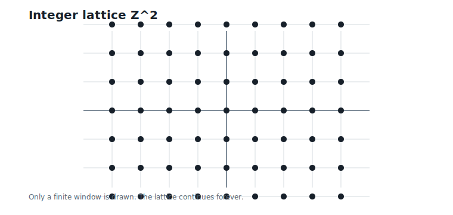
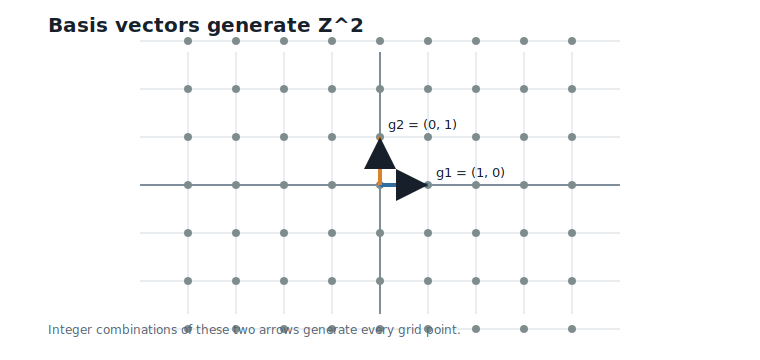
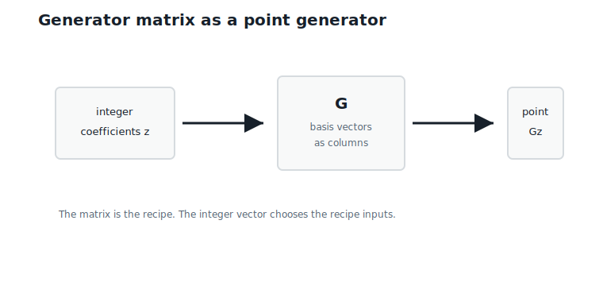
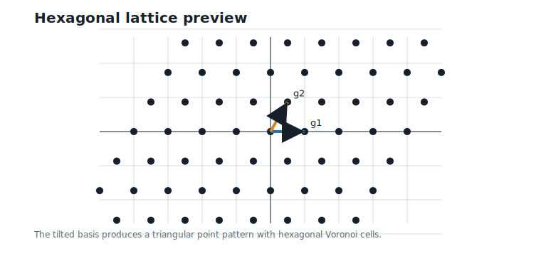
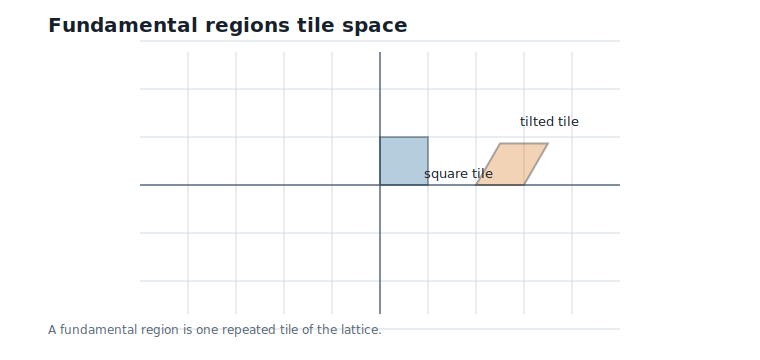
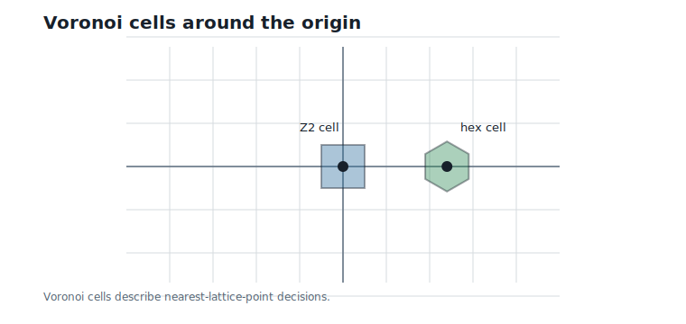

# Lattices from First Principles

**Question.** Can codebooks be generated mathematically?

## Learning Objectives

By the end of this chapter, you should be able to:

- explain why unstructured codebooks become difficult to store and search;
- generate an integer grid from two simple basis directions;
- read a generator matrix as a rule for producing points;
- define a lattice from concrete examples;
- explain fundamental regions and Voronoi cells;
- see why `D4` is the next natural lattice for the running example.

## Prerequisites

This chapter assumes vectors, Euclidean distance, nearest-neighbor search, and the finite-codebook viewpoint from Chapter 4. No lattice theory is assumed.

## Running Example

Chapter 4 used a 256-entry codebook for two four-dimensional weight blocks:

$$
v_1 = (0.73,\;-1.84,\;2.11,\;-0.45),
\qquad
v_2 = (1.27,\;0.08,\;-2.36,\;3.14).
$$

Interpretation:

- Verbal: the blocks were encoded by choosing nearby codewords.
- Geometric: each block was snapped to a nearby point in four-dimensional space.
- Engineering: the codebook worked, but it had to be stored as a table and searched as a table.

This chapter asks whether the codebook points can come from a rule instead of from an arbitrary list.

## Why We Need Structure

A classical vector quantizer stores a finite list:

$$
C = \{c_0,\;c_1,\;\ldots,\;c_{K-1}\}.
$$

Interpretation:

- Verbal: each codeword is written down explicitly.
- Geometric: the codebook is a cloud of representative points.
- Engineering: storing and searching the cloud becomes expensive as $K$ grows.

The alternative is to generate points from a small rule. If the rule is simple, we can store the rule and compute points when needed.

The simplest rule is the integer grid.

## The Integer Grid

Start in two dimensions. The integer grid contains all points whose coordinates are integers:

$$
\mathbb{Z}^2 = \{(a,\;b) : a \text{ and } b \text{ are integers}\}.
$$

Interpretation:

- Verbal: every point has two integer coordinates.
- Geometric: the points form a regular square grid.
- Engineering: this is an infinite codebook generated by a very small rule.

@fig-ch05-integer-lattice shows a finite window of the infinite integer grid.

{#fig-ch05-integer-lattice fig-alt="A two-dimensional integer grid with regularly spaced lattice points."}

This grid is already a structured codebook. We do not store every point. We store the rule: use integer coordinates.

## Basis Directions

Another way to describe the integer grid is with two basis directions:

$$
g_1 = (1,\;0),
\qquad
g_2 = (0,\;1).
$$

Interpretation:

- Verbal: $g_1$ moves one step horizontally, and $g_2$ moves one step vertically.
- Geometric: every grid point is reached by taking integer steps along these two arrows.
- Engineering: two short vectors generate infinitely many candidate representatives.

For example:

$$
2g_1 - 3g_2 = (2,\;-3).
$$

Interpretation:

- Verbal: move two steps in the first basis direction and negative three steps in the second.
- Geometric: this lands on the grid point $(2, -3)$.
- Engineering: the point is computed from two integer coefficients, not retrieved from a table.

@fig-ch05-basis-vectors shows the two basis arrows that generate $\mathbb{Z}^2$.

{#fig-ch05-basis-vectors fig-alt="Coordinate axes with two basis arrows generating the square integer grid."}

## Generator Matrices

Basis directions can be collected into a matrix:

$$
G =
\begin{bmatrix}
1 & 0 \\
0 & 1
\end{bmatrix}.
$$

Interpretation:

- Verbal: the columns of $G$ are the two basis directions.
- Geometric: multiplying by integer coefficients chooses a grid point.
- Engineering: $G$ is the compact recipe for generating representatives.

Let $z$ be an integer coefficient vector. For example:

$$
z =
\begin{bmatrix}
2 \\
-3
\end{bmatrix}.
$$

Then:

$$
Gz =
\begin{bmatrix}
1 & 0 \\
0 & 1
\end{bmatrix}
\begin{bmatrix}
2 \\
-3
\end{bmatrix}
=
\begin{bmatrix}
2 \\
-3
\end{bmatrix}.
$$

Interpretation:

- Verbal: the coefficients $(2, -3)$ generate the point $(2, -3)$.
- Geometric: the matrix maps integer coefficient steps to points in space.
- Engineering: generation costs matrix-vector multiplication, not codebook lookup.

Now replace the square basis with a skew basis:

$$
G =
\begin{bmatrix}
1 & 0.5 \\
0 & \sqrt{3}/2
\end{bmatrix}.
$$

Interpretation:

- Verbal: the second basis direction is tilted instead of vertical.
- Geometric: integer combinations form a triangular lattice whose Voronoi cells are hexagons.
- Engineering: changing the generator matrix changes the geometry of the generated codebook.

@fig-ch05-generator-matrix shows this generator-matrix viewpoint.

{#fig-ch05-generator-matrix fig-alt="Diagram showing integer coefficient pairs mapped through a generator matrix into lattice points."}

## Definition of a Lattice

We have now seen the pattern enough to name it.

**Definition.** A lattice is the set of all integer combinations of a fixed set of *linearly independent* basis vectors.

Using the generator matrix $G$, we write:

$$
L = \{Gz : z \text{ is an integer vector}\}.
$$

Interpretation:

- Verbal: choose integer coefficients, multiply by $G$, and get a lattice point.
- Geometric: the basis directions repeat forever in a regular pattern.
- Engineering: an infinite structured codebook is represented by one small matrix.

The words *linearly independent* are doing real work. If one basis arrow can be built from the others, integer combinations can produce points that pile up arbitrarily close together. Even in one dimension this fails: taking integer steps of size $1$ and of size $\sqrt{2}$ generates numbers that come arbitrarily close to *every* point on the line — the "grid" dissolves into dust. A lattice must keep its points separated, because quantization is about to assign each input to a nearest point, and "nearest" only behaves well when the candidates keep their distance from each other.

This is why lattices are attractive for quantization. They are not arbitrary tables. They are generated objects.

## Square and Hexagonal Lattices

The square lattice $\mathbb{Z}^2$ is generated by perpendicular unit steps. It is easy to understand, but it is not the only possible grid.

The tilted generator matrix above gives the two-dimensional hexagonal-lattice preview:

$$
g_1 = (1,\;0),
\qquad
g_2 = (0.5,\;\sqrt{3}/2).
$$

Interpretation:

- Verbal: one step is horizontal, and the other is tilted 60 degrees upward.
- Geometric: the points form a triangular pattern; nearest-neighbor regions are hexagons.
- Engineering: changing geometry can reduce quantization error for the same point density.

Note what just happened to the *structure* of the point set. In Chapter 4, our toy codebook was a product: each coordinate chose its level independently. The tilted basis breaks that. A hexagonal lattice point's coordinates are coupled through the shared coefficients $z$ — you cannot pick the first and second coordinates independently and expect to land on the lattice. This is the book's first codebook that escapes the product limitation, and it happens the moment the generator matrix stops being diagonal.

For the first two coordinates of the running block, $(0.73, -1.84)$, a bounded nearest-point search gives:

| Lattice | Nearest generated point | Distance |
|---|---|---:|
| Square $\mathbb{Z}^2$ | $(1.00, -2.00)$ | 0.31 |
| Hexagonal preview | $(1.00, -1.73)$ | 0.29 |

Read this comparison with care. Part of the hexagonal gain is simply density: at this scale the tilted basis packs more points per unit area (its fundamental tile is smaller, as computed below), so *any* target tends to have a nearer neighbor. The rest is shape: hexagonal cells are rounder than squares. A fair comparison must equalize density before crediting the shape — Chapter 8 introduces the scaling tools, and Chapter 14 quantifies the shape effect as quantization gain. Here the table only shows that geometry matters.

@fig-ch05-hexagonal-lattice shows a finite window of the hexagonal lattice.

{#fig-ch05-hexagonal-lattice fig-alt="A two-dimensional hexagonal lattice generated by tilted basis vectors."}

## Fundamental Regions

A lattice repeats space. A fundamental region is one tile whose translated copies cover the space without gaps or overlaps.

For the square lattice, one natural fundamental region is the unit square:

$$
[0,\;1) \times [0,\;1).
$$

Interpretation:

- Verbal: every point in the plane can be shifted by an integer grid point into this square.
- Geometric: copies of the square tile the plane.
- Engineering: one fundamental region describes the repeating storage pattern of the lattice.

For a two-dimensional generator matrix:

$$
G =
\begin{bmatrix}
g_{11} & g_{12} \\
g_{21} & g_{22}
\end{bmatrix},
$$

the area of the parallelogram fundamental region is:

$$
|\det(G)| = |g_{11}g_{22} - g_{12}g_{21}|.
$$

Interpretation:

- Verbal: the determinant measures the area of one repeated tile.
- Geometric: smaller area means points are packed more densely.
- Engineering: point density affects quantization distortion and codebook rate.

For the square lattice, the area is 1. For the hexagonal preview lattice, the area is:

$$
\sqrt{3}/2 \approx 0.866.
$$

Interpretation:

- Verbal: the hexagonal preview has a smaller tile area than the unit square.
- Geometric: its points are denser when the basis lengths are chosen this way.
- Engineering: this confirms the caution above — when comparing lattices fairly, scale must be controlled. Chapter 8 returns to scaling.

@fig-ch05-fundamental-region shows square and tilted fundamental regions.

{#fig-ch05-fundamental-region fig-alt="Square and parallelogram fundamental regions highlighted in their lattices."}

## Voronoi Cells

A fundamental region tiles the plane algebraically. A Voronoi cell tiles the plane by nearest point.

The Voronoi cell around the origin is:

$$
V = \{\,v : \|v\| \leq \|v - u\| \text{ for every lattice point } u \in L\,\}.
$$

Interpretation:

- Verbal: $V$ contains the points that are at least as close to the origin as to any other lattice point.
- Geometric: $V$ is the nearest-neighbor region around one lattice point.
- Engineering: lattice quantization means finding which Voronoi cell contains the input.

Points on the *boundary* of $V$ are shared: they are equally close to two or more lattice points, and either choice is a valid nearest neighbor. For now this is a harmless curiosity. It becomes a real bookkeeping matter in Chapter 9, where counting codewords will require breaking these ties by a fixed rule.

For $\mathbb{Z}^2$, the Voronoi cell around the origin is a square centered at the origin. For the hexagonal lattice, it is a hexagon.

@fig-ch05-voronoi-cells shows both cells.

{#fig-ch05-voronoi-cells fig-alt="Square Voronoi cell and hexagonal Voronoi cell around the origin."}

This is the bridge to lattice quantization. Instead of storing a finite arbitrary codebook, we can define infinitely many structured points and use nearest-point geometry.

## D4 Preview

The book's running block size is 4, so the first serious lattice will live in four dimensions. That lattice is called `D4`.

For now, only remember the motivation:

- $\mathbb{Z}^2$ shows how integer grids work.
- The hexagonal lattice shows that changing the generator can improve geometry.
- `D4` will be the four-dimensional lattice that lets the running example become concrete.

One preview is enough:

| Vector | Coordinate sum | Chapter 6 preview |
|---|---:|---|
| $(1, -2, 2, 0)$ | 1 | not in `D4` |
| $(1, 0, -2, 3)$ | 2 | in `D4` |

The reason is parity of the coordinate sum — the same whole-block parity we asked you to file away in Chapter 2. Chapter 6 will derive this from first principles. Here, the point is only that lattices can impose structure beyond "all integer vectors."

## Worked Example

Use the hexagonal preview generator:

$$
G =
\begin{bmatrix}
1 & 0.5 \\
0 & \sqrt{3}/2
\end{bmatrix}.
$$

Take integer coefficients:

$$
z =
\begin{bmatrix}
2 \\
-2
\end{bmatrix}.
$$

Then:

$$
Gz =
\begin{bmatrix}
1 & 0.5 \\
0 & \sqrt{3}/2
\end{bmatrix}
\begin{bmatrix}
2 \\
-2
\end{bmatrix}
=
\begin{bmatrix}
1 \\
-\sqrt{3}
\end{bmatrix}
\approx
\begin{bmatrix}
1.00 \\
-1.73
\end{bmatrix}.
$$

Interpretation:

- Verbal: integer coefficients $(2, -2)$ generate the point $(1.00, -1.73)$.
- Geometric: this point lies on the tilted hexagonal lattice.
- Engineering: a lattice point is computed from $G$ and $z$, not loaded from a codebook table.

For the visible target $(0.73, -1.84)$, this generated point is about 0.29 units away.

## Algorithms

### Algorithm 5.1: Generate Lattice Points in a Coefficient Box

**Input:** a generator matrix $G$ and an integer bound $R$.

**Output:** lattice points $Gz$ for all integer coefficient vectors $z$ with entries between $-R$ and $R$.

```text
function generate_lattice_points(G, R):
    points = empty list
    for every integer coefficient vector z in [-R, R]^d:
        append G z to points
    return points
```

**Complexity and implementation notes:**

| Property | Cost |
|---|---|
| Time | $O((2R + 1)^d d^2)$ for dense matrix multiplication |
| Memory | $O((2R + 1)^d d)$ if all points are stored |
| Offline preprocessing | Choose or store the generator matrix |
| Online inference cost | Usually generate only the candidates needed |
| Parallelism | Coefficient vectors are independent |
| GPU suitability | Good for regular bounded enumeration, but the count grows exponentially in $d$ |
| SIMD suitability | Good for batched matrix-vector products |
| Possible optimization | Generate points lazily instead of materializing all of them |

### Algorithm 5.2: Bounded Nearest Generated Point

**Input:** a target vector, a generator matrix $G$, and an integer bound $R$.

**Output:** the generated point $Gz$ nearest to the target among the bounded candidates.

```text
function bounded_nearest_generated_point(target, G, R):
    best_z = none
    best_point = none
    best_distance = infinity
    for every integer coefficient vector z in [-R, R]^d:
        point = G z
        distance = squared_euclidean_distance(target, point)
        if distance < best_distance:
            best_z = z
            best_point = point
            best_distance = distance
    return best_z, best_point, sqrt(best_distance)
```

**Complexity and implementation notes:**

| Property | Cost |
|---|---|
| Time | $O((2R + 1)^d d^2)$ |
| Memory | $O(d)$ if candidates are streamed |
| Offline preprocessing | Store $G$ |
| Online inference cost | Too expensive in high dimension unless the bound is tiny |
| Parallelism | Candidate evaluations are independent |
| GPU suitability | Good for small bounded searches, poor if the candidate count explodes |
| SIMD suitability | Good for small fixed dimension |
| Possible optimization | Use specialized nearest-lattice-point algorithms instead of bounded brute force |

The executable reference implementation is in `code/python/chapter_05_lattices.py`.

## Engineering Insight

Lattices solve one problem and create another.

They solve the storage problem: infinitely many structured points can be represented by a generator matrix. We do not need to store every point.

They create the decoding problem: given a target vector, how do we find the nearest lattice point without brute-force enumeration? The bounded search of Algorithm 5.2 costs $O((2R+1)^d d^2)$ — exponential in dimension, which is exactly the codebook-scan cost we were trying to escape. Structure in the *point set* is only half the bargain; we also need structure in the *search*. Chapter 7 will deliver that for `D4` and `Dn`, where the nearest lattice point costs $O(n)$ — no enumeration at all.

This chapter is therefore the first step from arbitrary finite codebooks toward structured vector quantization. The codebook is no longer just a table. It is a generated geometric object.

## Historical Note and Further Reading

Lattices are central objects in geometry of numbers, coding theory, sphere packing, and quantization. A standard reference for the lattice viewpoint used later in this book is @conway_sloane_1999.

This chapter uses only the constructive part: basis vectors generate structured point sets.

## Exercises

### Conceptual Exercises

1. Why does a generator matrix store an infinite lattice with finite data?
2. What is the difference between a finite codebook and a lattice?
3. Why is a finite window of a lattice not the same thing as the lattice?
4. Why must the basis vectors of a lattice be linearly independent? What goes wrong for quantization if they are not?

### Worked Numerical Exercises

1. For $\mathbb{Z}^2$, compute the point generated by coefficients $(3, -2)$.
2. For the hexagonal preview basis, compute the point generated by coefficients $(1, 1)$.
3. Compute the determinant area of the matrix with columns $(1, 0)$ and $(0.5, \sqrt{3}/2)$.

### Programming Exercises

1. Run `python code/python/chapter_05_lattices.py` and confirm the generated nearest points.
2. Modify the coefficient bound $R$ and count how many lattice points are generated.
3. Add a function that filters generated points to a visible plotting window.

### Research Questions

1. When is it better to generate candidates than to store a codebook?
2. How should lattices be scaled before comparing their quantization error?
3. What makes nearest-lattice-point search harder than generating lattice points?

## Common Mistakes

- Confusing a finite plotted window with the infinite lattice.
- Treating every lattice as an axis-aligned integer grid.
- Forgetting that a generator matrix defines geometry, not just storage.
- Assuming lattice generation automatically solves nearest-point search.
- Comparing lattices without controlling for point density.

## Summary

A lattice is a structured infinite set generated by integer combinations of linearly independent basis vectors. A generator matrix stores those basis vectors compactly. The square integer grid and the hexagonal lattice show how changing the basis changes the geometry of the generated points — and the tilted basis gives our first codebook whose coordinates are genuinely coupled.

Fundamental regions describe how a lattice repeats space. Voronoi cells describe nearest-point decisions. These two ideas connect generated structure to quantization.

## Preview of Next Chapter

Next we specialize this viewpoint to the first four-dimensional lattice used in the running example: `D4`. We will see its generator view, parity view, and relationship with $2\mathbb{Z}^4$.
