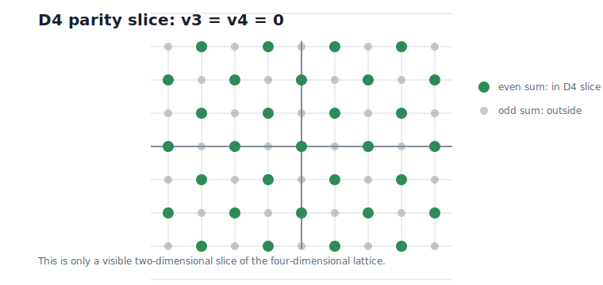
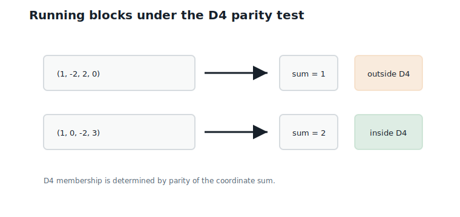
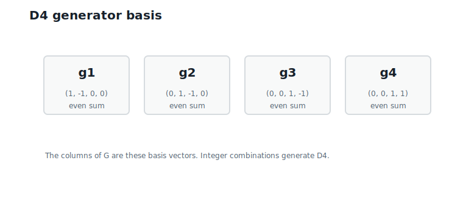
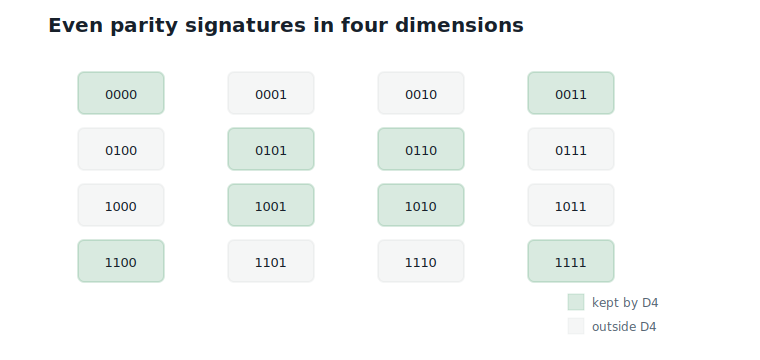
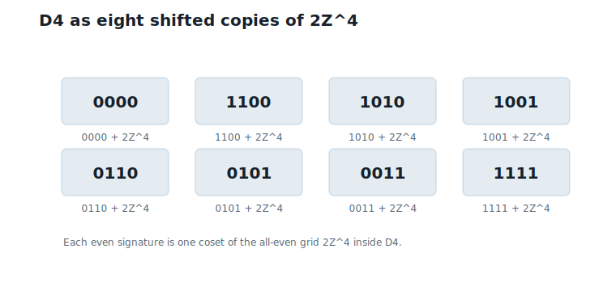

# The D4 Lattice

**Question.** Why is `D4` special?

## Learning Objectives

By the end of this chapter, you should be able to:

- define `D4` as the integer vectors with even coordinate sum;
- test whether a four-dimensional integer vector belongs to `D4`;
- generate `D4` points from a concrete generator matrix;
- explain why the generator and parity views describe the same lattice;
- describe `D4` as a union of cosets of $2\mathbb{Z}^4$;
- state the minimum distance of `D4` and why it beats the integer grid at equal density.

## Prerequisites

This chapter assumes integer grids, vectors, parity, generator matrices, and the lattice viewpoint from Chapter 5.

## Running Example

The running scalar-quantized weight blocks are:

$$
\hat{v}_1 = (1,\;-2,\;2,\;0),
\qquad
\hat{v}_2 = (1,\;0,\;-2,\;3).
$$

Interpretation:

- Verbal: these are the two four-coordinate blocks we have been carrying since Chapter 1.
- Geometric: each block is an integer point in four-dimensional space.
- Engineering: `D4` will decide which integer points are allowed by a structured lattice rule.

Their coordinate sums are:

$$
1 + (-2) + 2 + 0 = 1,
$$

and:

$$
1 + 0 + (-2) + 3 = 2.
$$

Interpretation:

- Verbal: the first sum is odd, and the second sum is even.
- Geometric: the two blocks lie in different parity layers of $\mathbb{Z}^4$.
- Engineering: the second block is already a `D4` point; the first block must be adjusted before it can be a `D4` quantized point.

This chapter explains that rule. Chapter 7 will explain how to make the adjustment efficiently.

## Why Not Use All of $\mathbb{Z}^4$?

The integer lattice $\mathbb{Z}^4$ contains every integer vector:

$$
\mathbb{Z}^4 = \{(a_1,\;a_2,\;a_3,\;a_4) : a_i \text{ is an integer}\}.
$$

Interpretation:

- Verbal: every coordinate is an integer.
- Geometric: this is the four-dimensional version of the square grid.
- Engineering: scalar rounding lands in $\mathbb{Z}^4$.

But Chapter 5 showed that different lattice geometries give different nearest-point behavior. `D4` is a structured sublattice of $\mathbb{Z}^4$. It keeps only half the integer points:

$$
D4 = \{v \in \mathbb{Z}^4 : v_1 + v_2 + v_3 + v_4 \text{ is even}\}.
$$

Interpretation:

- Verbal: a vector belongs to `D4` when its coordinate sum is even.
- Geometric: `D4` is an alternating parity pattern inside the integer grid.
- Engineering: one parity check gives a structured four-dimensional candidate set.

@fig-ch06-parity-slice shows the two-dimensional slice where the last two coordinates are fixed at zero. In this slice, `D4` keeps the checkerboard points with even $v_1 + v_2$.

{#fig-ch06-parity-slice fig-alt="Two-dimensional checkerboard slice showing integer points with even and odd coordinate sum."}

This is the first useful lattice in the book because it is simple enough to compute by hand but structured enough to be better than plain scalar rounding.

## Membership by Parity

The fastest way to test `D4` membership is the parity rule:

$$
v \in D4
\quad\Longleftrightarrow\quad
v \in \mathbb{Z}^4
\text{ and }
\sum_{i=1}^{4} v_i \equiv 0 \pmod 2.
$$

Interpretation:

- Verbal: all coordinates must be integers, and the coordinate sum must be even.
- Geometric: the vector must land on an even parity layer of the integer grid.
- Engineering: membership is one integer sum and one parity check.

For the running blocks:

| Vector | Coordinate sum | In `D4`? |
|---|---:|---|
| $(1, -2, 2, 0)$ | 1 | no |
| $(1, 0, -2, 3)$ | 2 | yes |

@fig-ch06-running-membership highlights these two cases.

{#fig-ch06-running-membership fig-alt="Table-like diagram showing one running block outside D4 and one running block inside D4."}

This test is also the first hint of Chapter 7. If a rounded vector has odd sum, the nearest `D4` point must repair the parity by changing one coordinate.

## Generator Matrix View

The parity rule is easy to test, but Chapter 5 introduced lattices through generator matrices. `D4` also has a generator view.

Use the four basis vectors:

$$
g_1 = (1,\;-1,\;0,\;0),
\quad
g_2 = (0,\;1,\;-1,\;0),
$$

$$
g_3 = (0,\;0,\;1,\;-1),
\quad
g_4 = (0,\;0,\;1,\;1).
$$

Interpretation:

- Verbal: each basis vector has integer coordinates and even coordinate sum.
- Geometric: integer combinations of these four directions fill the `D4` pattern.
- Engineering: four stored basis vectors generate infinitely many `D4` points.

Collect these basis vectors as columns:

$$
G =
\begin{bmatrix}
1 & 0 & 0 & 0 \\
-1 & 1 & 0 & 0 \\
0 & -1 & 1 & 1 \\
0 & 0 & -1 & 1
\end{bmatrix}.
$$

Interpretation:

- Verbal: the columns of $G$ are $g_1$, $g_2$, $g_3$, and $g_4$.
- Geometric: multiplying $G$ by integer coefficients walks along the `D4` basis directions.
- Engineering: $G$ is a compact recipe for generating `D4` points.

@fig-ch06-generator-basis shows this generator-matrix view.

{#fig-ch06-generator-basis fig-alt="Diagram showing the four D4 basis vectors as columns of a generator matrix."}

For example, choose:

$$
z =
\begin{bmatrix}
1 \\
1 \\
-2 \\
1
\end{bmatrix}.
$$

Then:

$$
Gz =
\begin{bmatrix}
1 \\
0 \\
-2 \\
3
\end{bmatrix}.
$$

Interpretation:

- Verbal: the integer coefficients generate the second running block.
- Geometric: $(1, 0, -2, 3)$ is reached by integer steps along the `D4` basis.
- Engineering: the vector can be represented by coefficients, not just by raw coordinates.

## Why the Two Views Agree

First direction: every generator combination has even coordinate sum.

Each basis vector has even coordinate sum:

| Basis vector | Coordinate sum |
|---|---:|
| $g_1 = (1, -1, 0, 0)$ | 0 |
| $g_2 = (0, 1, -1, 0)$ | 0 |
| $g_3 = (0, 0, 1, -1)$ | 0 |
| $g_4 = (0, 0, 1, 1)$ | 2 |

Any integer combination of even-sum vectors still has even sum. So every generated point is in `D4`.

Second direction: every even-sum integer vector can be generated.

Given:

$$
v = (v_1,\;v_2,\;v_3,\;v_4) \in D4,
$$

choose:

$$
z_1 = v_1,
\qquad
z_2 = v_1 + v_2,
$$

$$
z_4 = \frac{v_1 + v_2 + v_3 + v_4}{2},
\qquad
z_3 = z_4 - v_4.
$$

Interpretation:

- Verbal: the coefficients are computed directly from the target vector.
- Geometric: even coordinate sum guarantees the half-sum is an integer.
- Engineering: membership by parity and generation by $G$ describe the same set.

Because $v_1 + v_2 + v_3 + v_4$ is even, all four coefficients are integers. Substituting them into $Gz$ reconstructs $v$.

This gives two equivalent ways to think about `D4`:

- parity view: all integer vectors with even coordinate sum;
- generator view: all integer combinations of the four basis columns of $G$.

## Relationship with $2\mathbb{Z}^4$

The lattice $2\mathbb{Z}^4$ contains integer vectors whose coordinates are all even:

$$
2\mathbb{Z}^4 = \{(2a_1,\;2a_2,\;2a_3,\;2a_4) : a_i \text{ is an integer}\}.
$$

Interpretation:

- Verbal: every coordinate is a multiple of 2.
- Geometric: $2\mathbb{Z}^4$ is a coarser grid inside $\mathbb{Z}^4$.
- Engineering: this grid is useful because parity labels describe which shifted copy a vector belongs to.

Every integer vector has a parity signature:

$$
(v_1,\;v_2,\;v_3,\;v_4) \bmod 2.
$$

For a vector in `D4`, the parity signature must contain an even number of ones. There are 8 such signatures:

| Even parity signature | Example representative |
|---|---|
| $(0, 0, 0, 0)$ | $(0, 0, 0, 0)$ |
| $(1, 1, 0, 0)$ | $(1, 1, 0, 0)$ |
| $(1, 0, 1, 0)$ | $(1, 0, 1, 0)$ |
| $(1, 0, 0, 1)$ | $(1, 0, 0, 1)$ |
| $(0, 1, 1, 0)$ | $(0, 1, 1, 0)$ |
| $(0, 1, 0, 1)$ | $(0, 1, 0, 1)$ |
| $(0, 0, 1, 1)$ | $(0, 0, 1, 1)$ |
| $(1, 1, 1, 1)$ | $(1, 1, 1, 1)$ |

Interpretation:

- Verbal: `D4` consists of the parity classes with even number of odd coordinates.
- Geometric: `D4` is eight shifted copies of the coarse grid $2\mathbb{Z}^4$.
- Engineering: parity signatures give a compact way to describe the coset structure.

@fig-ch06-even-parity-patterns shows all 16 binary signatures and highlights the 8 with even parity.

{#fig-ch06-even-parity-patterns fig-alt="All sixteen four-bit parity signatures with the eight even-parity signatures highlighted."}

The relationship is:

$$
D4 =
\bigcup_{s \in \{0,1\}^4,\;\sum_i s_i \text{ even}}
(s + 2\mathbb{Z}^4).
$$

Interpretation:

- Verbal: choose an even parity signature $s$, then add any all-even vector.
- Geometric: `D4` is made from eight shifted copies of the coarse lattice $2\mathbb{Z}^4$.
- Engineering: this coset view will become essential when finite codebooks appear later.

@fig-ch06-cosets shows the coset idea as shifted copies of the even grid.

{#fig-ch06-cosets fig-alt="Diagram showing eight even parity signatures as shifted copies of 2Z^4."}

Do not confuse this with `D4`$/2$`D4`, which appears later and has 16 classes. This chapter is only discussing the relationship between `D4` and the coarser grid $2\mathbb{Z}^4$.

## What Does D4 Buy? A First Look at Geometry

So far `D4` looks like a restriction: we threw away half the integer points. The chapter's question — why is `D4` special? — deserves numbers, and Chapter 5 taught us to compare fairly, at equal density.

First, the density. The generator matrix has determinant:

$$
|\det(G)| = 2.
$$

Interpretation:

- Verbal: the fundamental tile of `D4` has volume 2, twice that of $\mathbb{Z}^4$.
- Geometric: `D4` really does contain half the integer points — one point per volume 2 — and a nonzero determinant confirms the four basis columns are linearly independent, as Chapter 5's definition requires.
- Engineering: half the points at the same scale means one fewer bit of codebook per block, or room to rescale.

Second, the separation. A nonzero integer vector with a *single* $\pm 1$ entry has odd coordinate sum, so it is not in `D4`. Reaching another `D4` point takes at least two unit steps, and vectors like $(1, 1, 0, 0)$ achieve exactly that:

$$
\min_{v \in D4,\; v \neq 0} \|v\| = \sqrt{2}.
$$

Interpretation:

- Verbal: the closest two `D4` points are $\sqrt{2} \approx 1.41$ apart, and exactly 24 neighbors sit at that distance.
- Geometric: the parity constraint forbids the shortest moves of the integer grid, pushing neighbors apart.
- Engineering: larger separation at fixed density means each point can own a rounder, larger cell — lower quantization error.

Now the fair comparison. Scale $\mathbb{Z}^4$ to the same density as `D4` (volume 2 per point): the scale factor is $2^{1/4} \approx 1.19$, so the scaled grid's nearest points are about $1.19$ apart. `D4` achieves $\sqrt{2} \approx 1.41$ — its points are about 19% farther apart *at equal density*. In fact `D4` is the densest lattice packing in four dimensions [@conway_sloane_1999], which is the precise sense in which it is special. This geometric edge, not the parity trick itself, is why `D4` earns its place in the running example.

## Worked Example

Classify four candidate vectors:

| Vector | Sum | In `D4`? | Reason |
|---|---:|---|---|
| $(1, -2, 2, 0)$ | 1 | no | odd sum |
| $(1, 0, -2, 3)$ | 2 | yes | even sum |
| $(2, -2, 2, 0)$ | 2 | yes | even sum |
| $(0, 0, 0, 0)$ | 0 | yes | even sum |

Now generate $(1, 0, -2, 3)$ from the generator matrix. The coefficient vector is:

$$
z = (1,\;1,\;-2,\;1).
$$

Multiplying gives:

$$
Gz = (1,\;0,\;-2,\;3).
$$

Interpretation:

- Verbal: the second running block passes both the parity test and the generator test.
- Geometric: it lies on the `D4` lattice.
- Engineering: this point can be used directly as a `D4` representative.

The first running block fails the parity test. Chapter 7 will find its nearest `D4` replacement.

## Algorithms

### Algorithm 6.1: D4 Membership Test

**Input:** a vector $v$ of length 4.

**Output:** `true` if $v$ is in `D4`, otherwise `false`.

```text
function is_in_D4(v):
    if length(v) != 4:
        return false
    if any coordinate of v is not an integer:
        return false
    return (v[1] + v[2] + v[3] + v[4]) is even
```

**Complexity and implementation notes:**

| Property | Cost |
|---|---|
| Time | $O(d)$, here $d = 4$ |
| Memory | $O(1)$ |
| Offline preprocessing | None |
| Online inference cost | One integer sum and one parity check |
| Parallelism | Coordinates can be reduced in parallel |
| GPU suitability | Excellent |
| SIMD suitability | Excellent |
| Possible optimization | Use bit parity on packed low bits |

**Language note.** "Is an integer" means the *value* is an integer, not that the variable has an integer type: the vector $(1.0,\;0,\;0,\;1)$ is in `D4`. In floating-point code, test integrality by value (for example, Python's `float.is_integer()`), and beware that large floats lose integer precision.

### Algorithm 6.2: Generate a D4 Point from Coefficients

**Input:** an integer coefficient vector $z$ of length 4.

**Output:** the lattice point $Gz$.

```text
function generate_D4_point(z):
    G = D4 generator matrix
    return G z
```

**Complexity and implementation notes:**

| Property | Cost |
|---|---|
| Time | $O(d^2)$ for dense matrix multiplication, or $O(d)$ using the sparse formula |
| Memory | $O(d)$ for the output |
| Offline preprocessing | Store the generator matrix |
| Online inference cost | Usually avoided unless coefficients are the stored representation |
| Parallelism | Coordinates are independent after coefficient reads |
| GPU suitability | Good, but direct formulas are better than dense matrix multiply |
| SIMD suitability | Good for batched coefficient vectors |
| Possible optimization | Use the explicit sparse coordinate formulas |

### Algorithm 6.3: Parity Signature and Coset Representative

**Input:** an integer vector $v$ of length 4.

**Output:** its modulo-2 parity signature and whether the signature is valid for `D4`.

```text
function D4_parity_signature(v):
    signature = empty list
    for coordinate in v:
        append coordinate mod 2 to signature
    valid = sum(signature) is even
    return signature, valid
```

**Complexity and implementation notes:**

| Property | Cost |
|---|---|
| Time | $O(d)$, here $d = 4$ |
| Memory | $O(d)$ for the signature |
| Offline preprocessing | None |
| Online inference cost | One parity bit per coordinate |
| Parallelism | Coordinates are independent |
| GPU suitability | Excellent for batched vectors |
| SIMD suitability | Excellent, especially with bit masks |
| Possible optimization | Pack the four parity bits into one nibble |

The executable reference implementation is in `code/python/chapter_06_d4.py`.

## Engineering Insight

`D4` is useful because it adds structure with almost no membership cost. Testing whether a vector is in `D4` is just a parity check, but the allowed point set has measurably better geometry than the cubic grid: about 19% more separation between points at equal density, the best any four-dimensional lattice can do.

This is the kind of tradeoff that matters in quantization. We want a codebook-like set that is structured enough to decode quickly, but rich enough to reduce error. `D4` is the first lattice in the book that balances those two goals.

The remaining problem is nearest-point decoding. If a rounded vector is not in `D4`, membership testing only tells us that it failed. It does not tell us which `D4` point to use. That is the job of Chapter 7.

## Historical Note and Further Reading

`D4` is the four-dimensional root lattice from the `D_n` family. It appears throughout lattice theory, coding theory, and sphere packing, and it gives the densest lattice packing in four dimensions. For a standard reference, see @conway_sloane_1999.

This book uses `D4` first because its parity rule is simple enough to compute by hand and its dimension matches the running block size.

## Exercises

### Conceptual Exercises

1. Show that the sum of two even-sum integer vectors has even sum. Why does this matter for `D4` being a lattice rather than an arbitrary subset of $\mathbb{Z}^4$?
2. Why does every integer combination of the four basis vectors stay in `D4`?
3. Why is `D4` not the same as $2\mathbb{Z}^4$?

### Worked Numerical Exercises

1. Determine whether $(2, 1, 3, 4)$ belongs to `D4`.
2. Determine the parity signature of $(1, 0, -2, 3)$.
3. Use the coefficient formula to generate $(2, -2, 2, 0)$ from the `D4` generator matrix.
4. List four of the 24 shortest nonzero vectors of `D4` and verify that each has length $\sqrt{2}$.

### Programming Exercises

1. Run `python code/python/chapter_06_d4.py` and confirm the membership results.
2. Implement a function that lists all even parity signatures of length 4.
3. Pack a four-bit parity signature into one integer from 0 to 15.

### Research Questions

1. Why might a sublattice of $\mathbb{Z}^4$ have better quantization geometry than $\mathbb{Z}^4$ itself?
2. How does the parity view of `D4` resemble a binary error-correcting code?
3. What hardware operations make parity checks cheap?

## Common Mistakes

- Confusing `D4` with all of $\mathbb{Z}^4$.
- Confusing `D4` with $2\mathbb{Z}^4$.
- Checking parity coordinate by coordinate instead of checking the coordinate sum.
- Thinking the membership test is the same as nearest-point decoding.
- Crediting `D4` over $\mathbb{Z}^4$ without equalizing density first.

## Summary

`D4` is the set of four-dimensional integer vectors with even coordinate sum. It can be understood in two equivalent ways: a parity rule and a generator matrix. It also decomposes into eight shifted copies of $2\mathbb{Z}^4$, one for each even four-bit parity signature.

The parity constraint pays for itself geometrically: at equal density, `D4` points are about 19% farther apart than integer-grid points, and no four-dimensional lattice does better. This makes `D4` a compact, structured, and computationally friendly lattice for the running four-dimensional blocks.

## Preview of Next Chapter

Next we turn `D4` into a quantizer. The key problem is nearest-point decoding: given any real-valued vector, find the closest point in `D4` without brute-force search.
