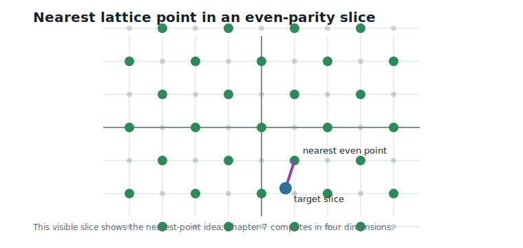
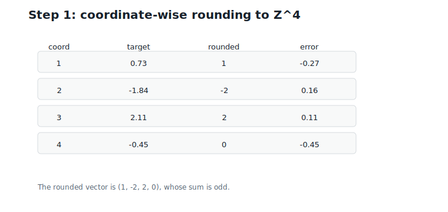
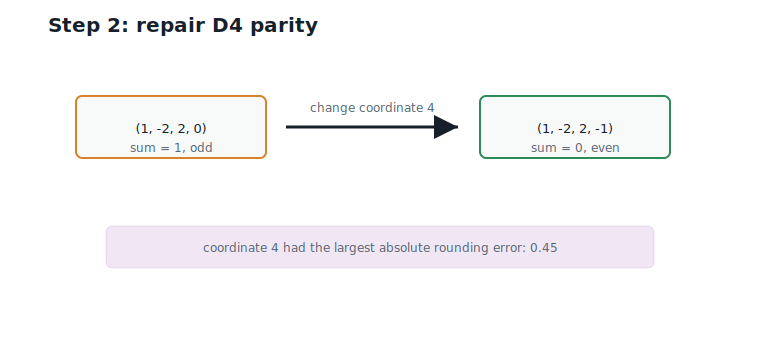
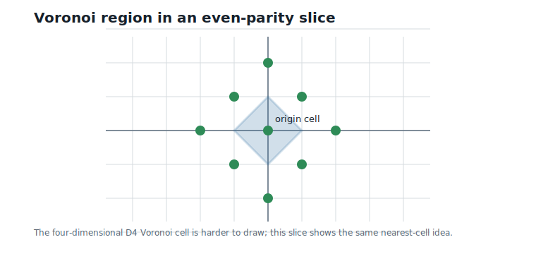
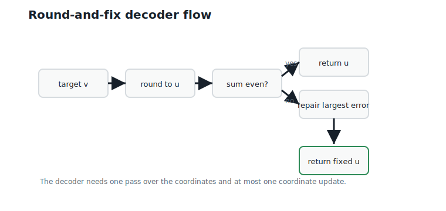

# Nearest Lattice Point Algorithms

**Question.** How do we quantize onto a lattice?

## Learning Objectives

By the end of this chapter, you should be able to:

- state the nearest lattice point problem;
- explain why brute-force search over a lattice is impossible in general;
- decode onto `D4` using round-and-fix logic;
- prove that round-and-fix returns a true nearest point;
- generalize the same decoder to the `D_n` lattice family;
- analyze the time and memory complexity of the decoder;
- implement and test nearest-`D4` decoding.

## Prerequisites

This chapter assumes Euclidean distance, coordinate-wise rounding, parity, and the `D4` lattice from Chapter 6.

## Running Example

The two floating-point weight blocks are:

$$
v_1 = (0.73,\;-1.84,\;2.11,\;-0.45),
\qquad
v_2 = (1.27,\;0.08,\;-2.36,\;3.14).
$$

Interpretation:

- Verbal: these are the two four-coordinate blocks from the running weight vector.
- Geometric: each block is a point in four-dimensional real space.
- Engineering: nearest-`D4` decoding turns each block into a structured integer representative.

Chapter 6 told us how to test whether an integer vector is in `D4`. This chapter solves the next problem:

> Given a real-valued vector, which `D4` point is closest?

## The Nearest Lattice Point Problem

For a lattice $L$, the nearest lattice point problem asks for:

$$
Q_L(v) = \arg\min_{y \in L} \|v - y\|_2.
$$

Interpretation:

- Verbal: find the lattice point $y$ closest to the target vector $v$.
- Geometric: choose the lattice point whose Voronoi cell contains $v$.
- Engineering: this is the encoder for lattice quantization.

For this chapter, $L =$ `D4`, so the problem is:

$$
Q_{D4}(v) = \arg\min_{y \in D4} \|v - y\|_2.
$$

Interpretation:

- Verbal: choose the closest integer vector with even coordinate sum.
- Geometric: snap the target to the nearest `D4` lattice point.
- Engineering: replace a brute-force table search with a structured decoder.

@fig-ch07-nearest-point shows the two-dimensional parity-slice version of the problem.

{#fig-ch07-nearest-point fig-alt="Two-dimensional parity slice with a target point and nearest even-parity lattice point highlighted."}

## Why Brute Force Is Not an Algorithm

A finite codebook has $K$ entries. Brute-force search checks all $K$ entries and stops.

A lattice is infinite. There is no final entry to check.

In a small drawing, we can search a bounded window. But the mathematical object continues forever. A practical lattice quantizer needs a decoder that uses the structure of the lattice.

For `D4`, the useful structure is:

1. `D4` points are integer vectors.
2. Their coordinate sum must be even.

The decoder will use both facts.

## Step 1: Round to $\mathbb{Z}^4$

Ignore the parity condition for a moment. If the allowed lattice were all of $\mathbb{Z}^4$, the nearest point would be found by rounding each coordinate independently.

For the first running block:

$$
v_1 = (0.73,\;-1.84,\;2.11,\;-0.45),
$$

coordinate-wise rounding gives:

$$
u = (1,\;-2,\;2,\;0).
$$

Interpretation:

- Verbal: each coordinate is rounded to its nearest integer.
- Geometric: $v_1$ is snapped to the nearest point of $\mathbb{Z}^4$.
- Engineering: this is the same cheap operation used by scalar rounding.

@fig-ch07-rounding shows this first step.

{#fig-ch07-rounding fig-alt="Coordinate table showing the first running block rounded coordinate by coordinate."}

Now check the sum:

$$
1 + (-2) + 2 + 0 = 1.
$$

Interpretation:

- Verbal: the rounded vector has odd coordinate sum.
- Geometric: the rounded point is on the wrong parity layer.
- Engineering: it is in $\mathbb{Z}^4$, but not in `D4`.

So rounding alone can fail.

## Step 2: Repair Parity

To enter `D4`, the coordinate sum must become even. Changing any one coordinate by $+1$ or $-1$ flips the parity of the sum.

The question is which coordinate should change.

The rounding errors for $v_1$ are:

| Coordinate | Target | Rounded | Error (target $-$ rounded) | Absolute error |
|---:|---:|---:|---:|---:|
| 1 | 0.73 | 1 | -0.27 | 0.27 |
| 2 | -1.84 | -2 | 0.16 | 0.16 |
| 3 | 2.11 | 2 | 0.11 | 0.11 |
| 4 | -0.45 | 0 | -0.45 | 0.45 |

The largest absolute rounding error is coordinate 4. It is the coordinate closest to the other neighboring integer. Since the target coordinate is below 0, move the rounded coordinate from $0$ to $-1$.

This gives:

$$
Q_{D4}(v_1) = (1,\;-2,\;2,\;-1).
$$

Interpretation:

- Verbal: round first, then change coordinate 4 to repair parity.
- Geometric: the corrected point is the nearest even-sum integer vector.
- Engineering: nearest-`D4` decoding costs one rounding pass, one parity check, and one coordinate correction.

@fig-ch07-parity-correction shows the correction step.

{#fig-ch07-parity-correction fig-alt="Diagram showing rounded vector with odd parity corrected by changing coordinate 4."}

The distance is:

$$
\|v_1 - Q_{D4}(v_1)\|_2 = 0.64.
$$

Interpretation:

- Verbal: the nearest `D4` point is about 0.64 units away from the first block.
- Geometric: this is the length of the final quantization error vector.
- Engineering: enforcing `D4` parity costs more error than plain rounding for this block, but gives a structured lattice point.

## When Rounding Already Works

For the second running block:

$$
v_2 = (1.27,\;0.08,\;-2.36,\;3.14),
$$

coordinate-wise rounding gives:

$$
u = (1,\;0,\;-2,\;3).
$$

The coordinate sum is:

$$
1 + 0 + (-2) + 3 = 2.
$$

Interpretation:

- Verbal: the rounded vector already has even coordinate sum.
- Geometric: the nearest $\mathbb{Z}^4$ point is already on the `D4` parity layer.
- Engineering: no correction is needed.

So:

$$
Q_{D4}(v_2) = (1,\;0,\;-2,\;3).
$$

The distance is:

$$
\|v_2 - Q_{D4}(v_2)\|_2 = 0.48.
$$

Interpretation:

- Verbal: the second block decodes to the same representative used in earlier chapters.
- Geometric: it was already nearest to a valid `D4` point after rounding.
- Engineering: many blocks require only rounding and a parity check.

## Why Round-and-Fix Is Exactly Right

The round-and-fix rule may look like a heuristic. It is not: it provably returns a nearest `D4` point. The argument has two parts, and both fit in a few lines.

**Intuition.** A parity repair must change the coordinate sum from odd to even, so *some* coordinate has to move by an odd amount — at least 1. Moving a coordinate to its second-nearest integer is cheapest when that coordinate was already sitting close to the boundary between two integers, which is exactly the coordinate with the largest rounding error. Every additional change only adds cost.

**Argument.** After rounding, coordinate $i$ has error $e_i = v_i - u_i$ with $|e_i| \leq \tfrac{1}{2}$. Moving coordinate $i$ to its other neighboring integer changes its squared error by:

$$
(1 - |e_i|)^2 - |e_i|^2
=
1 - 2|e_i| \;\geq\; 0.
$$

Interpretation:

- Verbal: a flip is cheaper when the coordinate was closer to the other integer.
- Geometric: the coordinate with largest rounding error lies closest to its alternate integer.
- Engineering: choose the largest absolute rounding error to minimize the cost of parity repair.

Now take any candidate $y \in$ `D4` when the rounded point $u$ has odd sum. Since the sums of $y$ and $u$ have different parities, at least one coordinate of $y$ differs from $u$ by an odd amount, and that coordinate alone contributes extra cost at least $1 - 2|e_{\max}|$, where $|e_{\max}|$ is the largest absolute rounding error. Every other changed coordinate contributes additional nonnegative cost, and moves of size 2 or more cost even more than flips. So no candidate beats the single cheapest flip:

$$
\|v - y\|^2 \;\geq\; \|v - u\|^2 + (1 - 2|e_{\max}|).
$$

The flip of the max-error coordinate achieves this bound exactly, so it is optimal. A useful restatement: the nearest `D4` point is always either the nearest integer vector or the *second*-nearest integer vector — and since those two differ by one unit step, they always have opposite parities, so one of them is in `D4`.

This is why the algorithm changes coordinate 4 for $v_1$: its absolute rounding error is 0.45, the largest in the block.

**Ties.** If two coordinates share the largest error — or a coordinate sits exactly halfway between integers — there are two or more equally near `D4` points. That is not a defect: the target lies on a Voronoi cell boundary, exactly the shared boundaries we flagged in Chapter 5. Any choice is a valid nearest point, but an implementation should make the choice *deterministically* (the reference implementation flips the first maximal coordinate), because Chapter 9 will assign stable indices to decoded points, and a nondeterministic encoder would assign different indices to the same input.

## Voronoi View

Every `D4` point has a Voronoi cell: the region of real vectors that decode to that point.

In four dimensions the cells are hard to draw. In the two-dimensional even-parity slice, the cell around the origin is a diamond. Points inside that diamond decode to $(0, 0)$ in the slice.

The true four-dimensional cell of `D4` is worth naming, even without a picture: it is the *24-cell*, a regular four-dimensional solid with 24 faces — one face toward each of the 24 nearest neighbors we counted in Chapter 6 [@conway_sloane_1999]. Its roundness is the geometric substance behind Chapter 6's claim that `D4` quantizes better than the cubic grid.

@fig-ch07-voronoi shows the visible two-dimensional analogue.

{#fig-ch07-voronoi fig-alt="Two-dimensional Voronoi diamond around the origin for the even-parity lattice slice."}

This geometric view will reappear in Chapter 8 when lattice quantization is defined directly through Voronoi cells.

## Generalizing from D4 to Dn

The same parity lattice exists in any dimension:

$$
D_n = \{u \in \mathbb{Z}^n : u_1 + u_2 + \cdots + u_n \text{ is even}\}.
$$

Interpretation:

- Verbal: `D_n` is the integer lattice with even coordinate sum.
- Geometric: it is the same parity idea as `D4`, but in $n$ dimensions.
- Engineering: one decoder works for the whole `D_n` family.

The nearest-`D_n` decoder is:

1. Round every coordinate to the nearest integer.
2. If the rounded sum is even, stop.
3. If the rounded sum is odd, change the coordinate with largest absolute rounding error to its other neighboring integer.

@fig-ch07-decoder-flow summarizes the control flow.

{#fig-ch07-decoder-flow fig-alt="Flow diagram for the nearest Dn round-and-fix decoder."}

This is the first decoder in the book that is genuinely scalable: it does not search an explicit codebook.

## Worked Example

Decode the first running block step by step:

$$
v_1 = (0.73,\;-1.84,\;2.11,\;-0.45).
$$

Round each coordinate:

$$
u = (1,\;-2,\;2,\;0).
$$

Check parity:

$$
1 + (-2) + 2 + 0 = 1,
$$

which is odd. The largest absolute rounding error is coordinate 4:

$$
|-0.45 - 0| = 0.45.
$$

Move coordinate 4 from $0$ to $-1$:

$$
Q_{D4}(v_1) = (1,\;-2,\;2,\;-1).
$$

Decode the second block:

$$
v_2 = (1.27,\;0.08,\;-2.36,\;3.14).
$$

Round:

$$
u = (1,\;0,\;-2,\;3).
$$

Check parity:

$$
1 + 0 + (-2) + 3 = 2,
$$

which is even. Therefore:

$$
Q_{D4}(v_2) = (1,\;0,\;-2,\;3).
$$

The decoded eight-weight vector is:

$$
(1,\;-2,\;2,\;-1,\;1,\;0,\;-2,\;3).
$$

Interpretation:

- Verbal: the first block needed parity repair; the second did not.
- Geometric: both final blocks lie in `D4`.
- Engineering: the running example now has a lattice-decoded weight representation.

## Algorithms

### Algorithm 7.1: Nearest Dn Decoder

**Input:** a real-valued vector $v$ of length $n$.

**Output:** the nearest point in `D_n`.

```text
function nearest_Dn(v):
    u = coordinate-wise round(v)
    if sum(u) is even:
        return u

    j = index of largest absolute value of v[j] - u[j]
    if v[j] >= u[j]:
        u[j] = u[j] + 1
    else:
        u[j] = u[j] - 1
    return u
```

**Complexity and implementation notes:**

| Property | Cost |
|---|---|
| Time | $O(n)$ |
| Memory | $O(n)$ for the rounded output, or $O(1)$ extra if done in place |
| Offline preprocessing | None |
| Online inference cost | One rounding pass, one reduction, and at most one coordinate update |
| Parallelism | Rounding and error computation are coordinate-wise; parity and maximum error are reductions |
| GPU suitability | Excellent for batched vectors |
| SIMD suitability | Excellent for fixed-width blocks such as `D4` |
| Possible optimization | Fuse rounding, parity, and max-error tracking in one pass |

**Language note.** "Round to the nearest integer" hides a convention for exact halves, and languages disagree: Python's built-in `round` (and NumPy) round halves to the nearest *even* integer, while C's `round` rounds halves away from zero. The reference implementation uses `floor(v + 0.5)` — halves round up — and breaks max-error ties by taking the first maximal coordinate. Any consistent convention returns a valid nearest point, because halves and tied errors are exactly the Voronoi boundary cases; what matters is that every implementation in a pipeline uses the *same* convention, so the same input always encodes to the same lattice point.

### Algorithm 7.2: Nearest D4 Decoder

**Input:** a real-valued vector $v$ of length 4.

**Output:** the nearest point in `D4`.

```text
function nearest_D4(v):
    require length(v) = 4
    return nearest_Dn(v)
```

**Complexity and implementation notes:**

| Property | Cost |
|---|---|
| Time | $O(1)$ for fixed dimension 4 |
| Memory | $O(1)$ |
| Offline preprocessing | None |
| Online inference cost | Four rounds, one parity sum, one max over four errors |
| Parallelism | Excellent across blocks |
| GPU suitability | Excellent |
| SIMD suitability | Excellent; one SIMD register can hold a block |
| Possible optimization | Hard-code the four-coordinate parity repair path |

The executable reference implementation is in `code/python/chapter_07_nearest_lattice.py`.

## Engineering Insight

Nearest-`D4` decoding is the moment when a lattice becomes practical for quantization. Before this chapter, `D4` was a structured infinite set. After this chapter, it is a computable quantizer: any real four-dimensional block can be mapped to a nearby `D4` point in constant time.

The contrast with classical vector quantization is sharp. A 256-entry codebook search costs $O(Kd)$. Nearest-`D4` decoding for fixed block size costs $O(1)$ and stores no explicit codebook. This is why structured lattices are attractive for efficient inference.

The tradeoff is that `D4` is infinite. Chapters 8 and 9 will separate two questions that are often confused: nearest lattice quantization controls distortion, but finite quotient codebooks control bit rate.

## Historical Note and Further Reading

Nearest-lattice-point algorithms are central to lattice quantization and decoding. The `D_n` round-and-fix decoder is a classical example of how lattice structure turns an infinite nearest-neighbor problem into a linear-time computation. Standard lattice references include @conway_sloane_1999.

## Exercises

### Conceptual Exercises

1. Why does coordinate-wise rounding solve nearest-point decoding for $\mathbb{Z}^d$?
2. Why can coordinate-wise rounding fail for `D4`?
3. Why does changing one coordinate repair parity?
4. Why can the nearest `D4` point never require changing two coordinates of the rounded vector?

### Worked Numerical Exercises

1. Decode $(0.2,\;0.4,\;0.6,\;0.8)$ onto `D4`.
2. Decode $(2.49,\;-1.51,\;0.52,\;0.48)$ onto `D4`. Watch for a tie: how many equally near `D4` points does this target have?
3. For $v_1$, verify that changing coordinate 4 gives a smaller error than changing coordinate 1.

### Programming Exercises

1. Run `python code/python/chapter_07_nearest_lattice.py` and confirm the decoded running blocks.
2. Add a brute-force bounded verifier for random four-dimensional test vectors.
3. Modify the decoder to return the rounded vector, the repaired coordinate, and the final point.

### Research Questions

1. How does the cost of nearest-`D4` decoding compare with searching a 256-entry codebook on real hardware?
2. What changes when nearest-point decoding must support thousands of blocks in parallel?
3. Why does finite bit rate require more than nearest lattice decoding?

## Common Mistakes

- Searching a large bounded window and mistaking it for a lattice decoder.
- Repairing parity before coordinate-wise rounding.
- Changing the smallest rounding error instead of the largest.
- Mixing rounding conventions between implementations, so the same input encodes differently.
- Forgetting that nearest lattice decoding controls distortion, not bit rate.

## Summary

Nearest-`D4` decoding uses the structure of `D4`: round to $\mathbb{Z}^4$, check the coordinate-sum parity, and if needed repair the coordinate with the largest rounding error. The repair is provably optimal: the nearest `D4` point is always the nearest or second-nearest integer vector. The same idea generalizes to `D_n` and runs in $O(n)$ time.

For the running example, the two blocks decode to $(1, -2, 2, -1)$ and $(1, 0, -2, 3)$. The first block needed parity repair; the second did not.

## Preview of Next Chapter

Next we use this decoder to define lattice vector quantization. We will see how nearest lattice points, Voronoi cells, and scaling turn an infinite lattice into a quantizer, and why this still does not give a finite bit rate.
