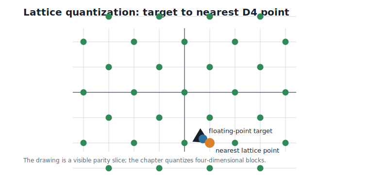
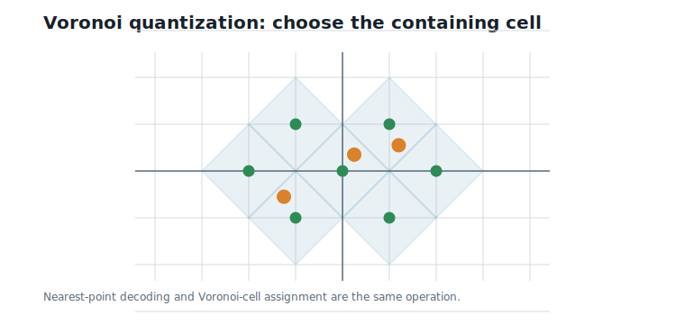
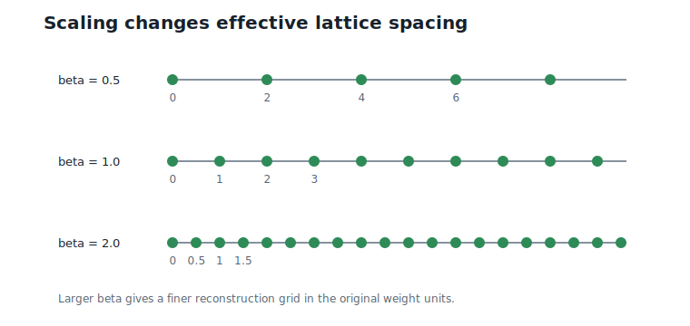
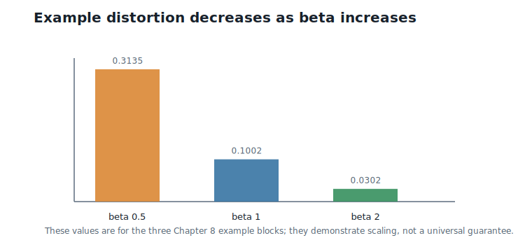
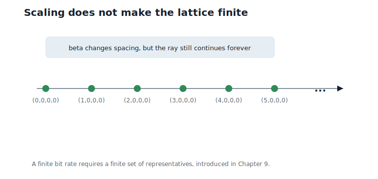

# Lattice Vector Quantization

**Question.** How can an infinite lattice become a practical vector quantizer?

## Learning Objectives

By the end of this chapter, you should be able to:

- explain lattice quantization as nearest-point decoding followed by reconstruction;
- describe Voronoi quantization geometrically;
- use a scaling factor to trade off distortion against lattice spacing;
- distinguish granular distortion from overload distortion;
- explain why scaling alone does not create a finite codebook;
- implement scaled nearest-`D4` lattice quantization.

## Prerequisites

This chapter assumes classical vector quantization from Chapter 4, lattice structure from Chapter 5, the `D4` membership rule from Chapter 6, and nearest-`D4` decoding from Chapter 7.

## Running Example

The running weight vector still contains two `D4` blocks:

$$
v_1 = (0.73,\;-1.84,\;2.11,\;-0.45),
\qquad
v_2 = (1.27,\;0.08,\;-2.36,\;3.14).
$$

Interpretation:

- Verbal: these are the same two four-coordinate weight blocks used in Chapters 4 through 7.
- Geometric: each block is a point in four-dimensional real space.
- Engineering: each block will be mapped to a nearby lattice point and then reconstructed.

This chapter also uses one diagnostic block:

$$
v_3 = (0.38,\;-0.62,\;1.49,\;-1.11).
$$

Interpretation:

- Verbal: this third block gives one more scaling example without changing the lattice.
- Geometric: it is another target point for the same `D4` quantizer.
- Engineering: it helps test that the implementation handles more than the two running weight blocks.

The key question is not whether `D4` can quantize a vector. Chapter 7 already showed that it can. The key question is what the quantizer means as a compression method.

## Review: Classical Vector Quantization

Classical vector quantization starts with a finite codebook $C$.

For a target block $v$, the encoder searches:

$$
b = \arg\min_j \|v - c_j\|_2.
$$

Interpretation:

- Verbal: choose the index of the closest codeword.
- Geometric: choose the finite codebook point whose cell contains $v$.
- Engineering: the stored representation is the index $b$, not the full vector.

The decoder returns:

$$
c_b.
$$

Interpretation:

- Verbal: the index points back to one stored codeword.
- Geometric: the reconstruction is one of finitely many points.
- Engineering: bit rate is fixed because the codebook has a fixed number of entries.

This is why a 256-entry four-dimensional codebook costs 8 bits per block, or 2 bits per weight. The codebook is finite before any data is encoded.

## The Failed Shortcut: Use the Whole Lattice

A lattice looks attractive because it gives a huge structured codebook without storing every codeword. For `D4`, Chapter 7 gave a fast decoder:

$$
Q_{D4}(v) = \arg\min_{y \in D4} \|v - y\|_2.
$$

Interpretation:

- Verbal: choose the closest `D4` point to $v$.
- Geometric: snap $v$ to the nearest even-sum integer point.
- Engineering: no explicit finite table is needed to perform nearest-neighbor encoding.

@fig-ch08-lattice-quantizer shows the basic mapping.

{#fig-ch08-lattice-quantizer fig-alt="A target point is mapped by an arrow to the nearest even-parity lattice point."}

For the first running block, Chapter 7 computed:

$$
Q_{D4}(v_1) = (1,\;-2,\;2,\;-1).
$$

Interpretation:

- Verbal: the closest `D4` point to the first block is $(1, -2, 2, -1)$.
- Geometric: the block lies in that lattice point's Voronoi cell.
- Engineering: decoding costs a few arithmetic operations instead of a table search.

This is useful, but it is not yet a compression scheme. The set `D4` is infinite. A point such as $(1000000, 0, 0, 0)$ is just as much a `D4` point as $(0, 0, 0, 0)$.

## Lattice Quantization

The lattice quantizer is the operation:

$$
v \longmapsto Q_L(v).
$$

Interpretation:

- Verbal: replace $v$ by the nearest lattice point.
- Geometric: partition space into Voronoi cells around lattice points.
- Engineering: the encoder is a nearest-lattice decoder.

For `D4`, the output is always an integer vector with even coordinate sum. That makes the reconstruction structured, but not finite.

The complete unscaled `D4` results for the three Chapter 8 blocks are:

| Block | Target | $Q_{D4}(v)$ | Distance |
|---:|---|---|---:|
| 1 | $(0.73, -1.84, 2.11, -0.45)$ | $(1, -2, 2, -1)$ | 0.6427 |
| 2 | $(1.27, 0.08, -2.36, 3.14)$ | $(1, 0, -2, 3)$ | 0.4780 |
| 3 | $(0.38, -0.62, 1.49, -1.11)$ | $(0, -1, 2, -1)$ | 0.7490 |

These distances measure distortion. They do not measure bit rate.

## Voronoi Quantization

A Voronoi cell of a lattice point contains all targets closer to that point than to any other lattice point. Quantization can therefore be described in two equivalent ways:

1. Find the nearest lattice point.
2. Find the Voronoi cell containing the target.

For the origin, the Voronoi cell is:

$$
V = \{v : \|v\|_2 \leq \|v - y\|_2 \text{ for every } y \in L\}.
$$

Interpretation:

- Verbal: $V$ is the set of points closer to the origin than to any other lattice point.
- Geometric: copies of $V$ tile space around every lattice point.
- Engineering: nearest-lattice decoding is equivalent to choosing one cell in this tiling.

@fig-ch08-voronoi-partition shows this cell view in a two-dimensional parity slice.

{#fig-ch08-voronoi-partition fig-alt="A two-dimensional parity-slice lattice with diamond Voronoi cells and target points inside cells."}

This geometric description is important because later quotient codebooks will reuse the origin cell $V$ to select a finite set of representatives.

## Scaling

The unscaled lattice has spacing one in lattice coordinates. Neural-network weights are not naturally spaced one unit apart. They might be small, wide, heavy-tailed, or layer-dependent.

Scaling adapts the lattice to the weight scale. In this book we use:

$$
\text{reconstruction} = \frac{1}{\beta} Q_L(\beta v).
$$

Interpretation:

- Verbal: multiply the target by $\beta$, decode on the original lattice, then divide the lattice point by $\beta$.
- Geometric: in the original weight space, this is the same as using a lattice whose spacing has been divided by $\beta$.
- Engineering: larger $\beta$ gives finer steps and usually lower granular distortion.

@fig-ch08-scaled-lattice shows how changing $\beta$ changes the effective grid in weight space.

{#fig-ch08-scaled-lattice fig-alt="Three one-dimensional grids showing coarse, baseline, and fine lattice spacing for different beta values."}

For $\beta = 2$, the first block is processed as:

$$
\beta v_1 = (1.46,\;-3.68,\;4.22,\;-0.90).
$$

Interpretation:

- Verbal: the target is doubled before nearest-`D4` decoding.
- Geometric: doubling the target is equivalent to using a half-spaced lattice in the original coordinates.
- Engineering: the decoder still receives an ordinary `D4` nearest-point problem.

Nearest-`D4` decoding gives:

$$
Q_{D4}(\beta v_1) = (1,\;-4,\;4,\;-1).
$$

Interpretation:

- Verbal: the closest `D4` point to the scaled target is $(1, -4, 4, -1)$.
- Geometric: this is the lattice point in scaled space.
- Engineering: this is the integer representative the decoder computes.

Then reconstruct in the original scale:

$$
\frac{1}{2}(1,\;-4,\;4,\;-1) = (0.5,\;-2.0,\;2.0,\;-0.5).
$$

Interpretation:

- Verbal: divide the lattice point by $2$ to return to weight units.
- Geometric: the reconstructed point lies on the half-spaced `D4` lattice.
- Engineering: finer spacing reduces the squared error of this block from $0.4131$ to $0.0931$.

## Coarse, Baseline, and Fine Scaling

The following table quantizes the same three targets with three scale values.

| $\beta$ | Block 1 reconstruction | Block 2 reconstruction | Block 3 reconstruction | Mean squared error |
|---:|---|---|---|---:|
| 0.5 | $(0, -2, 2, 0)$ | $(2, 0, -2, 4)$ | $(0, 0, 2, -2)$ | 0.3135 |
| 1.0 | $(1, -2, 2, -1)$ | $(1, 0, -2, 3)$ | $(0, -1, 2, -1)$ | 0.1002 |
| 2.0 | $(0.5, -2, 2, -0.5)$ | $(1.5, 0, -2.5, 3)$ | $(0, -0.5, 1.5, -1)$ | 0.0302 |

The trend is exactly what we expect:

- $\beta = 0.5$ creates a coarse lattice in weight space and has the largest error.
- $\beta = 1.0$ is the unscaled lattice from Chapter 7.
- $\beta = 2.0$ creates a finer lattice and has lower error on these blocks.

One entry in this table quietly exercises Chapter 7's tie rule. At $\beta = 2$, block 3 becomes $(0.76, -1.24, 2.98, -2.22)$, which rounds to $(1, -1, 3, -2)$ with odd sum — and coordinates 1 and 2 *tie* for the largest rounding error, $0.24$ each. Flipping either one gives an equally near `D4` point; the reference decoder's first-index rule picks coordinate 1, which is why the table shows $(0, -0.5, 1.5, -1)$ rather than the equally valid $(0.5, -1, 1.5, -1)$. Deterministic tie-breaking is what makes this table reproducible.

@fig-ch08-coarse-fine compares the errors visually.

{#fig-ch08-coarse-fine fig-alt="Bar chart showing mean squared error decreasing as beta increases from 0.5 to 2."}

## Granular Distortion and Overload Distortion

Scaling creates two different error regimes.

Granular distortion is the normal rounding error inside the region the quantizer is designed to cover. If the lattice spacing is too coarse, nearby targets collapse to the same reconstruction.

Overload distortion appears when the actual target lies outside the range a finite representation can handle.

An infinite lattice has no overload by itself: it extends forever. But a practical code must eventually store a finite index, and finite indices cover only a finite set of representatives. That is when overload appears.

This distinction matters:

- Scaling an infinite lattice changes granular distortion.
- Finite indexing creates the possibility of overload.
- A real quantizer must manage both.

The table above therefore tells only half the story. On this infinite lattice, raising $\beta$ helps monotonically. Once the codebook is finite, it will cover a bounded region in *scaled* coordinates — so raising $\beta$ also pushes scaled targets $\beta v$ toward the boundary of that region. Granular error shrinks while overload risk grows, the total error becomes U-shaped in $\beta$, and choosing the scale becomes a calibration problem. Chapter 9 makes the finite region explicit, Chapter 10 shows an overloaded block up close, and Chapter 13 turns the choice of $\beta$ into a measured procedure.

## Scaling Does Not Make the Codebook Finite

It is tempting to think that a good scale value solves the problem. It does not.

For any positive $\beta$, the scaled reconstruction set is:

$$
\left\{\frac{1}{\beta} y : y \in L \right\}.
$$

Interpretation:

- Verbal: every lattice point still gives one reconstruction point after dividing by $\beta$.
- Geometric: scaling changes spacing, but the grid still extends without end.
- Engineering: there are still infinitely many possible outputs and therefore no fixed bit rate.

For example, with $L =$ `D4`, all of these are valid reconstructed points when $\beta = 2$:

$$
(0,0,0,0),\quad (1,0,0,0),\quad (2,0,0,0),\quad (3,0,0,0),\quad \ldots
$$

Interpretation:

- Verbal: the list can continue forever.
- Geometric: these points lie along one ray of the scaled lattice.
- Engineering: a finite number of bits cannot index an infinite list without another rule.

@fig-ch08-infinite-scaled shows this failure mode directly.

{#fig-ch08-infinite-scaled fig-alt="A one-dimensional scaled lattice ray with points continuing beyond the drawn region."}

This is the bridge to quotient groups. Scaling controls distortion. Quotients control the number of codewords.

## Worked Example

Quantize the first running block with $\beta = 2$.

Start with:

$$
v_1 = (0.73,\;-1.84,\;2.11,\;-0.45).
$$

Scale:

$$
2v_1 = (1.46,\;-3.68,\;4.22,\;-0.90).
$$

Decode onto `D4`:

$$
Q_{D4}(2v_1) = (1,\;-4,\;4,\;-1).
$$

Divide by the scale:

$$
\frac{1}{2} Q_{D4}(2v_1) = (0.5,\;-2.0,\;2.0,\;-0.5).
$$

The squared error is:

$$
(0.73 - 0.5)^2 + (-1.84 + 2.0)^2 + (2.11 - 2.0)^2 + (-0.45 + 0.5)^2 = 0.0931.
$$

Interpretation:

- Verbal: finer scaling gives a reconstruction closer to the original block.
- Geometric: the target is closer to a half-spaced lattice point than to the unscaled integer lattice point.
- Engineering: this is a distortion improvement, not a bit-rate guarantee.

For the two running weight blocks, $\beta = 2$ reconstructs:

$$
(0.5,\;-2.0,\;2.0,\;-0.5,\;1.5,\;0.0,\;-2.5,\;3.0).
$$

Interpretation:

- Verbal: each four-coordinate block is quantized independently.
- Geometric: both blocks lie on the scaled `D4` lattice in weight space.
- Engineering: the implementation can process blocks independently and concatenate reconstructions.

## Algorithms

### Algorithm 8.1: Scaled Nearest-Lattice Quantization

**Input:** a target vector $v$, a lattice $L$, a positive scale $\beta$, and a nearest-lattice decoder for $L$.

**Output:** a reconstructed vector.

```text
function scaled_lattice_quantize(v, beta):
    require beta > 0
    scaled_target = beta * v
    lattice_point = nearest_lattice_decode(scaled_target)
    reconstruction = lattice_point / beta
    return reconstruction
```

**Complexity and implementation notes:**

| Property | Cost |
|---|---|
| Time | Cost of nearest-lattice decoding plus two coordinate-wise scaling passes |
| Memory | $O(d)$ for the reconstruction, or $O(1)$ extra if done in place |
| Offline preprocessing | None for an infinite lattice quantizer |
| Online inference cost | Scale, decode, inverse scale |
| Parallelism | Coordinate scaling is embarrassingly parallel; decoding is block-local |
| GPU suitability | Good for batched blocks |
| SIMD suitability | Good for fixed-width `D4` blocks |
| Possible optimization | Fold $\beta$ into layer or group scale metadata and fuse scaling with loads |

### Algorithm 8.2: Blockwise Scaled D4 Quantization

**Input:** a sequence of four-dimensional weight blocks and a positive scale $\beta$.

**Output:** reconstructed blocks on the scaled `D4` lattice.

```text
function quantize_D4_blocks(blocks, beta):
    outputs = []
    for block in blocks:
        outputs.append(scaled_lattice_quantize(block, beta))
    return outputs
```

**Complexity and implementation notes:**

| Property | Cost |
|---|---|
| Time | $O(Bd)$ for $B$ blocks of dimension $d = 4$; fixed `D4` decoding is constant per block |
| Memory | $O(Bd)$ for output blocks |
| Offline preprocessing | None |
| Online inference cost | One nearest-`D4` decode per block |
| Parallelism | Excellent across blocks |
| GPU suitability | Excellent when many blocks are processed together |
| SIMD suitability | Excellent; one block fits naturally in SIMD lanes |
| Possible optimization | Batch scale values by group to reduce metadata loads |

The executable reference implementation is in `code/python/chapter_08_lattice_quantization.py`.

## Engineering Insight

Lattice vector quantization separates two ideas that are often conflated.

The nearest-lattice decoder controls distortion. It answers: "Which reconstruction is closest?"

The representation controls bit rate. It answers: "How many different reconstructions can be indexed?"

Scaling belongs to the first question. It changes the spacing of the effective lattice, so it changes granular distortion. But it does not change the fact that the lattice has infinitely many points. A scaled infinite lattice is still infinite.

This is why Chapter 9 is necessary. To get fixed-rate compression, we must choose a finite set of representatives and assign stable indices. That requires quotient groups, not just scaling.

## Historical Note and Further Reading

Lattice quantization and Voronoi regions are classical topics in quantization and lattice coding; @conway_sloane_1999 provides the standard geometric background for lattices, while vector quantization texts such as @gersho_gray_1992 emphasize the finite-codebook viewpoint. The machine-learning issue is the interaction between these views: structured nearest-neighbor decoding is useful only after the representation is made finite enough for hardware inference.

## Exercises

### Conceptual Exercises

1. Why does nearest-lattice decoding control distortion but not bit rate?
2. What changes geometrically when $\beta$ increases?
3. Why does an infinite lattice have no overload distortion until a finite representation is imposed?

### Worked Numerical Exercises

1. Quantize $(0.2,\;0.4,\;0.6,\;0.8)$ with `D4` using $\beta = 1$.
2. Repeat the previous exercise with $\beta = 2$.
3. For the first running block, verify the squared error $0.0931$ at $\beta = 2$.
4. For block 3 at $\beta = 2$, find the tied coordinates and write down both equally near reconstructions.

### Programming Exercises

1. Run `python code/python/chapter_08_lattice_quantization.py` and confirm the three-scale distortion table.
2. Add another scale value and check whether the mean squared error decreases for the three example blocks.
3. Modify the script to support one scale per block instead of one shared scale.

### Research Questions

1. How should $\beta$ be chosen for a real weight matrix with outliers?
2. When does finer scaling stop improving task-level quality?
3. How does per-group scaling interact with lookup-table reuse in later Hierarchical Nested Lattice Quantization (HNLQ) inference?

## Common Mistakes

- Treating a lattice point as a finite codebook index.
- Assuming that a larger $\beta$ always improves a model, even when finite indexing later introduces overload.
- Forgetting to divide by $\beta$ after decoding the scaled target.
- Confusing Voronoi quantization with a stored Voronoi diagram.
- Believing that scaling makes an infinite lattice finite.

## Summary

Lattice vector quantization maps a target block to a nearest lattice point. Voronoi cells describe the same operation geometrically. Scaling uses $Q_L(\beta v) / \beta$ to control the effective lattice spacing and therefore the distortion.

For the Chapter 8 examples, increasing $\beta$ from $0.5$ to $2.0$ reduces mean squared error from $0.3135$ to $0.0302$. But the scaled lattice is still infinite, so scaling alone does not provide a finite bit rate — and once Chapter 9 imposes a finite codebook, raising $\beta$ will no longer be free.

## Preview of Next Chapter

Next we make the infinite lattice finite. Quotient groups will turn `D4` with $q = 2$ into exactly 16 stable codewords, each with a deterministic index.
