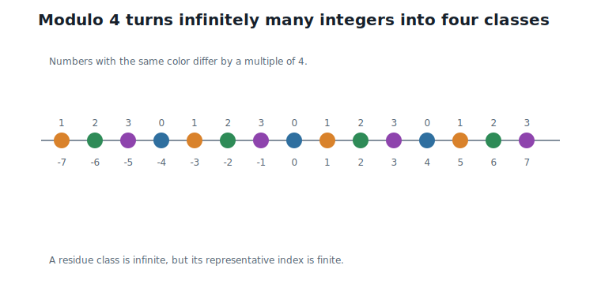
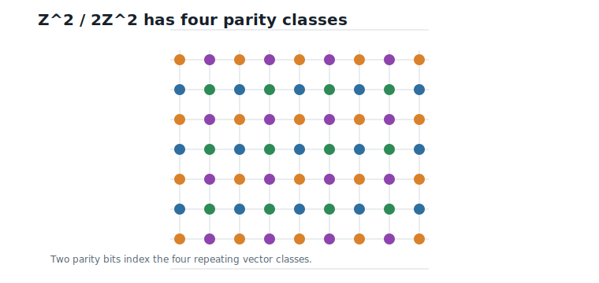
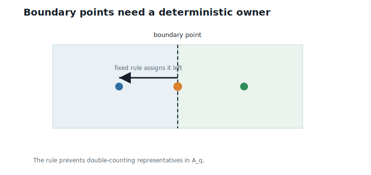
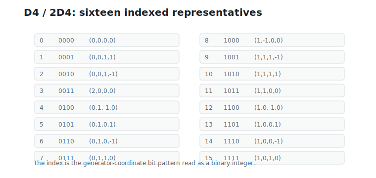
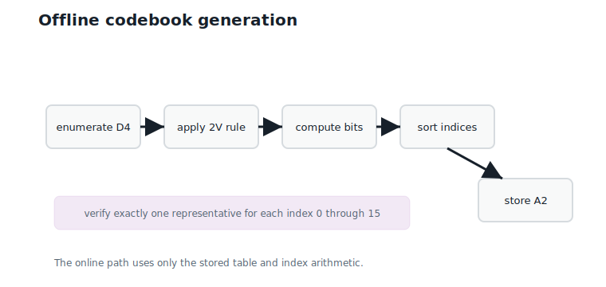

# Quotient Groups and Finite Codebooks

**Question.** How can infinitely many lattice points become exactly 16 or 256 codewords?

## Learning Objectives

By the end of this chapter, you should be able to:

- explain why scaling does not create a finite codebook;
- use cosets to group infinitely many lattice points into finitely many classes;
- construct $D4/2D4$ and count its 16 classes;
- choose deterministic representatives for those classes;
- build the finite Hierarchical Nested Lattice Quantization (HNLQ) codebook $A_q$;
- assign stable codebook indices for offline lookup.

## Prerequisites

This chapter assumes modulo arithmetic from Chapter 2, finite codebooks from Chapter 4, the `D4` lattice from Chapter 6, and lattice quantization from Chapter 8.

## Running Example

The running lattice is still `D4`, the dimension is still $d = 4$, and the quotient radix is:

$$
q = 2.
$$

Interpretation:

- Verbal: we will group `D4` points by differences that are multiples of 2.
- Geometric: the coarse lattice $2D4$ is a wider copy of `D4`.
- Engineering: $q = 2$ should produce $2^4 = 16$ codewords for each four-dimensional block.

The goal is to construct the complete finite codebook:

$$
A_2 = D4 \cap 2V.
$$

Interpretation:

- Verbal: keep the `D4` points that lie inside the doubled origin Voronoi region.
- Geometric: choose one compact representative from each $D4/2D4$ class.
- Engineering: these representatives become the finite codewords stored in an offline table.

By the end of the chapter, every codeword has a deterministic index from 0 to 15.

## Why Chapter 8 Was Not Enough

Chapter 8 gave the scaled lattice quantizer:

$$
\text{reconstruction} = \frac{1}{\beta}Q_L(\beta v).
$$

Scaling changes the effective step size and therefore the distortion — Chapter 8's whole story.

But the scaled reconstruction set is still infinite:

$$
\left\{\frac{1}{\beta}y : y \in L\right\}.
$$

The grid spacing changes, but the grid never ends: no finite number of bits can index this set directly.

To get fixed-rate coding, we must group infinitely many lattice points into finitely many classes.

## Start With Integers

Modulo arithmetic already solved this problem for integers.

The integers are infinite:

$$
\mathbb{Z} = \{\ldots,-2,-1,0,1,2,\ldots\}.
$$

Storing an arbitrary integer needs an unbounded number of bits unless we restrict or group it.

Modulo 4 groups all integers into four classes:

$$
\mathbb{Z}/4\mathbb{Z} = \{0,1,2,3\}.
$$

The infinite number line folds into four repeating positions, and a remainder modulo 4 costs exactly 2 bits.

@fig-ch09-integer-cosets shows this fold.

{#fig-ch09-integer-cosets fig-alt="Integer number line colored by residue classes modulo 4."}

The class containing 1 is:

$$
1 + 4\mathbb{Z} = \{\ldots,-7,-3,1,5,9,\ldots\}.
$$

One stored index now represents infinitely many possible original integers — the pattern we need for lattices.

This is the pattern we need for lattices.

## Vector Cosets

For integer vectors, the same idea applies coordinate by coordinate. In two dimensions, reducing modulo 2 gives:

$$
\mathbb{Z}^2 / 2\mathbb{Z}^2.
$$

Two integer vectors are equivalent if they differ by an even vector; two parity bits index the four classes.

@fig-ch09-vector-cosets shows the four classes.

{#fig-ch09-vector-cosets fig-alt="Integer grid points colored by their two coordinate parities modulo 2."}

The four representatives can be:

$$
(0,0),\quad (0,1),\quad (1,0),\quad (1,1).
$$

A finite table of four representatives replaces an infinite grid.

This is already a quotient codebook.

## From Z4 to D4

`D4` is not all of $\mathbb{Z}^4$. It is the even-sum integer lattice:

$$
D4 = \{u \in \mathbb{Z}^4 : u_1 + u_2 + u_3 + u_4 \text{ is even}\}.
$$

This is Chapter 6's lattice; every codeword we build must satisfy the even-sum rule.

The coarse lattice $2D4$ is:

$$
2D4 = \{2u : u \in D4\}.
$$

Doubling every `D4` point creates a wider sublattice inside `D4`; differences in $2D4$ will be treated as belonging to the same class.

Now we group `D4` by $2D4$. Two points are equivalent if their difference lies in $2D4$:

$$
a \sim b
\quad\text{when}\quad
a - b \in 2D4.
$$

Two points share a class when the coarse lattice can move one to the other; every class will need one stored representative and one index.

The quotient is written:

$$
D4 / 2D4.
$$

Interpretation:

- Verbal: this is the set of equivalence classes of `D4` points modulo $2D4$.
- Geometric: it is one fundamental period of the `D4` lattice under coarse-lattice shifts.
- Engineering: it is the finite codebook shape used by the $q = 2$ HNLQ level.

## Why There Are Sixteen Classes

Chapter 6 gave a generator matrix for `D4`. A `D4` point can be written as:

$$
u = Gz.
$$

The generator basis gives every lattice point integer coordinates, and coordinates give an easy indexing rule.

Modulo $2D4$, only the parity of the four generator coefficients matters:

$$
z \bmod 2 \in \{0,1\}^4.
$$

Interpretation:

- Verbal: each of the four generator coefficients has two possible residues.
- Geometric: the coarse lattice $2D4$ forgets how many full pairs of generator steps were taken.
- Engineering: four bits give $2^4 = 16$ possible quotient classes.

Therefore:

$$
|D4 / 2D4| = 16.
$$

Interpretation:

- Verbal: the infinite lattice collapses into 16 classes.
- Geometric: one period of `D4` under $2D4$ contains 16 representatives.
- Engineering: one codebook index costs exactly 4 bits per four-dimensional block, or 1 bit per weight.

This is the first fixed-rate lattice codebook in the book.

## Representatives

A quotient class is not a single vector. It is an infinite set of vectors. To build a codebook, we choose one representative from each class.

Representatives must be deterministic. If index 13 means one vector today and another vector tomorrow, a stored model becomes unreadable.

For Hierarchical Nested Lattice Quantization, the finite level codebook is:

$$
A_q = L \cap qV.
$$

Interpretation:

- Verbal: keep lattice points inside the scaled origin Voronoi cell.
- Geometric: choose compact representatives around the origin.
- Engineering: this produces a small table that can be reused across blocks and hierarchy levels.

Read the display with care: taken literally, with the closed region, $D4 \cap 2V$ contains *more* than 16 points, because boundary points shared between neighboring cells appear for several classes at once. The set becomes a 16-entry codebook only after a rule picks one point per class.

Boundary points therefore require a rule. In this book, a representative is chosen as follows: first consider all lattice points in the closed region $qV$; within each quotient class, choose a minimum-norm point; if several points tie, choose the lexicographically largest vector.

The class with index 3 shows the rule earning its keep. That class contains all eight vectors of the form $(\pm 2, 0, 0, 0)$, $(0, \pm 2, 0, 0)$, $(0, 0, \pm 2, 0)$, $(0, 0, 0, \pm 2)$ — every one of them has norm 2, and every one of them sits exactly on the boundary of $2V$, equidistant between the origin and a neighboring $2D4$ point. Minimum norm alone cannot separate them; the lexicographic rule picks $(2, 0, 0, 0)$, and it will pick the same vector next year.

This is the same discipline Chapter 7 applied to nearest-point ties, now promoted from the encoder to the codebook itself: whenever geometry offers several equally valid answers, a deployed system must fix one by rule.

@fig-ch09-boundary-rule illustrates why the rule is needed.

{#fig-ch09-boundary-rule fig-alt="Two neighboring cells share a boundary, with a boundary point assigned by a fixed arrow to one side."}

This rule is not decoration. Without it, a boundary point could be counted twice or not counted consistently.

## The Complete D4, q = 2 Codebook

For the running example:

$$
A_2 = D4 \cap 2V.
$$

Interpretation:

- Verbal: these are the `D4` representatives in the doubled origin cell.
- Geometric: they form one compact period of `D4` modulo $2D4$.
- Engineering: this is the 16-entry finite codebook used by the $q = 2$ level.

The stable index is the four-bit parity of the generator coefficients, read as a binary number.

| Index $b$ | Generator-coordinate bits | Representative $c_b$ |
|---:|---|---|
| 0 | `0000` | $(0, 0, 0, 0)$ |
| 1 | `0001` | $(0, 0, 1, 1)$ |
| 2 | `0010` | $(0, 0, 1, -1)$ |
| 3 | `0011` | $(2, 0, 0, 0)$ |
| 4 | `0100` | $(0, 1, -1, 0)$ |
| 5 | `0101` | $(0, 1, 0, 1)$ |
| 6 | `0110` | $(0, 1, 0, -1)$ |
| 7 | `0111` | $(0, 1, 1, 0)$ |
| 8 | `1000` | $(1, -1, 0, 0)$ |
| 9 | `1001` | $(1, 1, 1, -1)$ |
| 10 | `1010` | $(1, 1, 1, 1)$ |
| 11 | `1011` | $(1, 1, 0, 0)$ |
| 12 | `1100` | $(1, 0, -1, 0)$ |
| 13 | `1101` | $(1, 0, 0, 1)$ |
| 14 | `1110` | $(1, 0, 0, -1)$ |
| 15 | `1111` | $(1, 0, 1, 0)$ |

@fig-ch09-d4-representatives summarizes the same table visually.

{#fig-ch09-d4-representatives fig-alt="A compact table of sixteen D4 quotient representatives with indices from 0 to 15."}

Every entry has even coordinate sum. Every pair of entries belongs to a different coset modulo $2D4$. There are exactly 16 entries.

## Reducing a Lattice Point to an Index

Suppose Chapter 7 decodes the first running block to:

$$
y_1 = (1,\;-2,\;2,\;-1).
$$

This is the nearest `D4` point for the first weight block — one point in the infinite lattice, not yet a finite index.

The generator coefficients for this point are:

$$
z = (1,\;-1,\;1,\;0).
$$

These are the integer coordinates of $y_1$ in the generator basis; their parities determine the quotient codebook index.

Modulo 2, the coefficient bits are:

$$
z \bmod 2 = (1,\;1,\;1,\;0).
$$

Negative odd coefficients become residue 1, and the bit pattern `1110` is index 14.

So the finite representative is:

$$
c_{14} = (1,\;0,\;0,\;-1).
$$

Interpretation:

- Verbal: $c_{14}$ is the compact representative of the same quotient class.
- Geometric: the difference between $y_1$ and $c_{14}$ is a $2D4$ shift.
- Engineering: storing index 14 is enough to identify the class.

Check the difference:

$$
y_1 - c_{14} = (0,\;-2,\;2,\;0) \in 2D4.
$$

The decoded lattice point and its representative differ by a coarse-lattice point: the quotient index has discarded the coarse location, exactly as designed.

For the second decoded block:

$$
y_2 = (1,\;0,\;-2,\;3)
$$

reduces to index 13 with representative:

$$
c_{13} = (1,\;0,\;0,\;1).
$$

The two running blocks map to different quotient indices — this is how an infinite lattice point becomes a finite symbol.

## Offline Enumeration

The codebook is generated once and reused many times.

The offline procedure is:

1. Enumerate candidate `D4` points in a small search window.
2. Keep only points in the closed region $2V$.
3. Compute each point's generator-coordinate parity bits.
4. Sort by the resulting index.
5. Verify that indices 0 through 15 appear exactly once.

@fig-ch09-offline-enumeration shows the flow.

{#fig-ch09-offline-enumeration fig-alt="Flow diagram from D4 enumeration through boundary rule and index assignment to a stored codebook table."}

This table is now identical in form to a classical finite codebook: index in, representative out.

The difference is how the table was constructed. Classical vector quantization usually learns or chooses arbitrary codewords. Here, quotient structure guarantees the count and the indexing rule.

## Nearest Representative Search

Once $A_2$ is a finite codebook, we can also search it directly:

$$
b = \arg\min_j \|v - c_j\|_2.
$$

This is ordinary finite-codebook nearest-neighbor search; for 16 entries, brute force is cheap.

This search and quotient reduction answer different questions:

- Nearest-lattice decoding followed by quotient reduction maps an arbitrary lattice point to its coset index.
- Brute-force search over $A_2$ chooses the nearest compact codeword directly.

Both are useful. HNLQ will use finite codebooks inside a hierarchy, where residuals are kept near the origin. In that setting, compact representatives are exactly what we want.

## Worked Example

Generate the codebook and encode the two Chapter 7 decoded lattice points.

The finite codebook has:

$$
|A_2| = 16.
$$

Interpretation:

- Verbal: there are sixteen representatives.
- Geometric: one representative is chosen from each period of `D4` under `2D4`.
- Engineering: one block index costs 4 bits.

The first decoded lattice point reduces as:

| Quantity | Value |
|---|---|
| Decoded lattice point | $(1, -2, 2, -1)$ |
| Generator coefficients | $(1, -1, 1, 0)$ |
| Bits | `1110` |
| Index | 14 |
| Representative | $(1, 0, 0, -1)$ |
| Difference | $(0, -2, 2, 0) \in 2D4$ |

The second decoded lattice point reduces as:

| Quantity | Value |
|---|---|
| Decoded lattice point | $(1, 0, -2, 3)$ |
| Generator coefficients | $(1, 1, -2, 1)$ |
| Bits | `1101` |
| Index | 13 |
| Representative | $(1, 0, 0, 1)$ |
| Difference | $(0, 0, -2, 2) \in 2D4$ |

These two indices are not yet a full quantized model. They are one level of a quotient codebook. Chapter 10 will stack such levels hierarchically.

## Algorithms

### Algorithm 9.1: Generate A2 for D4

**Input:** the `D4` membership test, the nearest-`D4` decoder, and $q = 2$.

**Output:** a 16-entry codebook indexed from 0 to 15.

```text
function generate_A2_D4():
    entries = empty map
    for candidate in bounded integer search window:
        if candidate is not in D4:
            continue
        if candidate is not in the closed region 2V:
            continue
        bits = generator_coefficients(candidate) mod 2
        index = binary_integer(bits)
        keep candidate as one option for this index
    for each index:
        choose the minimum-norm candidate
        break ties by lexicographically largest vector
    require entries contain exactly indices 0 through 15
    return entries sorted by index
```

**Complexity and implementation notes:**

| Property | Cost |
|---|---|
| Time | $O(W^d)$ for an offline search window of width $W$ |
| Memory | $O(q^d)$ for the output codebook |
| Offline preprocessing | Required once per lattice/radix choice |
| Online inference cost | None for generation; lookup is $O(1)$ |
| Parallelism | Candidate tests are independent |
| GPU suitability | Usually unnecessary for $q = 2$, but enumeration is parallel |
| SIMD suitability | Good for batched membership and decoder checks |
| Possible optimization | Derive representatives algebraically instead of searching |

### Algorithm 9.2: Reduce a D4 Point Modulo 2D4

**Input:** a lattice point $u$ in `D4`.

**Output:** a quotient index and representative.

```text
function reduce_D4_mod_2D4(u):
    z = generator_coefficients(u)
    bits = z mod 2
    index = binary_integer(bits)
    representative = A2[index]
    return index, representative
```

**Complexity and implementation notes:**

| Property | Cost |
|---|---|
| Time | $O(d)$ for coefficient extraction and parity |
| Memory | $O(1)$ beyond the codebook |
| Offline preprocessing | Requires the 16-entry $A_2$ table |
| Online inference cost | A few integer operations and one table lookup |
| Parallelism | Excellent across blocks |
| GPU suitability | Excellent; table fits in constant or shared memory |
| SIMD suitability | Excellent for packed block indices |
| Possible optimization | Compute coefficient parity directly from coordinates |

### Algorithm 9.3: Nearest Representative Search

**Input:** target vector $v$ and finite codebook $A_2$.

**Output:** index of the nearest representative.

```text
function nearest_representative(v, A2):
    best_index = 0
    best_distance = squared_distance(v, A2[0])
    for index from 1 to 15:
        current = squared_distance(v, A2[index])
        if current < best_distance:
            best_index = index
            best_distance = current
    return best_index
```

**Complexity and implementation notes:**

| Property | Cost |
|---|---|
| Time | $O(q^d d)$ for brute-force search over $q^d$ representatives |
| Memory | $O(q^d d)$ for the codebook |
| Offline preprocessing | Codebook generation |
| Online inference cost | 16 distance computations for `D4`, $q = 2$ |
| Parallelism | Distances are independent reductions |
| GPU suitability | Good for many blocks, but table lookup is often cheaper inside HNLQ |
| SIMD suitability | Good; all representatives are short vectors |
| Possible optimization | Use nearest-lattice decoding plus quotient reduction when the target is already decoded to `D4` |

The executable reference implementation is in `code/python/chapter_09_quotient_codebooks.py`.

## Engineering Insight

This chapter is the fixed-rate turning point.

Scaling adjusts distortion, but it does not determine how many symbols the encoder can emit. Quotients do. For `D4` and $q = 2$, the quotient $D4/2D4$ has exactly 16 classes, so the codebook has exactly 16 representatives and the index costs exactly 4 bits per block.

The deterministic representative rule matters as much as the count. In a deployed model, index 14 must always decode to the same vector. Boundary tie-breaking, sorted indexing, and offline verification are therefore part of the mathematical construction, not implementation trivia.

This is why quotient codebooks are useful for inference: they give a small table, stable indices, predictable bit rate, and enough algebraic structure for the hierarchy in the next chapter.

## Historical Note and Further Reading

Quotient and coset viewpoints are standard in lattice coding. Forney's coset-code work is a classical entry point for the coding perspective, while Conway and Sloane provide the lattice background [@forney_1988; @conway_sloane_1999]. The contribution here is pedagogical and systems-oriented: we use quotients to explain how a lattice quantizer becomes a finite neural-network codebook.

## Exercises

### Conceptual Exercises

1. Why does $D4/2D4$ have 16 classes instead of 8?
2. Why must a representative rule be deterministic?
3. What is the difference between a coset and a representative?

### Worked Numerical Exercises

1. Compute the generator-coordinate parity bits for $(1, 0, -2, 3)$.
2. Verify that $(1, -2, 2, -1)$ and $(1, 0, 0, -1)$ are in the same coset modulo $2D4$.
3. List the four classes of $\mathbb{Z}^2 / 2\mathbb{Z}^2$.

### Programming Exercises

1. Run `python code/python/chapter_09_quotient_codebooks.py` and print the complete 16-entry codebook.
2. Add a test that every representative has even coordinate sum.
3. Implement brute-force nearest search over the 16 representatives.

### Research Questions

1. For larger $q$, when does brute-force nearest-representative search become too expensive?
2. How should boundary tie-breaking be specified for a production quantizer?
3. What metadata is needed so a stored model can decode quotient indices years later?

## Common Mistakes

- Confusing $D4/2D4$ with the eight even-parity signatures of `D4` modulo $2\mathbb{Z}^4$.
- Treating representatives as arbitrary choices without stable indices.
- Forgetting that boundary points need a deterministic rule.
- Assuming the compact representative preserves the original coarse lattice location.
- Using nearest representative search and quotient reduction interchangeably without checking which problem is being solved.

## Summary

Quotient groups turn an infinite lattice into a finite set of classes. For the running `D4`, $q = 2$ example, $D4/2D4$ has exactly 16 classes. The finite codebook $A_2 = D4 \cap 2V$ chooses one deterministic representative from each class and assigns stable indices 0 through 15.

The running decoded lattice points reduce to indices 14 and 13. This is the first point in the book where lattice quantization has a fixed codebook size and a predictable number of bits.

## Preview of Next Chapter

Next we stack these small quotient codebooks hierarchically. Hierarchical Nested Lattice Quantization will represent larger effective codebooks as combinations of small indexed representatives.
