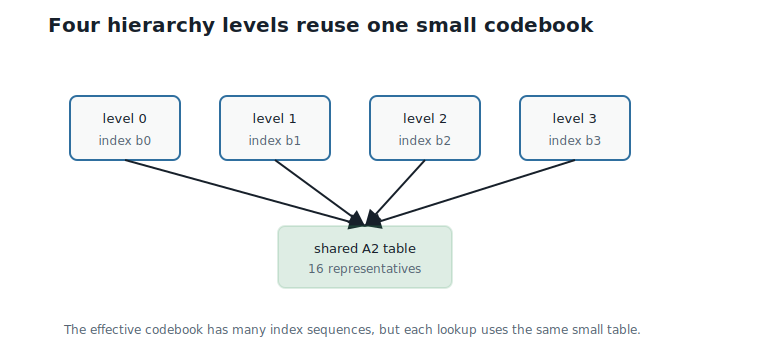
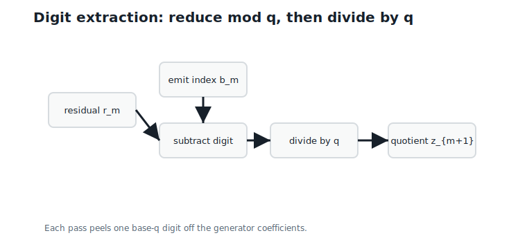
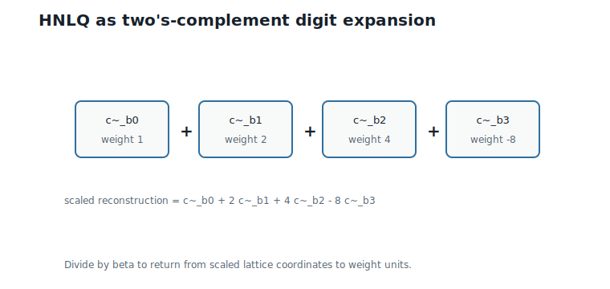
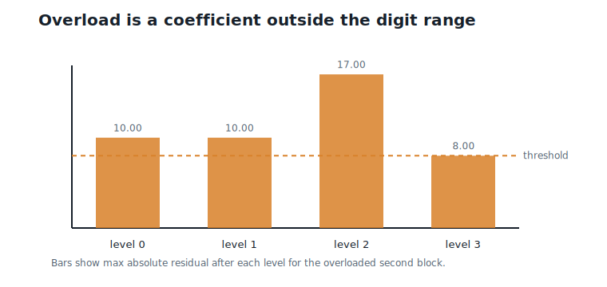
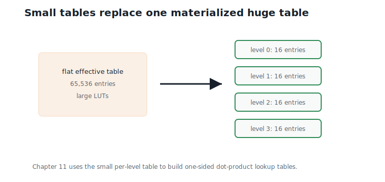

# Hierarchical Nested Lattice Quantization

**Question.** Can large codebooks be represented as combinations of small codebooks?

## Learning Objectives

By the end of this chapter, you should be able to:

- encode a block with one nearest-lattice decode followed by digit extraction;
- read a Hierarchical Nested Lattice Quantization (HNLQ) index sequence as a base-$q$ two's-complement expansion of generator coefficients;
- explain why each digit is a Chapter 9 coset index;
- state when decoding is exact and when overload occurs;
- explain why the min-norm representatives of Chapter 9 cannot serve as digits;
- explain why small lookup tables become possible.

## Prerequisites

This chapter assumes generator coefficients from Chapter 6, nearest-`D4` decoding from Chapter 7, scaled lattice quantization from Chapter 8, and the quotient $D4/2D4$ from Chapter 9.

## Running Example

We keep the book-wide values:

| Quantity | Value |
|---|---:|
| Lattice | `D4` |
| Dimension $d$ | 4 |
| Radix $q$ | 2 |
| Hierarchy depth $M$ | 4 |
| Per-level codebook size | 16 |
| Scale $\beta$ | 2 |

The two running weight blocks are:

$$
v_1 = (0.73,\;-1.84,\;2.11,\;-0.45),
\qquad
v_2 = (1.27,\;0.08,\;-2.36,\;3.14).
$$

The scale $\beta = 2$ is the fine, non-overloaded setting Chapter 8 used for these blocks. That choice is intentional: this chapter's whole job is to give the Chapter 8 quantizer a *fixed-rate index*, without changing its reconstructions at all.

## From One Codebook to Many Levels

Chapter 9 built one finite codebook with 16 entries — 4 bits per block, 1 bit per weight. That is a very coarse quantizer. Chapter 8's good reconstructions used lattice points like $(3, 0, -5, 6)$, far outside any single 16-entry table.

Using four index levels instead of one gives:

$$
16^4 = 65536
$$

possible index sequences — 16 bits per block, 4 bits per weight.

Interpretation:

- Verbal: four small choices combine into 65,536 possible reconstructions.
- Geometric: the levels will describe one lattice point at four different scales.
- Engineering: the effective codebook is large, but every level reuses one 16-entry table — which is what keeps Chapter 11's lookup tables small.

@fig-ch10-hierarchy shows this reuse pattern.

{#fig-ch10-hierarchy fig-alt="Four hierarchy levels each referencing the same 16-entry codebook."}

This is the central idea of Hierarchical Nested Lattice Quantization, or HNLQ. The question is how four indices should describe one lattice point.

## One Decode, Then Digits

The encoder does exactly one piece of geometry, then pure integer arithmetic:

1. Decode once: $y = Q_{D4}(\beta v)$, using Chapter 7.
2. Read off the generator coefficients $z$ with $y = Gz$, using Chapter 6.
3. Write each coefficient in $M$-digit base-$q$ two's complement, and emit one index per digit plane.

For the first running block, step 1 and step 2 give:

$$
y_1 = Q_{D4}(2v_1) = (1,\;-4,\;4,\;-1),
\qquad
z = (1,\;-3,\;1,\;0).
$$

Step 3 is Chapter 17's two's complement, applied early: with $M = 4$ and $q = 2$, each coefficient becomes four bits, and the bits at position $m$ across the four coefficients form the level-$m$ digit:

| Coefficient | Value | Bits (MSB to LSB) |
|---:|---:|---|
| $z_1$ | 1 | `0001` |
| $z_2$ | -3 | `1101` |
| $z_3$ | 1 | `0001` |
| $z_4$ | 0 | `0000` |

Reading the columns from least significant to most significant:

| Level $m$ | Digit bits $(z_1, z_2, z_3, z_4)$ | Index $b_m$ |
|---:|---|---:|
| 0 | $(1, 1, 1, 0)$ | 14 |
| 1 | $(0, 0, 0, 0)$ | 0 |
| 2 | $(0, 1, 0, 0)$ | 4 |
| 3 | $(0, 1, 0, 0)$ | 4 |

So block 1 encodes to the index sequence $(14, 0, 4, 4)$.

Here is the connection that makes this a *quotient* hierarchy and not just bit-twiddling. The level-0 digit bits are $z \bmod 2$ — exactly Chapter 9's coset reduction, so $b_0 = 14$ is the same index 14 that Chapter 9 assigned to this block's coset. And after subtracting the level-0 digit and dividing by $q$, the level-1 digit is the coset index of the *quotient*, and so on. Each level answers "which coset?" for a successively coarser view of the same lattice point:

$$
b_m = \text{coset index of } z_m \bmod q,
\qquad
z_{m+1} = \frac{z_m - (z_m \bmod q)}{q}.
$$

@fig-ch10-residual-flow shows the loop.

{#fig-ch10-residual-flow fig-alt="Flow diagram showing coefficients reduced mod q, an index emitted, and the quotient passed to the next level."}

## Digit Representatives

To decode, each index must contribute a vector. Define the **digit representative** of index $b$ as the generator combination of its bits:

$$
\tilde{c}_b = G \cdot \operatorname{bits}(b).
$$

Interpretation:

- Verbal: $\tilde{c}_b$ is the lattice point whose coefficients are exactly the four bits of $b$.
- Geometric: the sixteen digit representatives are the corners of one generator parallelepiped.
- Engineering: linearity in the bits is what lets digits at different levels add up without interfering — the same reason ordinary long addition works one digit column at a time.

Twelve of the sixteen digit representatives coincide with Chapter 9's compact representatives $c_b$; they differ only at indices 3, 9, 10, and 11, where the min-norm rule and the linear rule disagree (for example, $\tilde{c}_3 = (0, 0, 2, 0)$ while $c_3 = (2, 0, 0, 0)$).

Why not simply reuse the min-norm table? Because exact digit decomposition needs to *terminate*. Run the digit recursion with min-norm representatives on the small lattice point $(0, -1, 1, 0)$: its coset representative is $(0, 1, -1, 0)$, the difference is $(0, -2, 2, 0)$, and dividing by 2 returns $(0, -1, 1, 0)$ — the recursion cycles forever without producing a finite digit string. (The reference code demonstrates this in `minnorm_digit_attempt`.) The generator-bit representatives inherit termination from ordinary two's-complement arithmetic: every coefficient in range decomposes in exactly $M$ digits.

## The Decoder: A Signed Radix Expansion

The decoder recombines the digits with two's-complement weights — the most significant digit carries a *negative* weight, exactly as in Chapter 17's signed bit planes:

$$
\hat{y}
=
\tilde{c}_{b_0}
+ q\,\tilde{c}_{b_1}
+ \cdots
+ q^{M-2}\,\tilde{c}_{b_{M-2}}
- q^{M-1}\,\tilde{c}_{b_{M-1}},
\qquad
\text{reconstruction} = \frac{\hat{y}}{\beta}.
$$

**What problem does this solve?** Whether four 4-bit indices can name a lattice point exactly.

**Exactness.** If every coefficient of $y$ lies in the two's-complement range $\{-q^{M-1}, \ldots, q^{M-1} - 1\}$ (for our values: $-8$ to $7$), then $\hat{y} = y$ — the digits reproduce the coefficients exactly, and the linear map $G$ turns exact coefficients into the exact lattice point.

**What does this mean in practice?** Within range, HNLQ adds *zero* error beyond Chapter 8's single nearest-lattice decode. The hierarchy is a lossless index for the Chapter 8 quantizer, not an extra approximation stage.

@fig-ch10-radix shows the expansion.

{#fig-ch10-radix fig-alt="Four digit representatives combined with two's-complement weights into a scaled reconstruction."}

## Complete 8-Weight Example

For $q = 2$, $M = 4$, and $\beta = 2$:

| Block | Lattice point $y$ | Coefficients $z$ | Indices $(b_0,b_1,b_2,b_3)$ | Reconstruction | Squared error |
|---:|---|---|---|---|---:|
| 1 | $(1, -4, 4, -1)$ | $(1, -3, 1, 0)$ | $(14, 0, 4, 4)$ | $(0.5, -2.0, 2.0, -0.5)$ | 0.0931 |
| 2 | $(3, 0, -5, 6)$ | $(3, 3, -4, 2)$ | $(12, 13, 2, 2)$ | $(1.5, 0.0, -2.5, 3.0)$ | 0.0985 |

The reconstructed eight-weight vector is:

$$
(0.5,\;-2.0,\;2.0,\;-0.5,\;1.5,\;0.0,\;-2.5,\;3.0),
$$

with mean squared error $0.0239$ across the eight weights. Compare Chapter 8's $\beta = 2$ table: the reconstructions are *identical*. HNLQ has not changed the quantizer — it has given each block a 16-bit name.

Encoding cost is worth pausing on: one round-and-fix decode, one coefficient solve, and a few bit operations per block. No search over 65,536 sequences, no greedy level-by-level choices. The exactness argument above did the searching for us, once, algebraically.

## Overload: When Coefficients Leave the Range

The digit range is finite: $M = 4$ base-2 digits hold coefficients from $-8$ to $7$. Overload is precisely a coefficient outside that box.

Push the scale to $\beta = 8$ and encode block 2. The decode gives $y = (10, 0, -19, 25)$, with coefficients:

$$
z = (10,\;10,\;-17,\;8).
$$

All four coefficients are out of range. The reference implementation clamps them to $(7, 7, -8, 7)$ — a deterministic saturation policy — and decodes to $(0.875, 0, -1, 1.875)$, with squared error $3.61$ against a target whose largest entry is $3.14$. The reconstruction is not garbage, but the error is two orders of magnitude worse than at $\beta = 2$.

@fig-ch10-overload shows the geometry of the failure.

{#fig-ch10-overload fig-alt="Bar chart of coefficient magnitudes with the digit-range threshold marked."}

Now the full sweep, which turns Chapter 8's predicted U-curve into measured numbers:

| $\beta$ | Mean squared error | Overloaded blocks |
|---:|---:|---:|
| 0.5 | 0.2727 | 0 |
| 1.0 | 0.0802 | 0 |
| 2.0 | 0.0239 | 0 |
| 4.0 | 0.0077 | 1 |
| 8.0 | 0.4544 | 2 |

Two lessons hide in this table. First, the U-curve is real: finer scales help until the coefficient box overflows, then the error explodes. Second, overload is graded, not a cliff — at $\beta = 4$ one block clamps a single coefficient by one step and the error still *improves*. Calibration (Chapter 13) is about finding the bottom of this valley, and the overload count is a useful side channel while searching for it.

An implementation must choose an overload policy: clamp and accept the error (as here), rescale $\beta$ for the offending block or group, increase $M$, or flag the block for separate handling. What it must not do is fail silently.

## Why Lookup Tables Become Small

The effective codebook has $16^4 = 65536$ entries — in fact, within the coefficient box the digit map is a bijection, so all 65,536 index sequences decode to *distinct* lattice points. But the per-level codebook still has only 16 entries, and all four levels share it (up to the level weight, which is a scalar).

Storing 65,536 four-dimensional codewords explicitly would take a megabyte-scale table per activation block in Chapter 11. Storing 16 digit representatives takes 64 small integers. That ratio — effective size $q^{dM}$, table size $q^d$ — is the entire systems case for the hierarchy.

@fig-ch10-codebook-reuse compares the two storage strategies.

{#fig-ch10-codebook-reuse fig-alt="A large effective codebook represented by four uses of one small 16-entry table."}

## Worked Example

Decode block 1 from its indices $(14, 0, 4, 4)$ by hand.

The digit representatives are $\tilde{c}_{14} = (1, 0, 0, -1)$, $\tilde{c}_0 = (0, 0, 0, 0)$, and $\tilde{c}_4 = (0, 1, -1, 0)$. Apply the weights $1, 2, 4, -8$:

$$
\hat{y}
= \tilde{c}_{14} + 2\,\tilde{c}_0 + 4\,\tilde{c}_4 - 8\,\tilde{c}_4
= (1, 0, 0, -1) - 4\,(0, 1, -1, 0)
= (1,\;-4,\;4,\;-1).
$$

This is exactly the lattice point the encoder started from. Dividing by $\beta = 2$:

$$
\frac{\hat{y}}{2} = (0.5,\;-2.0,\;2.0,\;-0.5),
$$

which is Chapter 8's reconstruction for this block, error and all. Four table lookups, four scaled additions, one division — and no information lost between encoder and decoder.

## Algorithms

### Algorithm 10.1: HNLQ Encoder

**Input:** target block $v$, scale $\beta$, radix $q$, depth $M$.

**Output:** index sequence $(b_0, \ldots, b_{M-1})$ and an overload flag.

```text
function hnlq_encode(v, beta, q, M):
    y = nearest_D4(beta * v)
    z = generator_coefficients(y)
    clamp each z_i into [-q^(M-1), q^(M-1) - 1]; flag overload if any changed
    wrap each z_i modulo q^M            # two's complement
    for m from 0 to M - 1:
        bits_m = (z_i digit at position m, for each i)
        b_m = index of bits_m
    return (b_0, ..., b_{M-1}), overload flag
```

**Complexity and implementation notes:**

| Property | Cost |
|---|---|
| Time | $O(d)$ decode plus $O(Md)$ bit extraction |
| Memory | $O(d)$ |
| Offline preprocessing | None beyond the shared digit table |
| Online inference cost | Encoding is offline for weights; cost is trivial either way |
| Parallelism | Blocks are independent; digit planes are independent bit operations |
| SIMD/GPU suitability | Excellent — rounding, parity repair, and bit slicing vectorize |
| Possible optimization | Fuse coefficient extraction with the decoder's parity repair |

### Algorithm 10.2: HNLQ Decoder

**Input:** indices $(b_0, \ldots, b_{M-1})$, scale $\beta$, radix $q$.

**Output:** reconstructed block.

```text
function hnlq_decode(indices, beta, q):
    weights = (1, q, ..., q^(M-2), -q^(M-1))
    y = zero vector
    for m from 0 to M - 1:
        y = y + weights[m] * digit_representative(indices[m])
    return y / beta
```

**Complexity and implementation notes:**

| Property | Cost |
|---|---|
| Time | $O(Md)$ |
| Memory | $O(d)$ accumulator plus the 16-entry digit table |
| Online inference cost | $M$ table reads and scaled additions per block |
| Parallelism | Excellent across blocks |
| SIMD/GPU suitability | Excellent; the digit table fits in registers or shared memory |
| Possible optimization | Pre-scale the table by the level weights |

The executable reference implementation is in `code/python/chapter_10_hnlq.py`.

## Engineering Insight

HNLQ separates effective codebook size from lookup-table size — that was always the goal. What the digit construction adds is that the separation costs nothing in distortion (within range) and nothing meaningful in encode time. The encoder is one Chapter 7 decode plus bit slicing; earlier drafts of this idea that greedily re-quantized residuals level by level paid compounding errors for the same bit budget, which is why the digit form is the right one.

The honest limitation is the *shape* of the coverage. The digit range is a box in coefficient space, and the generator $G$ maps that box to a skewed parallelepiped in weight space. Weights that fit the box waste no rate; weight distributions shaped like balls (Gaussians, in practice) leave parts of the box unused. Chapter 13 measures what that shaping mismatch costs and what the geometry of `D4` buys back.

## Historical Note and Further Reading

The high-rate Hierarchical Nested Lattice Quantization construction and its small-LUT motivation are due to Kaplan and Ordentlich @kaplan_ordentlich_2025. This chapter adapts the idea to the book's fixed `D4`, $q = 2$, $M = 4$ running example and spells out the coefficient-digit version used by the reference code.

Multistage and residual vector quantization are classical: each stage re-quantizes what the previous stage missed, and errors compound across stages. Nested-lattice constructions replace re-quantization with exact algebraic decomposition — the hierarchy here follows that tradition, with digits drawn from $L/qL$ and two's-complement weights making the decomposition exact. The quotient machinery is Chapter 9's; the bit-plane view of the same digits returns in Chapters 17 and 18.

## Exercises

### Conceptual Exercises

1. Why is the level-0 index exactly Chapter 9's coset index?
2. Why does the most significant digit carry a negative weight?
3. Why must digit representatives be linear in their bits, and why does the min-norm table fail this requirement?
4. Within the coefficient box, why do all $16^4$ index sequences decode to distinct lattice points?

### Worked Numerical Exercises

1. Decode indices $(12, 13, 2, 2)$ by hand using $\beta = 2$ and verify the block 2 reconstruction.
2. Extract the digits of the coefficient vector $(5, -1, 2, -6)$.
3. Run the digit recursion with min-norm representatives on $(0, -1, 1, 0)$ and exhibit the cycle.
4. For block 2 at $\beta = 8$, verify the clamped coefficients $(7, 7, -8, 7)$.

### Programming Exercises

1. Run `python code/python/chapter_10_hnlq.py` and confirm the digit tables and the $\beta$ sweep.
2. Add $\beta = 3$ to the sweep and locate the valley more precisely.
3. Implement `indices_to_coefficients` from scratch and test it against `coefficients_to_indices` on random in-range vectors.

### Research Questions

1. How should the overload policy differ between weights (offline) and activations (online)?
2. Can the coefficient box be replaced by a Voronoi-shaped region without losing exactness or termination?
3. How does the choice of generator matrix affect which weight distributions fit the digit range efficiently?

## Common Mistakes

- Re-quantizing residuals level by level instead of extracting digits — the errors compound.
- Using min-norm representatives as digits and hitting nonterminating cycles.
- Forgetting the negative weight on the most significant digit.
- Forgetting to divide the recombined lattice point by $\beta$.
- Ignoring the overload flag because the clamped reconstruction "looks reasonable."

## Summary

HNLQ encodes a block with one nearest-`D4` decode and then writes the generator coefficients in $M$-digit base-$q$ two's complement; each digit is a Chapter 9 coset index, and the decoder recombines digit representatives with weights $1, q, \ldots, -q^{M-1}$. Within the coefficient range the round trip is exact, so the hierarchy is a fixed-rate *index* for Chapter 8's quantizer rather than an extra approximation. For the running blocks at $\beta = 2$, the indices are $(14, 0, 4, 4)$ and $(12, 13, 2, 2)$, the reconstructions match Chapter 8 exactly, and the measured $\beta$ sweep traces the granular-overload U-curve with its valley at the calibrated scale.

## Preview of Next Chapter

Next we exploit the small digit table. One-sided lookup tables will compute dot products from HNLQ indices without reconstructing each weight block first.
