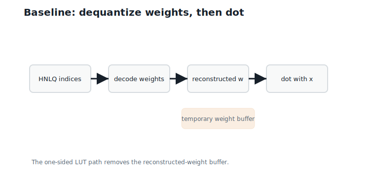
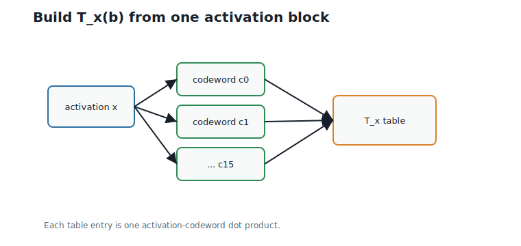
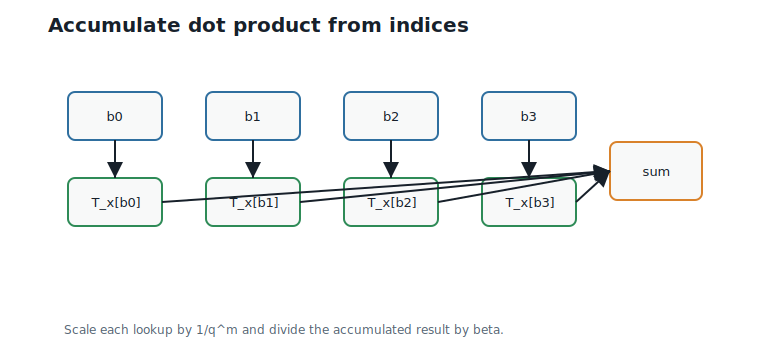
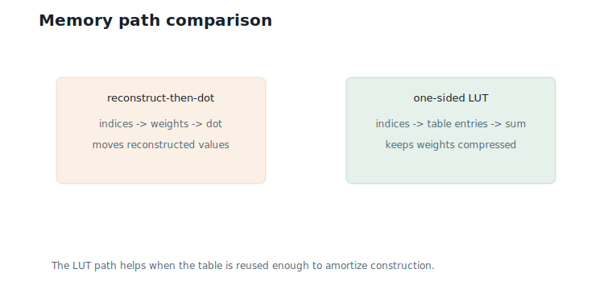
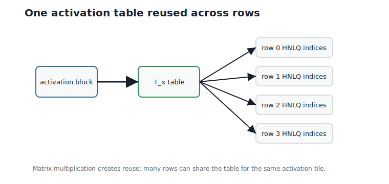

# One-Sided Lookup Tables

**Question.** Can dot products be computed without reconstructing weights?

## Learning Objectives

By the end of this chapter, you should be able to:

- explain why dequantizing weights before a dot product creates extra memory traffic;
- construct a one-sided lookup table from an activation block and a codebook;
- compute a Hierarchical Nested Lattice Quantization (HNLQ) dot product from indices alone;
- verify that lookup accumulation equals reconstruct-then-dot;
- analyze when lookup tables reduce inference cost;
- identify the cost of rebuilding tables when activations change.

## Prerequisites

This chapter assumes dot products from Chapters 1 and 3, HNLQ indices from Chapter 10, and the 16-entry quotient codebook from Chapter 9.

## Running Example

The activation vector is:

$$
x = (2,\;1,\;-1,\;3,\;-2,\;0.5,\;1,\;-1.5).
$$

This is the same activation vector used since Chapter 1. Activations remain floating point; the weights are represented by HNLQ indices.

Split $x$ into two four-dimensional activation blocks:

$$
x_1 = (2,\;1,\;-1,\;3),
\qquad
x_2 = (-2,\;0.5,\;1,\;-1.5).
$$

Each activation block lines up with one quantized weight block, and one lookup table is built per activation block.

From Chapter 10, the two HNLQ-encoded weight blocks use:

| Block | Indices $(b_0,b_1,b_2,b_3)$ | Reconstruction |
|---:|---|---|
| 1 | $(14, 0, 4, 4)$ | $(0.5, -2.0, 2.0, -0.5)$ |
| 2 | $(12, 13, 2, 2)$ | $(1.5, 0.0, -2.5, 3.0)$ |

The question is whether we can compute:

$$
x^\top \hat{w}
$$

without first materializing $\hat{w}$.

We want the same value reconstruction would give, without writing reconstructed FP values to memory just to read them back for multiplication.

## Classical Inference

The ordinary path is:

1. Decode the compressed weight representation.
2. Write or hold the reconstructed weights.
3. Multiply reconstructed weights by activations.
4. Accumulate the dot product.

For one block, this computes:

$$
x_j^\top \hat{w}_j.
$$

Decoding and multiplication are separate steps — that separation is the cost we want to remove.

@fig-ch11-dequantize-dot shows this path.

{#fig-ch11-dequantize-dot fig-alt="Pipeline showing indices decoded to weights, then multiplied with activations."}

The problem is memory movement. If reconstructed weights are written to a buffer, the system has moved data that does not need to exist as a separate object.

## Lookup-Table Construction

For one activation block $x$, define:

$$
T_x(b) = x^\top \tilde{c}_b.
$$

Interpretation:

- Verbal: $T_x(b)$ is the dot product between the activation block and digit representative $b$.
- Geometric: it is the projection of $\tilde{c}_b$ along the activation direction.
- Engineering: once $T_x$ is built, an index $b$ can be converted to a dot-product contribution by lookup.

For $x_1 = (2, 1, -1, 3)$, the table entries used by block 1 are:

| Index $b$ | Digit representative $\tilde{c}_b$ | $T_{x_1}(b)$ |
|---:|---|---:|
| 14 | $(1, 0, 0, -1)$ | -1.0 |
| 0 | $(0, 0, 0, 0)$ | 0.0 |
| 4 | $(0, 1, -1, 0)$ | 2.0 |

@fig-ch11-lut-construction shows the table-building step.

{#fig-ch11-lut-construction fig-alt="Activation block dotted with each codeword to create a 16-entry table."}

The table is "one-sided" because only the activation side changes at runtime. The codebook is fixed.

## Accumulating a Hierarchical Dot Product

Chapter 10 decodes a block as:

$$
\hat{w}_j =
\frac{1}{\beta}
\left(
\tilde{c}_{b_0} + q\,\tilde{c}_{b_1}
+ q^2\,\tilde{c}_{b_2}
- q^3\,\tilde{c}_{b_3}
\right).
$$

Interpretation:

- Verbal: the reconstructed block is a scaled sum of codewords.
- Geometric: each level contributes a smaller correction vector.
- Engineering: the dot product can distribute over this sum.

Dot with $x_j$:

$$
x_j^\top \hat{w}_j =
\frac{1}{\beta}
\left(
T_{x_j}(b_0)
+ q\,T_{x_j}(b_1)
+ q^2\,T_{x_j}(b_2)
- q^3\,T_{x_j}(b_3)
\right).
$$

Interpretation:

- Verbal: replace each codeword dot product by a table lookup.
- Geometric: projections add the same way vectors add.
- Engineering: no reconstructed weight block is needed.

@fig-ch11-lookup-accumulation shows the accumulation path.

{#fig-ch11-lookup-accumulation fig-alt="HNLQ indices look up table entries, apply level scales, and accumulate a dot product."}

## Complete Numerical Example

Use $q = 2$, $M = 4$, and $\beta = 2$.

For block 1, the indices are $(14, 0, 4, 4)$. The lookup accumulation is:

$$
\frac{1}{2}
\left(
-1.0 + 2 \cdot 0.0 + 4 \cdot 2.0 - 8 \cdot 2.0
\right)
= -4.50.
$$

Four index lookups replace reconstructing four weight coordinates.

For block 2, the selected table entries are:

| Index $b$ | $T_{x_2}(b)$ |
|---:|---:|
| 12 | -3.0 |
| 13 | -3.5 |
| 2 | 2.5 |

The accumulation is:

$$
\frac{1}{2}
\left(
-3.0 + 2 \cdot (-3.5) + 4 \cdot 2.5 - 8 \cdot 2.5
\right)
= -10.00.
$$

The second block contributes $-10.00$, again computed entirely from indices and table entries.

The full HNLQ dot product is:

$$
-4.50 + (-10.00) = -14.50.
$$

The result matches reconstruct-then-dot without ever materializing $\hat{w}$.

The original FP dot product was $-13.41$, so the HNLQ dot-product error at this calibrated scale is:

$$
-14.50 - (-13.41) = -1.09.
$$

Interpretation:

- Verbal: the quantized dot product is $1.09$ below the original — about 8% of its magnitude.
- Geometric: the granular quantization error has a component along the activation direction, and nothing more; no block overloaded at $\beta = 2$.
- Engineering: Chapter 3's bound applies: the weight error has length $\sqrt{0.0931 + 0.0985} \approx 0.44$, so the worst case was $0.44 \times 4.74 \approx 2.08$; we landed at half of it.

## Why This Saves Work

The lookup path avoids explicit dequantization:

| Path | Main operations |
|---|---|
| Reconstruct then dot | read indices, decode codewords, write or hold reconstructed weights, multiply by activations, accumulate |
| One-sided LUT | build $T_x$, read indices, lookup contributions, apply level scales, accumulate |

The LUT path is not free. It must build $T_x$ whenever the activation block changes. The break-even arithmetic is short. Building the table costs 16 codeword dot products — roughly the work of decoding four blocks the classical way. Once built, each additional weight row costs only $M = 4$ scalar lookups and adds, instead of a full decode ($Md = 16$ scaled coordinate additions) plus a $d$-term dot product. So the table pays for itself after a handful of rows, and every row beyond that is nearly free of decode work. In matrix multiplication, the same activation block meets hundreds or thousands of weight rows, so the table-building cost vanishes into the tile.

@fig-ch11-memory-traffic compares the data movement.

{#fig-ch11-memory-traffic fig-alt="Comparison between reconstruct-then-dot memory path and one-sided LUT path."}

The smaller the table, the more likely it stays in fast memory. This is why Chapter 10's small per-level codebook matters.

## Activation Dependence

The table is tied to $x$. If $x$ changes, $T_x$ changes:

$$
T_x(b) = x^\top \tilde{c}_b.
$$

Interpretation:

- Verbal: a different activation vector gives different table entries.
- Geometric: projections depend on direction.
- Engineering: LUT construction is part of the online inference path unless activations are reused.

@fig-ch11-activation-reuse shows why matrix multiplication is the natural setting.

{#fig-ch11-activation-reuse fig-alt="One activation block builds a lookup table reused by several rows of HNLQ indices."}

Chapter 12 will scale this from one dot product to GEMM.

## Worked Example

Verify block 1 by reconstructing and by lookup.

The reconstructed block from Chapter 10 is:

$$
\hat{w}_1 = (0.5,\;-2.0,\;2.0,\;-0.5).
$$

Reconstructing it explicitly is the baseline path.

Direct dot product:

$$
x_1^\top \hat{w}_1
=
2(0.5) + 1(-2.0) + (-1)(2.0) + 3(-0.5)
= -4.50.
$$

This path requires the reconstructed coordinates.

Lookup path:

$$
\frac{1}{2}
\left(
T_{x_1}(14) + 2\,T_{x_1}(0)
+ 4\,T_{x_1}(4)
- 8\,T_{x_1}(4)
\right)
= -4.50.
$$

The same value comes from four lookup entries: the two paths are algebraically identical.

## Algorithms

### Algorithm 11.1: Build One-Sided LUT

**Input:** activation block $x$ and the 16 digit representatives $\tilde{c}_b$.

**Output:** table $T_x$.

```text
function build_lut(x, digit_representatives):
    for each index b:
        T_x[b] = dot(x, digit_representatives[b])
    return T_x
```

**Complexity and implementation notes:**

| Property | Cost |
|---|---|
| Time | $O(q^d d)$ per activation block |
| Memory | $O(q^d)$ table entries |
| Offline preprocessing | Codebook is precomputed; LUT depends on online activations |
| Online inference cost | Build once per activation block per tile |
| Parallelism | Codeword dot products are independent |
| GPU suitability | Good when table fits in shared memory or registers |
| SIMD suitability | Good for short fixed-width codewords |
| Possible optimization | Fuse table construction with activation loading |

### Algorithm 11.2: HNLQ Dot Product by Lookup

**Input:** activation block $x$, index sequence $(b_0, \ldots, b_{M-1})$, table $T_x$, scale $\beta$, and radix $q$.

**Output:** block dot-product contribution.

```text
function hnlq_dot_from_lut(indices, T_x, beta, q):
    weights = (1, q, ..., q^(M-2), -q^(M-1))
    total = 0
    for m from 0 to M - 1:
        total = total + weights[m] * T_x[indices[m]]
    return total / beta
```

**Complexity and implementation notes:**

| Property | Cost |
|---|---|
| Time | $O(M)$ lookups and additions per block |
| Memory | $O(q^d)$ for the table |
| Offline preprocessing | HNLQ codebook and stored indices |
| Online inference cost | Table lookups plus scalar accumulation |
| Parallelism | Blocks are independent once tables are built |
| GPU suitability | Good if access patterns are coalesced or cached |
| SIMD suitability | Good for accumulating multiple blocks or rows |
| Possible optimization | Precompute level weights $q^m$ (with the final sign) and fold in $1/\beta$ |

The executable reference implementation is in `code/python/chapter_11_one_sided_lut.py`.

## Engineering Insight

One-sided lookup tables target memory traffic, not abstract arithmetic count.

The dot product still has to combine activation-dependent quantities with weight-dependent indices. The win is that reconstructed weights do not need to become an intermediate tensor. If the same activation table is reused across many rows, the cost of building $T_x$ is amortized and compressed indices can stream through the kernel.

This is also the main limitation. If every activation block is used only once, LUT construction may cost more than it saves. HNLQ becomes attractive when blocking and matrix multiplication create reuse.

## Historical Note and Further Reading

Lookup-table inference is a recurring idea in quantized and compressed neural-network computation. Kaplan and Ordentlich introduced the high-rate nested-lattice hierarchy specifically to keep LUTs small while preserving the effective quantization rate @kaplan_ordentlich_2025. The one-sided HNLQ table used here is the book's activation-fixed specialization: one side is the activation vector, while the other side is a structured lattice codebook reused across hierarchy levels. Chapter 12 turns this single-dot-product idea into matrix multiplication.

## Exercises

### Conceptual Exercises

1. Why does $T_x(b)$ depend on activations but not on a particular weight row?
2. Why does lookup accumulation equal reconstruct-then-dot?
3. When can LUT construction cost dominate?

### Worked Numerical Exercises

1. Compute $T_{x_1}(14)$ and $T_{x_1}(4)$ by hand.
2. Verify the block 2 contribution $-10.00$.
3. Compute the HNLQ dot-product error relative to the original FP dot product.

### Programming Exercises

1. Run `python code/python/chapter_11_one_sided_lut.py` and confirm the lookup dot product.
2. Add a check that lookup accumulation matches reconstruct-then-dot for every block.
3. Time LUT construction versus reconstruct-then-dot for many repeated rows.

### Research Questions

1. How large can the digit table become before the LUT no longer fits in cache?
2. How should a GPU kernel place $T_x$ in registers, shared memory, or constant memory?
3. When does activation reuse outweigh the cost of table construction?

## Common Mistakes

- Reconstructing weights first and then claiming to use a one-sided LUT.
- Forgetting the level weights $q^m$, especially the negative weight on the last digit.
- Forgetting the final division by $\beta$.
- Reusing a table after the activation block has changed.
- Expecting bitwise-identical results from the two paths in floating point; they agree exactly in exact arithmetic, and to rounding error in practice, because the summation order differs.
- Counting arithmetic operations while ignoring memory movement.

## Summary

One-sided lookup tables compute HNLQ dot products from activation-representative dot products. For the running example, lookup accumulation gives block contributions $-4.50$ and $-10.00$, for a total of $-14.50$, within $1.09$ of the floating-point dot product. This exactly matches reconstruct-then-dot for the Chapter 10 HNLQ reconstruction.

The benefit is avoiding a reconstructed-weight buffer. The cost is building activation-dependent tables. Chapter 12 shows how matrix multiplication reuses those tables across many rows.

## Preview of Next Chapter

Next we lift the one-sided dot-product kernel into matrix multiplication. The main question becomes data reuse: how do we tile activations, indices, and lookup tables so the tables stay in fast memory?
