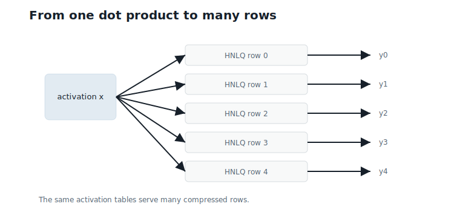
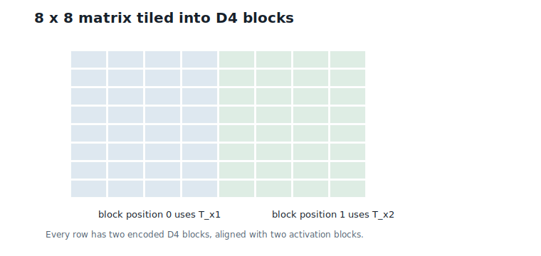
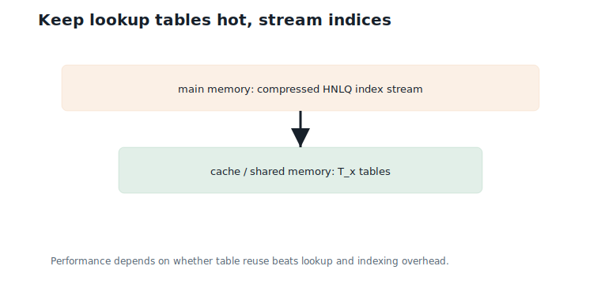
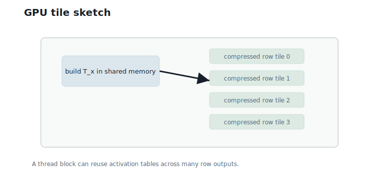
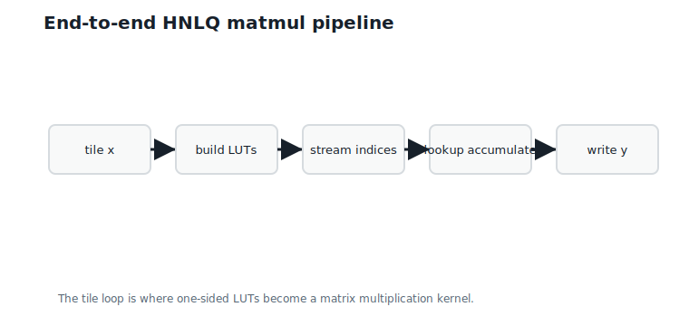

# Matrix Multiplication with Hierarchical Nested Lattice Quantization (HNLQ)

**Question.** How do one-sided dot products become GEMM?

## Learning Objectives

By the end of this chapter, you should be able to:

- lift one-sided HNLQ dot products to matrix-vector and matrix-matrix multiplication;
- explain why activation-block lookup tables are reused across weight rows;
- describe blocking and tiling for HNLQ inference;
- reason about cache, SIMD, and GPU placement of lookup tables;
- compare compressed-index streaming against dequantize-then-GEMM memory traffic;
- implement a CPU prototype of HNLQ matrix-vector multiplication.

## Prerequisites

This chapter assumes HNLQ decoding from Chapter 10 and one-sided lookup tables from Chapter 11.

## Running Example

We now promote the running dot product to an $8 \times 8$ weight matrix times the same activation vector:

$$
x = (2,\;1,\;-1,\;3,\;-2,\;0.5,\;1,\;-1.5).
$$

Interpretation:

- Verbal: one activation vector is multiplied by several weight rows.
- Geometric: each row computes one projection against $x$.
- Engineering: the activation lookup tables can be reused across rows.

Each row has two `D4` blocks, and each block has four HNLQ indices. With eight rows, the matrix contains 16 encoded blocks.

## From Dot Products to GEMM

Chapter 11 computed one dot product:

$$
x^\top \hat{w}.
$$

Interpretation:

- Verbal: one activation vector meets one weight row.
- Geometric: the output is one projection.
- Engineering: one set of HNLQ indices produces one scalar output.

Matrix-vector multiplication repeats the same operation for many rows:

$$
y_i = x^\top \hat{w}_i.
$$

Interpretation:

- Verbal: every row produces one output value.
- Geometric: the same activation vector is projected onto many reconstructed rows.
- Engineering: the activation-dependent tables should be built once and reused.

@fig-ch12-dot-to-gemm shows the shift.

{#fig-ch12-dot-to-gemm fig-alt="One activation vector feeding several HNLQ-encoded weight rows through shared lookup tables."}

## Blocking and Tiling

The block size is 4, so the activation vector splits into:

$$
x_1 = (2,\;1,\;-1,\;3),
\qquad
x_2 = (-2,\;0.5,\;1,\;-1.5).
$$

Interpretation:

- Verbal: each block aligns with one `D4` weight block.
- Geometric: each block contributes a partial dot product.
- Engineering: build one table for $x_1$ and one table for $x_2$.

For each activation block, build:

$$
T_{x_j}(b) = x_j^\top \tilde{c}_b.
$$

Interpretation:

- Verbal: table $j$ contains codeword dot products for activation block $j$.
- Geometric: it stores projections of all codewords along $x_j$.
- Engineering: every row whose block position is $j$ can reuse the same table.

@fig-ch12-tiling shows the block layout.

{#fig-ch12-tiling fig-alt="Eight matrix rows split into two D4 blocks, with two activation lookup tables shared across rows."}

## Complete Numerical Example

The first row uses the two index sequences from Chapter 11:

| Row | Block 1 indices | Block 2 indices | Output |
|---:|---|---|---:|
| 0 | $(14, 0, 4, 4)$ | $(12, 13, 2, 2)$ | $-14.500$ |

The full $8 \times 8$ example produces:

$$
y =
(-14.5,\;14.75,\;2.0,\;-2.5,\;-24.0,\;0.5,\;-0.5,\;0.5).
$$

Interpretation:

- Verbal: these are the eight row outputs.
- Geometric: each output is a dot product between $x$ and one reconstructed HNLQ row.
- Engineering: the implementation computes them from compressed indices and shared lookup tables.

The reference script verifies that LUT matvec and reconstruct-then-matvec produce the same vector.

## Cache Locality

For this example:

| Item | Count |
|---|---:|
| HNLQ indices | $8 \text{ rows} \times 2 \text{ blocks} \times 4 \text{ levels} = 64$ |
| Reconstructed weight values avoided | $8 \text{ rows} \times 8 \text{ columns} = 64$ |
| Lookup table entries | $2 \text{ activation blocks} \times 16 \text{ entries} = 32$ |

Now count bytes, not just items. Each block stores four 4-bit indices — 16 bits per four weights, or 4 bits per weight. The same block as FP16 weights is 64 bits. So the index stream moves one quarter of the bytes that a dequantize-then-GEMM kernel would move for its weight tile, and the 32 table entries (a few hundred bytes) sit permanently in fast memory. The counts here are tiny, but the pattern is the real point: in a large layer, compressed indices stream through memory while small activation tables stay hot.

@fig-ch12-cache shows the intended memory placement.

{#fig-ch12-cache fig-alt="Memory hierarchy diagram with activation lookup tables in cache and compressed indices streaming from memory."}

## SIMD and GPU Implications

On a CPU, the inner loop has a regular structure:

1. Load a few packed indices.
2. Lookup table entries.
3. Apply level weights.
4. Accumulate scalar outputs.

For `D4`, a block naturally fits in a SIMD register when reconstructing, but the LUT path shifts work from vector multiply-adds to indexed loads and scalar additions. Whether that wins depends on cache behavior and index packing.

On a GPU, table placement is the main question. Small $T_x$ tables may fit in shared memory or registers for a tile. Chapter 11 estimated that a table pays for itself after a handful of rows; a thread block that reuses the same activation tile across dozens or hundreds of rows is far past break-even, and the table-building cost disappears into the tile.

@fig-ch12-gpu sketches the mapping.

{#fig-ch12-gpu fig-alt="GPU tile diagram with shared activation LUTs and many rows of compressed indices."}

Tensor Cores are less direct. Standard Tensor Cores expect dense numeric tiles, while HNLQ uses index lookups. HNLQ can still reduce memory movement around Tensor Core kernels, but using Tensor Cores directly would require specialized hardware support or a different lowering.

## Product Lattices

An 8-coordinate row is represented as two independent `D4` blocks. Mathematically, this is a product lattice:

$$
D4 \times D4.
$$

Interpretation:

- Verbal: the row is made from two separate four-dimensional lattice blocks.
- Geometric: the full row space is a Cartesian product of two `D4` spaces.
- Engineering: block independence makes lookup tables and index streams regular.

For larger rows, the product has more blocks. The same one-sided table idea applies to every block position in a tile.

## End-to-End Pipeline

The inference pipeline is:

1. Split activation tile into `D4` blocks.
2. Build one lookup table per activation block.
3. Stream HNLQ indices for many weight rows.
4. Accumulate row outputs from table entries.
5. Move to the next activation tile.

@fig-ch12-pipeline summarizes the flow.

{#fig-ch12-pipeline fig-alt="Pipeline from activation tiling through LUT construction, compressed-index streaming, and output accumulation."}

The key systems question is whether table reuse and reduced memory movement outweigh lookup overhead.

## Worked Example

For row 0, Chapter 11 already computed:

$$
x_1^\top \hat{w}_{0,1} = -4.50,
\qquad
x_2^\top \hat{w}_{0,2} = -10.00.
$$

Interpretation:

- Verbal: the row output is the sum of two block contributions.
- Geometric: the row projection splits over the two product-lattice blocks.
- Engineering: each contribution comes from a different activation-block table.

Therefore:

$$
y_0 = -4.50 + (-10.00) = -14.50.
$$

Interpretation:

- Verbal: row 0 produces output $-14.50$.
- Geometric: this is the dot product of the full reconstructed row with $x$.
- Engineering: no reconstructed row was materialized.

The remaining rows use the same two activation tables and different compressed index sequences.

## Algorithms

### Algorithm 12.1: Build Activation Tables for a Tile

**Input:** activation vector $x$, block size $d$, and the linear digit representatives $\tilde{c}_b$.

**Output:** one table per activation block.

```text
function build_activation_tables(x, d, digit_representatives):
    blocks = split x into blocks of length d
    for each block x_j:
        tables[j] = build_lut(x_j, digit_representatives)
    return tables
```

**Complexity and implementation notes:**

| Property | Cost |
|---|---|
| Time | $O(B q^d d)$ for $B$ activation blocks |
| Memory | $O(B q^d)$ table entries |
| Offline preprocessing | Digit-representative table generation |
| Online inference cost | Paid per activation tile |
| Parallelism | Tables are independent across activation blocks |
| GPU suitability | Good when tables fit in shared memory |
| SIMD suitability | Good for codeword dot products |
| Possible optimization | Fuse activation load and table construction |

### Algorithm 12.2: HNLQ Matrix-Vector Multiplication

**Input:** HNLQ index matrix, activation tables, scale $\beta$, radix $q$.

**Output:** output vector $y$.

```text
function hnlq_matvec(index_matrix, tables, beta, q):
    for each row i:
        total = 0
        for each block j:
            total += hnlq_dot_from_lut(index_matrix[i][j], tables[j], beta, q)
        y[i] = total
    return y
```

**Complexity and implementation notes:**

| Property | Cost |
|---|---|
| Time | $O(RBM)$ lookups for $R$ rows, $B$ blocks, depth $M$ |
| Memory | Compressed indices plus $O(B q^d)$ tables |
| Offline preprocessing | Store HNLQ index matrix |
| Online inference cost | Build tables, stream indices, accumulate outputs |
| Parallelism | Rows and tiles are independent |
| GPU suitability | Good when row tiles reuse activation tables |
| SIMD suitability | Good for multiple rows or blocks in parallel |
| Possible optimization | Pack indices and precompute level-scaled table entries |

The executable reference implementation is in `code/python/chapter_12_hnlq_matmul.py`.

## Engineering Insight

The core systems question is memory movement, not arithmetic count.

If HNLQ indices are small and activation tables stay resident in fast memory, the kernel streams compressed data instead of reconstructed weights. This is attractive for bandwidth-bound inference. If tables are rebuilt too often or index lookups miss cache, the benefit can disappear.

That is why HNLQ matmul must be designed as a tiled kernel. The algorithm is not just "replace multiply with lookup"; it is "organize reuse so lookup tables are hot and compressed indices are cheap to stream."

## Historical Note and Further Reading

Matrix multiplication kernels are built around data reuse: blocking, tiling, cache locality, and hardware-specific memory hierarchies. The HNLQ small-LUT framing follows Kaplan and Ordentlich's high-rate nested-lattice matrix-multiplication work @kaplan_ordentlich_2025. HNLQ changes the payload from dense weights to compressed indices plus small tables. The same systems principles still apply, but the inner loop is now lookup-accumulate rather than multiply-accumulate.

## Exercises

### Conceptual Exercises

1. Why does matrix multiplication create more activation-table reuse than a single dot product?
2. Why is cache locality more important than raw arithmetic count here?
3. Why are Tensor Cores not a direct fit for index lookup?

### Worked Numerical Exercises

1. Verify row 0 output $-14.50$.
2. Count the number of HNLQ indices in the $8 \times 8$ example.
3. How many activation lookup tables are needed for an 8-coordinate activation vector with block size 4?

### Programming Exercises

1. Run `python code/python/chapter_12_hnlq_matmul.py` and compare LUT matvec with reconstruct-then-matvec.
2. Add another row to the index matrix and verify the output.
3. Precompute level-scaled table entries and compare the number of multiplications.

### Research Questions

1. How large can a tile be before activation tables stop fitting in fast memory?
2. What index layout gives coalesced GPU loads?
3. Could specialized hardware combine table lookup and accumulation efficiently?

## Common Mistakes

- Rebuilding activation tables separately for every row.
- Materializing reconstructed weights and calling the result HNLQ matmul.
- Ignoring the cost of random table lookups.
- Comparing against dense GEMM without accounting for memory bandwidth.
- Assuming Tensor Core speedups apply automatically.

## Summary

One-sided HNLQ dot products become matrix multiplication by reusing activation-block lookup tables across many weight rows. In the $8 \times 8$ example, two activation tables serve all eight rows, and LUT matvec exactly matches reconstruct-then-matvec.

The practical win depends on tiling: keep small tables hot, stream compressed indices, and avoid reconstructed-weight buffers.

## Preview of Next Chapter

Next we leave toy matrices and discuss how to calibrate HNLQ on a real model: choosing $\beta$, measuring error, and comparing against scalar baselines at matched bit rate.
