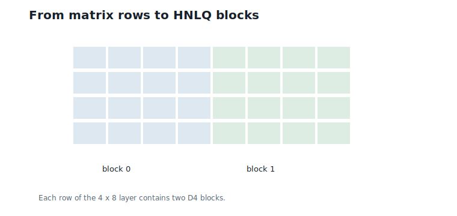
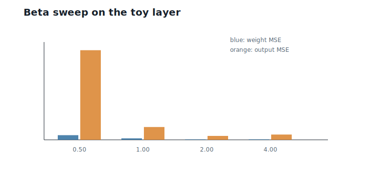
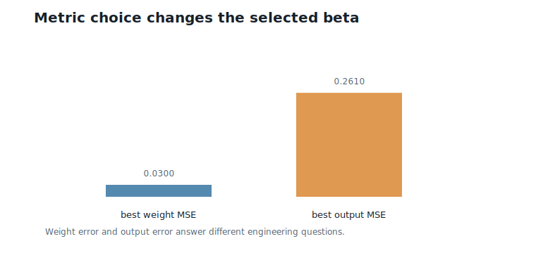
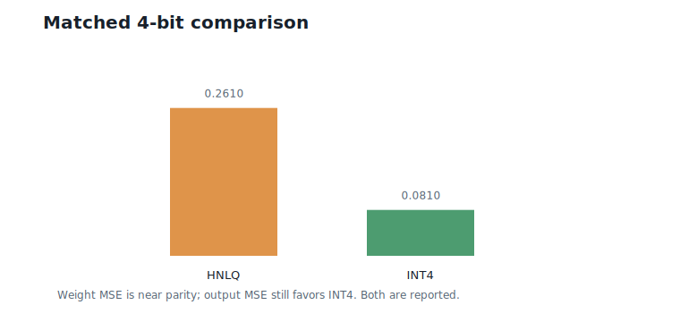
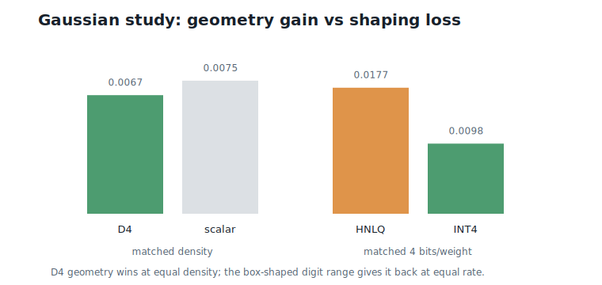
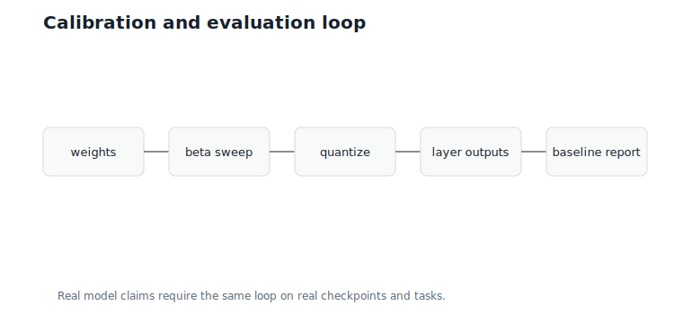

# Hierarchical Nested Lattice Quantization (HNLQ) in Practice: Quantizing a Real Model

**Question.** Does HNLQ work on a real network, and how would we know?

## Learning Objectives

By the end of this chapter, you should be able to:

- organize a weight matrix into HNLQ blocks;
- calibrate $\beta$ from measured error instead of guessing;
- measure weight MSE and layer-output MSE;
- compare HNLQ against a *scale-swept* scalar INT4 baseline at matched bits per weight;
- separate the `D4` geometry gain from the digit-range shaping loss on Gaussian data;
- state HNLQ's value proposition precisely: near-parity distortion plus a cheaper compute path.

## Prerequisites

This chapter assumes the digit encoder from Chapter 10, one-sided lookup tables from Chapter 11, and matrix multiplication from Chapter 12.

## Running Example

The reference implementation in this repository uses a deterministic small layer and a deterministic Gaussian sample. Neither is a downloaded pretrained checkpoint; the choice keeps every number in this chapter reproducible without network access.

The workflow is the one used for a real model:

1. Take a weight matrix.
2. Split each row into four-dimensional blocks.
3. Sweep candidate $\beta$ values and quantize with the Chapter 10 digit encoder.
4. Evaluate weight error and layer-output error.
5. Compare against scalar INT4 at the same 4 bits per weight — with the INT4 step size swept too, so the baseline is treated as fairly as HNLQ.

The toy layer's first row is the running eight-weight vector, so the numbers below connect directly to Chapters 8 through 12.

## From Blocks to Tensors

A model layer is a matrix, not one block. For an $R \times C$ weight matrix with block size 4, every row is split into $C/4$ blocks. The toy layer has shape $4 \times 8$: four output rows, two `D4` blocks per row, eight HNLQ blocks in total.

@fig-ch13-blocks shows the organization.

{#fig-ch13-blocks fig-alt="A small weight matrix split into row-wise D4 blocks."}

## Calibrating beta

Calibration asks which scale produces the best measured behavior. We sweep $\beta \in \{0.5, 1, 2, 4\}$ and measure:

| $\beta$ | Weight MSE | Layer-output MSE | Overloaded blocks |
|---:|---:|---:|---:|
| 0.5 | 0.3087 | 5.9559 | 0 |
| 1.0 | 0.0987 | 0.8513 | 0 |
| 2.0 | 0.0300 | 0.2610 | 0 |
| 4.0 | 0.0334 | 0.3494 | 3 |

@fig-ch13-beta-sweep shows the same sweep.

{#fig-ch13-beta-sweep fig-alt="Bar chart showing weight MSE and layer-output MSE over beta candidates."}

Both metrics agree here: $\beta = 2$ is the valley. The shape is Chapter 8's U-curve, measured on a real sweep — finer scales help until coefficients start leaving the digit range (three blocks overload at $\beta = 4$, and the error turns back up). The overload count is a cheap side channel for the calibrator: it says *why* the curve turned, not just that it did.

## Evaluation Metrics

A fair evaluation uses more than one number.

Weight MSE is:

$$
\frac{1}{RC}\sum_{i,j}(W_{ij} - \hat{W}_{ij})^2.
$$

Layer-output MSE is:

$$
\frac{1}{SR}\sum_{s,i}(Y_{s,i} - \hat{Y}_{s,i})^2,
$$

measured over calibration activations. Weight MSE is cheap and activation-independent; output MSE is closer to inference behavior because it weights each error by the activations it will actually meet — Chapter 3's projection lesson, applied at layer scale. When the two disagree, trust the one closer to the deployment metric.

@fig-ch13-output-error compares the two at their best scales.

{#fig-ch13-output-error fig-alt="Bars comparing best weight MSE and best layer-output MSE."}

For a full language model, the next metric would be perplexity or task accuracy. This repository does not claim such a result.

## Baselines at Matched Bit Rate

The HNLQ setting uses four 4-bit digit indices per four-weight block — 16 bits per block, 4 bits per weight. The scalar INT4 baseline also uses 4 bits per weight, with levels $-8$ to $7$ and a step size swept over a fine grid (best step by output MSE: $\delta = 0.56$). On the toy layer:

| Method | Bits per weight | Weight MSE | Layer-output MSE |
|---|---:|---:|---:|
| HNLQ, $\beta = 2$ | 4.0 | 0.0300 | 0.2610 |
| Scalar INT4, swept $\delta$ | 4.0 | 0.0278 | 0.0810 |

@fig-ch13-baseline compares them.

{#fig-ch13-baseline fig-alt="Bar chart comparing HNLQ and scalar INT4 output MSE at 4 bits per weight."}

Read this table the way a systems engineer would. On weight MSE the two methods are at near parity — HNLQ is 8% behind on eight blocks of data, which is noise-level for a sample this small. On output MSE the scalar baseline is about $3\times$ better on this layer; output error depends on how quantization errors align with the calibration activations (Chapter 3), and per-row or per-group scales — which scalar pipelines routinely use and our toy HNLQ does not yet — are the standard lever for that gap.

The point of matched-rate parity is what it *buys*: at the same bits per weight and comparable distortion, HNLQ inference runs through Chapter 11's lookup tables and Chapter 12's tiled kernels — streaming 4-bit indices, keeping a 16-entry table hot, and never materializing a dequantized weight tensor. Distortion parity plus a cheaper compute path is the practical case for HNLQ, and each half of that claim now has a measurement or an identity behind it.

## A Gaussian Study: Geometry Gain versus Shaping Loss

Real weight tensors are approximately Gaussian, so the reference code includes a deterministic Gaussian study (256 samples, fixed seed) that separates two effects the toy layer mixes together.

**Matched point density (the geometry gain).** Quantize the Gaussian blocks with the plain `D4` quantizer at scale $\beta$, and with a scalar grid whose step $\delta = 2^{1/4}/\beta$ gives *exactly the same number of reconstruction points per unit volume* — Chapter 6's fair-comparison discipline, executed. Measured:

| Quantizer | MSE |
|---|---:|
| `D4`, matched density | 0.00666 |
| Scalar grid, matched density | 0.00747 |

`D4` wins by about 11%. This is Chapter 6's 24-cell geometry paying off on Gaussian data, at last measured rather than promised.

**Matched bits per weight (the shaping loss).** Now compare the full HNLQ pipeline against swept INT4 at 4 bits per weight, both at their best scales: HNLQ reaches MSE 0.0177 at $\beta = 2.5$; INT4 reaches 0.0098 at $\delta = 0.32$ — a ratio of about 1.8 against HNLQ.

@fig-ch13-gaussian shows both comparisons side by side.

{#fig-ch13-gaussian fig-alt="Grouped bars showing D4 beating scalar at matched density and HNLQ trailing INT4 at matched rate."}

The two measurements bracket the truth. The lattice geometry is genuinely better (−11% at equal density), but the digit range is a *box in coefficient space*, and the generator maps it to a skewed parallelepiped poorly matched to a Gaussian ball — so at fixed rate, part of the bit budget pays for reconstruction points the data never visits. That shaping loss currently outweighs the geometry gain. It is also the clearest research lever in this book: Chapter 10's research question about Voronoi-shaped digit ranges is exactly the question of recovering this loss, and the INT4 gap quantifies the prize.

## Case Study Protocol

For a real pretrained model, the protocol is:

1. Choose layers to quantize.
2. Collect calibration activations.
3. Choose per-tensor or per-group $\beta$ candidates.
4. Quantize weights at matched bit rate.
5. Measure weight MSE and layer-output error on calibration activations.
6. Run task-level evaluation.
7. Compare against scalar baselines using the same data, the same bit rate, and the same freedom to sweep their scales.

@fig-ch13-pipeline shows the loop.

{#fig-ch13-pipeline fig-alt="Pipeline from weights and calibration activations through beta sweep, quantization, layer evaluation, and baseline comparison."}

The important discipline is to keep measured claims separate from expectations. If no task-level run was performed, do not imply a task-level gain — and if the baseline was not allowed to sweep its scale, do not call the comparison matched.

## Worked Example

At the calibrated $\beta = 2$, the first toy row — the running weight vector — reconstructs as:

$$
(0.5,\;-2.0,\;2.0,\;-0.5,\;1.5,\;0.0,\;-2.5,\;3.0),
$$

which is precisely the Chapter 10 (and Chapter 8) reconstruction: no block overloads, so the only error is the single nearest-`D4` decode per block. Its row dot product with the running activations is $-14.50$, within $1.09$ of the floating-point $-13.41$ — computed in Chapter 11 entirely from lookup tables.

Contrast the same row at $\beta = 0.5$: weight error more than ten times larger, purely from coarse granularity. Calibration is not a refinement; on this layer it is the difference between a usable quantizer and a useless one.

## Algorithms

### Algorithm 13.1: Beta Calibration

**Input:** weight matrix, calibration activations, candidate scales.

**Output:** best scale according to a chosen metric.

```text
function calibrate_beta(W, X, beta_candidates):
    best_beta = none
    best_score = infinity
    for beta in beta_candidates:
        W_hat = quantize_hnlq(W, beta)
        score = layer_output_mse(X W^T, X W_hat^T)
        if score < best_score:
            best_beta = beta
            best_score = score
    return best_beta
```

**Complexity and implementation notes:**

| Property | Cost |
|---|---|
| Time | Number of candidates times quantization and evaluation cost |
| Memory | Original weights, quantized weights, and calibration outputs |
| Offline preprocessing | Calibration before deployment |
| Online inference cost | None; the chosen scale is stored as metadata |
| Parallelism | Candidate scales and layers are independent |
| Possible optimization | Coarse per-tensor sweep first, then refine per group |

### Algorithm 13.2: Quantize-Evaluate Loop

**Input:** model layer, activations, HNLQ settings, scalar baseline with swept scale.

**Output:** fair comparison table.

```text
function quantize_evaluate(W, X):
    hnlq_results = calibrate and evaluate HNLQ over beta candidates
    scalar_results = calibrate and evaluate scalar INT4 over step candidates
    report both at matched bits per weight
```

**Complexity and implementation notes:**

| Property | Cost |
|---|---|
| Time | Evaluation dominates for realistic models |
| Memory | Calibration activations can dominate small experiments |
| Offline preprocessing | Required |
| Online inference cost | Determined by the selected quantized representation |
| Possible optimization | Cache original layer outputs during sweeps |

The executable reference implementation is in `code/python/chapter_13_hnlq_practice.py`.

## Engineering Insight

Calibration is cheap compared with honest evaluation. Trying four $\beta$ values on one layer is easy; running a full model benchmark with matched, scale-swept baselines is the expensive part.

The measured picture on this repository's data: HNLQ reaches weight-MSE parity with swept INT4 at 4 bits per weight, trails on activation-weighted output error where per-group scaling is the known lever, wins on pure lattice geometry at matched density, and loses that win back to the box-shaped digit range at matched rate. None of those four clauses is hypothetical — each has a number attached. What HNLQ offers on top, and scalar INT4 does not, is the Chapter 11–12 compute path: index streaming and cache-resident tables instead of dequantize-then-multiply. A method that matches distortion while restructuring the kernel around memory movement is a systems proposition, and it should be evaluated as one.

## Historical Note and Further Reading

Neural-network quantization practice emphasizes calibration data, matched bit rates, and downstream evaluation. HNLQ should be judged by the same standard as scalar methods such as integer post-training quantization: same model, same calibration data, same bits per weight, the same freedom to calibrate — and task-level metrics before any claim that goes beyond a single layer.

## Exercises

### Conceptual Exercises

1. Why must the INT4 baseline's step size be swept for the comparison to be fair?
2. Why can weight MSE and layer-output MSE prefer different scales in general, even though they agree on this layer?
3. Why does the matched-density comparison isolate lattice geometry, and the matched-rate comparison include the support shape?

### Worked Numerical Exercises

1. From the sweep table, compute how much weight MSE improves from $\beta = 0.5$ to $\beta = 2$.
2. Compute the bits per weight for $M = 4$, $q = 2$, $d = 4$.
3. Using the Gaussian study numbers, compute the geometry gain and the matched-rate gap as percentages.

### Programming Exercises

1. Run `python code/python/chapter_13_hnlq_practice.py` and confirm the sweep, baseline, and Gaussian numbers.
2. Add $\beta = 3$ to the sweep and check whether the valley moves.
3. Give each row its own $\beta$ and measure how much the output MSE gap to INT4 closes.

### Research Questions

1. How much of the matched-rate gap can per-group scaling recover on real checkpoints?
2. Can a Voronoi-shaped digit range recover the shaping loss while keeping Chapter 10's exactness?
3. How should HNLQ be compared with GPTQ- or AWQ-style methods, which optimize output error directly?

## Common Mistakes

- Reporting only the best HNLQ number against a fixed-scale baseline.
- Comparing methods at different bits per weight.
- Treating a toy-layer result as a model-level result.
- Attributing the matched-rate gap to lattice geometry when the measurements show it comes from support shape.
- Claiming the compute-path benefit without the matched-rate distortion evidence next to it.

## Summary

With the digit encoder and a calibrated scale, HNLQ on the toy layer reaches weight-MSE parity with a scale-swept INT4 baseline at 4 bits per weight (0.0300 versus 0.0278), with zero overload at the valley of a measured U-curve. The Gaussian study separates the ingredients: `D4` geometry wins 11% at matched density; the box-shaped digit range gives back more than that at matched rate. HNLQ's case is therefore not a distortion victory — it is comparable distortion delivered through a fundamentally cheaper inference path, with the shaping loss identified as the concrete research target.

The same protocol applies to real models: calibrate scales, quantize layers, measure layer-output error, sweep the baselines too, and only then make task-level claims.

## Preview of Next Chapter

Next we return to lattice geometry and ask whether replacing `D4` with higher-dimensional lattices such as `E8` can improve quantization quality.
