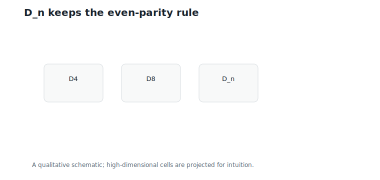
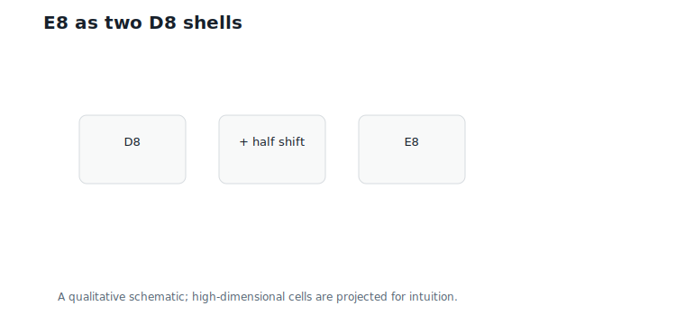
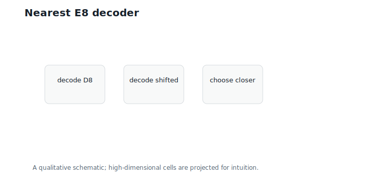
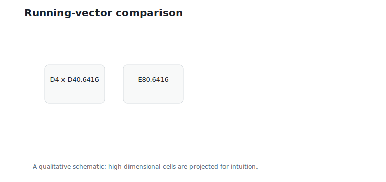
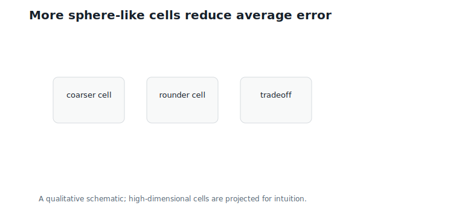

# Beyond D4: Higher-Dimensional Lattices

**Question.** Why stop at `D4`?

## Learning Objectives

By the end of this chapter, you should be able to:

- generalize the `D4` parity lattice to `D_n`;
- describe `E8` as two shifted `D8` shells;
- implement a simple nearest-`E8` decoder;
- compare $D4 \times D4$ and `E8` on the running 8-weight vector;
- explain coding gain and packing density qualitatively;
- reason about the tradeoff between geometry and decoder complexity.

## Prerequisites

This chapter assumes `D4` membership from Chapter 6, nearest-`D_n` decoding from Chapter 7, and the eight-weight running example.

## Running Example

Until now, the eight weights were two separate `D4` blocks:

$$
w = (0.73,\;-1.84,\;2.11,\;-0.45,\;1.27,\;0.08,\;-2.36,\;3.14).
$$

Interpretation:

- Verbal: the same eight values can be treated as two blocks or one larger block.
- Geometric: $D4 \times D4$ uses two independent four-dimensional cells; `E8` uses one eight-dimensional cell.
- Engineering: a larger block may reduce distortion, but the decoder and lookup tables become more complex.

## Review of D4 and Dn

The `D_n` lattice is:

$$
D_n = \{u \in \mathbb{Z}^n : u_1 + \cdots + u_n \text{ is even}\}.
$$

Interpretation:

- Verbal: `D_n` is the even-sum integer lattice in dimension $n$.
- Geometric: it keeps one parity layer of the integer grid.
- Engineering: the Chapter 7 round-and-fix decoder works for any $n$.

For $n = 4$, this is `D4`. For $n = 8$, it is `D8`.

@fig-ch14-dn-family shows the family idea.

{#fig-ch14-dn-family fig-alt="Diagram showing D4 and D8 as members of the Dn even-parity family."}

## Constructing E8

One useful construction of `E8` is:

$$
E8 = D8 \cup \left(D8 + \left(\frac12,\ldots,\frac12\right)\right).
$$

Interpretation:

- Verbal: `E8` is the union of the `D8` lattice and a half-shifted copy of `D8`.
- Geometric: the half-shift fills holes in the `D8` packing.
- Engineering: nearest-`E8` decoding can try two nearest-`D8` decodes and choose the closer candidate.

@fig-ch14-e8-union illustrates the two-shell view.

{#fig-ch14-e8-union fig-alt="Two layered grids labeled D8 shell and half-shifted shell."}

This construction is enough for an implementation overview. It is not the only way to define `E8`.

## Nearest E8 Decoder

Given a target $v$, compute two candidates:

$$
y_0 = Q_{D8}(v),
$$

Interpretation:

- Verbal: decode directly to the nearest `D8` point.
- Geometric: this checks the integer even-parity shell.
- Engineering: this is one call to the `D_n` decoder.

and:

$$
y_1 = \left(\frac12,\ldots,\frac12\right)
+ Q_{D8}\left(v - \left(\frac12,\ldots,\frac12\right)\right).
$$

Interpretation:

- Verbal: shift the target down by half, decode to `D8`, then shift back.
- Geometric: this checks the half-shifted shell.
- Engineering: this is a second call to the same decoder.

Choose the closer candidate.

@fig-ch14-e8-decoder shows the two-candidate flow.

{#fig-ch14-e8-decoder fig-alt="Flow diagram showing two D8 decodes and a distance comparison."}

## Running Comparison

The product-lattice result from two independent `D4` decodes is:

$$
(1,\;-2,\;2,\;-1,\;1,\;0,\;-2,\;3).
$$

Interpretation:

- Verbal: this is the Chapter 7 result applied to both blocks.
- Geometric: the vector lies in $D4 \times D4$.
- Engineering: it uses two small four-dimensional decoders.

Its squared error is:

$$
0.6416.
$$

Interpretation:

- Verbal: this is the total squared error across all eight coordinates.
- Geometric: it is the squared distance from $w$ to the product-lattice reconstruction.
- Engineering: it is the baseline for the `E8` comparison.

The two `E8` candidates are:

| Candidate | Point | Squared error |
|---|---|---:|
| `D8` shell | $(1, -2, 2, -1, 1, 0, -2, 3)$ | 0.6416 |
| half-shifted shell | $(0.5, -1.5, 2.5, -0.5, 1.5, 0.5, -2.5, 3.5)$ | 0.7016 |

For this particular vector, `E8` chooses the same point as $D4 \times D4$.

@fig-ch14-comparison summarizes the result.

{#fig-ch14-comparison fig-alt="Comparison table showing D4xD4 and E8 squared errors for the running vector."}

This is not a failure of `E8`. Better geometry improves average behavior, not every individual target.

## Coding Gain and Packing Density

Before the numbers, note the containment ladder hiding in this chapter. A vector whose two block sums are both even has an even total sum, so $D4 \times D4$ is a sublattice of `D8` — the eight-dimensional parity lattice is already richer than two independent four-dimensional ones, because it also admits blocks whose sums are both odd. And `E8` contains `D8` by construction, adding the half-shifted shell that fills `D8`'s deepest holes. Each step of $D4 \times D4 \subset D8 \subset E8$ adds points without changing the even-parity spirit.

Packing density asks how much space is covered by equal-radius spheres around lattice points before spheres overlap. Quantization gain asks how small the average squared error is over a cell.

Dense lattices are attractive because their cells are more sphere-like. More sphere-like cells usually reduce average quantization error.

For `E8` the numbers are remarkable, and they extend Chapter 6's fair-comparison discipline. The `E8` generator has determinant 1 — exactly one lattice point per unit volume, the *same* density as the cubic grid $\mathbb{Z}^8$. Yet its nearest points are $\sqrt{2} \approx 1.41$ apart instead of 1, with 240 nearest neighbors. A 41% separation bonus at identical density is what eight-dimensional room to maneuver buys. This is not merely the best known construction: Viazovska proved that no sphere packing in eight dimensions — lattice or not — beats `E8` [@viazovska_2017].

@fig-ch14-packing compares the idea qualitatively.

{#fig-ch14-packing fig-alt="Qualitative comparison of square-like and rounder cell shapes."}

The practical question is whether the reduction in distortion is worth the cost of a larger block and a more complex decoder.

## Practical Implications

`D4` is small and SIMD-friendly. `E8` has better geometry, but it doubles the block size and changes the lookup-table story.

| Lattice | Block size | Decoder idea | Practical tradeoff |
|---|---:|---|---|
| `D4` | 4 | round-and-fix | small, simple, easy LUTs |
| `D_n` | $n$ | round-and-fix | scalable parity family |
| `E8` | 8 | two `D8` decodes | better geometry, larger blocks |
| Leech | 24 | specialized | excellent geometry, much more complex |

The Leech lattice is important historically and geometrically, but it is not a natural first implementation target for neural-network inference.

## Worked Example

Run the `E8` decoder on the running vector.

First shell:

$$
Q_{D8}(w) = (1,\;-2,\;2,\;-1,\;1,\;0,\;-2,\;3).
$$

Interpretation:

- Verbal: direct `D8` decoding gives an integer even-sum vector.
- Geometric: this lies on the unshifted shell.
- Engineering: this candidate costs one `D_n` decode.

Second shell:

$$
\left(\frac12,\ldots,\frac12\right)
+ Q_{D8}\left(w-\left(\frac12,\ldots,\frac12\right)\right)
=
(0.5,\;-1.5,\;2.5,\;-0.5,\;1.5,\;0.5,\;-2.5,\;3.5).
$$

Interpretation:

- Verbal: the half-shifted shell gives a different candidate.
- Geometric: every coordinate is half-integer.
- Engineering: this candidate costs another `D_n` decode and a distance comparison.

The first candidate is closer, so nearest `E8` returns the same reconstruction as `D4 x D4` for this vector.

## Algorithms

### Algorithm 14.1: Nearest E8 Overview

**Input:** an eight-dimensional target vector $v$.

**Output:** nearest point in `E8`.

```text
function nearest_E8(v):
    h = (1/2, ..., 1/2)
    y0 = nearest_Dn(v)
    y1 = h + nearest_Dn(v - h)
    if distance(v, y0) <= distance(v, y1):
        return y0
    return y1
```

**Complexity and implementation notes:**

| Property | Cost |
|---|---|
| Time | Two $O(n)$ `D_n` decodes plus distance comparison |
| Memory | $O(n)$ for candidates |
| Offline preprocessing | None |
| Online inference cost | Higher than `D4`, still structured |
| Parallelism | Two candidates and coordinate operations are parallelizable |
| GPU suitability | Good for batched blocks, but block size doubles |
| SIMD suitability | Good for 8-wide vectors |
| Possible optimization | Fuse candidate generation and distance computation |

The executable reference implementation is in `code/python/chapter_14_higher_lattices.py`.

## Engineering Insight

Better lattices can reduce distortion, but they also change the systems problem. `E8` can be decoded efficiently, but an `E8` Hierarchical Nested Lattice Quantization (HNLQ) table is an eight-dimensional object. Larger blocks may improve geometry while making lookup tables, cache placement, and calibration harder.

The right question is not "Which lattice is mathematically best?" The right question is "Which lattice gives the best accuracy-speed-memory tradeoff for a target inference system?"

## Historical Note and Further Reading

The `E8` and Leech lattices are central examples in the geometry of numbers and sphere packing. Conway and Sloane remain the standard reference for their structure and coding connections [@conway_sloane_1999]. This chapter uses only the minimal `E8` construction needed to connect better geometry to quantization tradeoffs.

## Exercises

### Conceptual Exercises

1. Why does `E8` contain a half-shifted copy of `D8`?
2. Why can a better lattice fail to improve one specific vector?
3. What changes in LUT design when block size grows from 4 to 8?

### Worked Numerical Exercises

1. Verify the squared error 0.7016 for the half-shifted candidate.
2. Decode $(0.2, 0.2, \ldots, 0.2)$ with the two-candidate `E8` rule.
3. Compare `D8` and half-shifted candidates for a vector near $(0.5, \ldots, 0.5)$.

### Programming Exercises

1. Run `python code/python/chapter_14_higher_lattices.py`.
2. Generate random vectors and count how often the half-shifted shell wins.
3. Time $D4 \times D4$ decoding versus `E8` decoding for many blocks.

### Research Questions

1. When is the distortion gain of `E8` worth the larger table structure?
2. How should `E8` quotient representatives be indexed?
3. Are there hardware layouts that make 8-dimensional blocks natural?

## Common Mistakes

- Assuming denser always means faster.
- Comparing `D4` and `E8` without fixing dimension and bit rate.
- Treating the Leech lattice as a practical default because it is geometrically famous.
- Forgetting that average gain does not guarantee every vector improves.

## Summary

`D4` belongs to the `D_n` family, and `E8` can be built from `D8` plus a half-shifted copy. A simple nearest-`E8` decoder checks both shells and chooses the closer candidate.

For the running vector, `E8` chooses the same point as $D4 \times D4$, with squared error 0.6416. The lesson is the tradeoff: better lattice geometry can help average quantization, but larger blocks and more complex tables affect implementation.

## Preview of Next Chapter

Next we look at Barnes-Wall lattices, where recursive structure offers another way to represent lattices beyond generator matrices.
