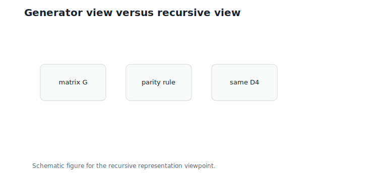
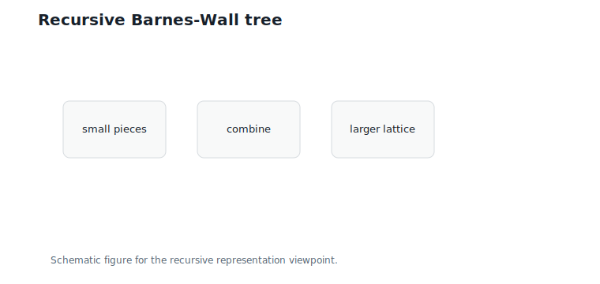
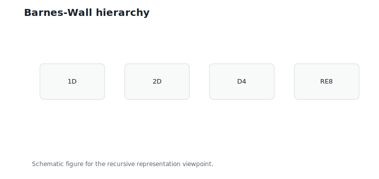
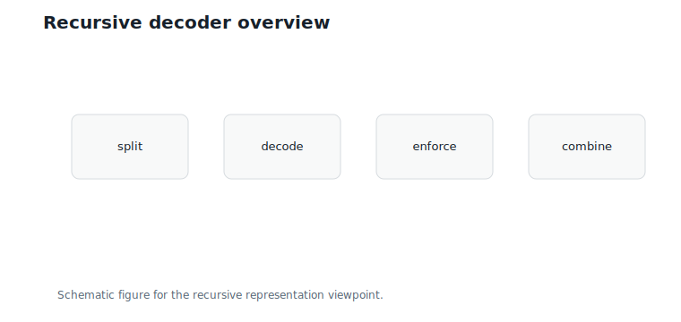

# Barnes-Wall Lattices

**Question.** Can lattices be described without generator matrices?

## Learning Objectives

By the end of this chapter, you should be able to:

- explain why generator matrices are not the only lattice representation;
- describe `D4` using parity constraints;
- interpret a recursive lattice hierarchy;
- define the rotation-and-scaling operator $R$ used in this chapter;
- explain why Barnes-Wall lattices connect geometry to binary structure;
- distinguish a full Barnes-Wall decoder from the overview given here.

## Prerequisites

This chapter assumes `D4` from Chapter 6, `E8` motivation from Chapter 14, and parity constraints from earlier chapters.

## Running Example

The `D4` lattice has two descriptions we already know:

$$
D4 = \{u \in \mathbb{Z}^4 : u_1 + u_2 + u_3 + u_4 \text{ is even}\}.
$$

Membership can be tested by one parity check, without touching a generator matrix. It also has a generator-matrix description from Chapter 6. Both descriptions name the same set.

## Motivation

Generator matrices are useful, but they hide structure. A matrix says how to generate points. It does not always explain why parity, recursion, or binary codes appear.

Barnes-Wall lattices are important because they emphasize recursive structure. Instead of starting with one large generator matrix, they build higher-dimensional lattices from smaller pieces.

@fig-ch15-generator-vs-recursion shows the contrast.

{#fig-ch15-generator-vs-recursion fig-alt="Two panels comparing matrix generation with recursive parity constraints."}

## D4 Revisited

For implementation, the parity description is simplest:

$$
u \in D4 \quad\text{if and only if}\quad u \in \mathbb{Z}^4 \text{ and } \sum_i u_i \text{ is even}.
$$

In optimized code this is a branch-free integer test. The same point can also be generated as $Gz$: the generator view is constructive, the parity view is diagnostic.

## The R Operator

This chapter uses a simple rotation-and-scaling operator on a pair:

$$
R(a,b) = (a+b,\;a-b).
$$

Interpretation:

- Verbal: combine two coordinates by sum and difference.
- Geometric: this is a 45-degree rotation with scaling by $\sqrt{2}$: squared lengths exactly double, because $(a+b)^2 + (a-b)^2 = 2(a^2 + b^2)$.
- Engineering: it turns pairwise structure into a form suitable for recursion.

Applied pairwise to an eight-vector:

$$
R(x_1,x_2,\ldots,x_8)
=
(x_1+x_2,\;x_1-x_2,\;\ldots,\;x_7+x_8,\;x_7-x_8).
$$

The transform is local — each pair is processed independently — so it parallelizes perfectly.

Here is the operator's first magic trick, small enough to verify by hand. Apply $R$ to *every* pair of integers:

$$
R(\mathbb{Z}^2) = \{(a+b,\;a-b) : a, b \in \mathbb{Z}\}
= \{(x, y) \in \mathbb{Z}^2 : x + y \text{ is even}\}.
$$

Interpretation:

- Verbal: rotating the plain integer grid produces exactly the two-dimensional checkerboard lattice.
- Geometric: the sum of the two outputs is $(a+b) + (a-b) = 2a$, always even; and any even-sum pair $(x, y)$ is reached by $a = (x+y)/2$, $b = (x-y)/2$.
- Engineering: a parity *constraint* on one side is a plain *grid* on the other side of a rotation. This is the seed of the whole chapter: recursion and rotation generate the parity structure that Chapter 6 imposed by hand.

In Barnes-Wall notation, `RE8` means a rotated, scaled copy of `E8` under this kind of operator.

## Recursive Construction

A recursive lattice description has the form:

1. Start with a small base lattice.
2. Combine two copies.
3. Apply constraints or a rotation.
4. Repeat.

@fig-ch15-recursive-tree shows the hierarchy.

{#fig-ch15-recursive-tree fig-alt="Binary tree showing smaller lattice pieces combining into larger Barnes-Wall levels."}

The point is not that every implementation must literally recurse. The point is that recursion exposes relationships between coordinates that a flat matrix can obscure.

## The (a, a+b) Construction

The Barnes-Wall recursion has a concrete form we can verify by hand. Given a lattice $\Lambda$ in dimension $n$, build a lattice in dimension $2n$ by:

$$
\Lambda' = \{(a,\; a + b) : a \in \Lambda,\; b \in R\Lambda\},
$$

where $R\Lambda$ is the pairwise sum-difference image of $\Lambda$.

Interpretation:

- Verbal: the first half is any point of $\Lambda$; the second half is the same point nudged by a rotated-and-scaled lattice vector.
- Geometric: the two halves are correlated — knowing $a$ constrains where $a + b$ can be.
- Engineering: the construction stores no new generator matrix, only the rule "copy, then perturb by $R\Lambda$."

**First rung, verified.** Take $\Lambda = \mathbb{Z}^2$. We proved above that $R\mathbb{Z}^2$ is the even-sum checkerboard. Then:

$$
\{(a,\; a+b) : a \in \mathbb{Z}^2,\; b \in R\mathbb{Z}^2\} = D4.
$$

Both directions are one line. Forward: the coordinate sum of $(a, a+b)$ is $2\,\mathrm{sum}(a) + \mathrm{sum}(b)$, and both terms are even. Backward: given $u \in D4$, split it into halves $u = (u_{12}, u_{34})$ and set $a = u_{12}$, $b = u_{34} - u_{12}$; then $\mathrm{sum}(b) = \mathrm{sum}(u) - 2\,\mathrm{sum}(u_{12})$ is even, so $b \in R\mathbb{Z}^2$. The running lattice of this book is the first rung of the Barnes-Wall ladder.

**Second rung, sanity-checked.** Apply the same rule to $\Lambda = D4$: the result $\{(a, a+b) : a \in D4, b \in RD4\}$ is a scaled copy of `E8` [@conway_sloane_1999]. Two checks make this believable without the full proof. Determinant: the construction gives $\det = \det(D4) \cdot \det(RD4) = 2 \cdot 8 = 16$, which equals $\det(\sqrt{2}\,E8) = (\sqrt{2})^8$. Minimum distance: pairs $(a, a)$ with $a$ a minimal `D4` vector have norm $\sqrt{2 \cdot 2} = 2$, pairs $(0, b)$ with $b$ minimal in $RD4$ have norm $\sqrt{2} \cdot \sqrt{2} = 2$, and $\sqrt{2}\,E8$ has minimum distance exactly $2$. One rule, applied twice, walks from the integer grid through `D4` to `E8` — and it keeps walking to dimensions 16, 32, and beyond, which is the Barnes-Wall family.

## D4, E8, and Barnes-Wall

The first Barnes-Wall levels align with familiar objects:

| Dimension | Object in this chapter |
|---:|---|
| 1 | integer line |
| 2 | pairwise sum-difference structure |
| 4 | `D4`-like parity structure |
| 8 | `E8`/`RE8`-like structure |

This table is intentionally informal. A full Barnes-Wall construction requires more coding-theoretic machinery, introduced in Chapter 16.

@fig-ch15-hierarchy summarizes the levels.

{#fig-ch15-hierarchy fig-alt="Stacked hierarchy from dimension 1 through D4 and E8-like levels."}

## Recursive Decoding Overview

A recursive decoder follows the construction backward:

1. Split the received vector into halves or pairs.
2. Decode smaller pieces.
3. Enforce code constraints.
4. Combine the decoded pieces.

@fig-ch15-decoder sketches the flow.

{#fig-ch15-decoder fig-alt="Flow diagram for recursive decoding from split to combine."}

This chapter does not derive a production Barnes-Wall decoder. It prepares the representation needed for the binary-code chapters.

## Worked Example

Check whether:

$$
u = (1,\;0,\;-2,\;3)
$$

belongs to `D4`.

The sum is:

$$
1 + 0 + (-2) + 3 = 2.
$$

The sum is even, so the parity constraint accepts the vector. Now apply $R$ to pairs:

$$
R(u) = (1,\;1,\;1,\;-5).
$$

Each pair becomes a sum and a difference — the local form that recursive algorithms operate on.

## Algorithms

### Algorithm 15.1: D4 Membership by Parity

**Input:** four-dimensional vector $u$.

**Output:** whether $u$ belongs to `D4`.

```text
function is_D4_by_parity(u):
    return all coordinates are integers and sum(u) is even
```

**Complexity and implementation notes:**

| Property | Cost |
|---|---|
| Time | $O(d)$ |
| Memory | $O(1)$ |
| Offline preprocessing | None |
| Online inference cost | One integer sum and parity test |
| Parallelism | Coordinate checks reduce to one sum |
| GPU suitability | Excellent |
| SIMD suitability | Excellent |
| Possible optimization | Fuse parity test with unpacking |

### Algorithm 15.2: Pairwise R Transform

**Input:** even-length vector.

**Output:** pairwise sum-difference transform.

```text
function pairwise_R(x):
    output = []
    for pairs (a, b):
        output.append(a + b)
        output.append(a - b)
    return output
```

**Complexity and implementation notes:**

| Property | Cost |
|---|---|
| Time | $O(d)$ |
| Memory | $O(d)$ output |
| Offline preprocessing | None |
| Online inference cost | Pairwise additions and subtractions |
| Parallelism | Pairs are independent |
| GPU suitability | Good |
| SIMD suitability | Excellent |
| Possible optimization | Use vector shuffle-add-sub instructions |

The executable reference implementation is in `code/python/chapter_15_barnes_wall.py`.

## Engineering Insight

Recursive structure can simplify storage and reasoning. Instead of storing one large matrix, an implementation can store small rules: parity checks, pairwise transforms, and code constraints.

The tradeoff is control flow. Recursion may be elegant mathematically but awkward on hardware unless it is flattened into regular kernels.

## Historical Note and Further Reading

Barnes-Wall lattices are classical structured lattices with deep connections to binary codes and recursive decoding. This chapter is only an implementation-oriented doorway; Chapter 16 explains the binary codes that make the recursion work.

## Exercises

### Conceptual Exercises

1. Why can parity be a better membership test than solving for generator coefficients?
2. What does the pairwise $R$ transform reveal?
3. Why might recursive structure help storage?
4. Show that every vector in $R(\mathbb{Z}^2)$ has even coordinate sum, and that every even-sum integer pair is in $R(\mathbb{Z}^2)$.

### Worked Numerical Exercises

1. Test whether $(2, -2, 2, 0)$ is in `D4`.
2. Verify that $(1, 0, -2, 3)$ arises from the $(a, a+b)$ construction: find $a \in \mathbb{Z}^2$ and $b \in R\mathbb{Z}^2$ with $(a, a+b) = (1, 0, -2, 3)$.
3. Apply $R$ to $(1, 0, -2, 3)$.
4. Apply $R$ twice to an eight-vector.

### Programming Exercises

1. Run `python code/python/chapter_15_barnes_wall.py`.
2. Implement an inverse pairwise $R$ transform.
3. Compare parity membership with generator reconstruction for several `D4` points.

### Research Questions

1. When should recursive decoding be flattened for hardware?
2. How do Barnes-Wall lattices relate to Reed-Muller codes?
3. Can recursive structure reduce codebook metadata?

## Common Mistakes

- Thinking a generator matrix is the lattice itself.
- Treating recursive descriptions as purely abstract.
- Forgetting that `RE8` means a rotated, scaled copy of `E8`.
- Assuming this overview is a full Barnes-Wall decoder.

## Summary

Barnes-Wall lattices show that lattices can be represented recursively, not only by generator matrices. The $(a, a+b)$ rule makes the recursion concrete: applied to $\mathbb{Z}^2$ it produces exactly `D4`, and applied to `D4` it produces a scaled `E8`. `D4` already hints at this: parity constraints describe the same set as a generator matrix. The pairwise $R$ operator introduces the sum-difference structure used to discuss `RE8` and higher Barnes-Wall levels — and its action on the plain integer grid already manufactures the checkerboard parity lattice, showing that rotation can create the constraints Chapter 6 imposed directly.

## Preview of Next Chapter

Next we explain why binary error-correcting codes, especially Reed-Muller codes, appear naturally inside these recursive lattice constructions.
