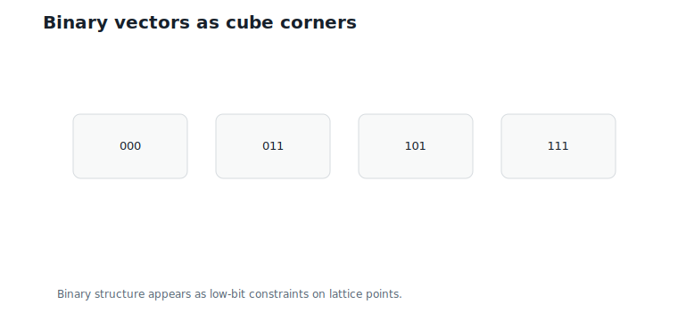
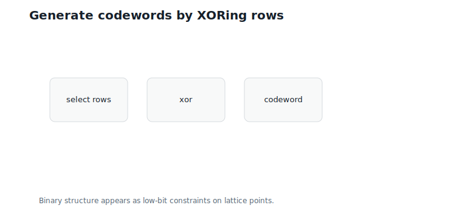
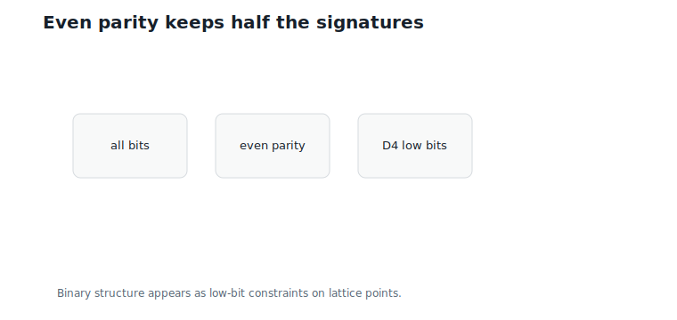
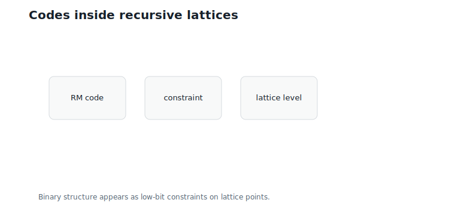

# Reed-Muller Codes

**Question.** Why do binary error-correcting codes appear inside lattices?

## Learning Objectives

By the end of this chapter, you should be able to:

- work with binary vectors over 0 and 1;
- generate a binary linear code from a generator matrix;
- identify the even-parity length-four code;
- recognize `RM(1,2)` as the binary code behind `D4` modulo $2\mathbb{Z}^4$;
- explain $D4 = 2\mathbb{Z}^4 + C$ for the parity code $C$;
- connect Reed-Muller structure to Barnes-Wall recursion.

## Prerequisites

This chapter assumes parity from Chapter 6 and recursive structure from Chapter 15.

## Running Example

Chapter 6 showed that every `D4` point has an even parity signature modulo 2. For example:

$$
(1,\;0,\;-2,\;3) \bmod 2 = (1,\;0,\;0,\;1).
$$

Interpretation:

- Verbal: reduce each coordinate to its parity bit.
- Geometric: the integer lattice collapses to a four-dimensional binary cube.
- Engineering: the low bits of `D4` points are constrained.

The question is what set of binary signatures is allowed.

## Binary Vectors

A binary vector is a vector whose entries are 0 or 1. Addition is modulo 2:

$$
1 + 1 = 0 \pmod 2.
$$

Adding a bit to itself cancels — XOR implements binary addition, and binary vectors live on the corners of a cube.

@fig-ch16-binary-cube shows the length-three version for intuition.

{#fig-ch16-binary-cube fig-alt="Cube corners labeled by binary vectors."}

## Linear Codes

A binary linear code is the set of all binary sums of generator rows.

For a binary generator matrix $G$, the code is:

$$
C = \{aG : a \in \{0,1\}^k\}.
$$

Interpretation:

- Verbal: choose which generator rows to XOR together.
- Geometric: the code is a structured subset of the binary cube.
- Engineering: all codewords can be generated by bit operations.

@fig-ch16-generator shows this process.

{#fig-ch16-generator fig-alt="Binary generator rows selected and XORed into a codeword."}

## Even Parity

The length-four even-parity code is:

$$
C = \{c \in \{0,1\}^4 : c_1+c_2+c_3+c_4 = 0 \pmod 2\}.
$$

One parity check selects the half of the cube's vertices with an even number of ones.

There are eight codewords:

| Codeword |
|---|
| `0000` |
| `0011` |
| `0101` |
| `0110` |
| `1001` |
| `1010` |
| `1100` |
| `1111` |

These are exactly the eight even parity signatures tabulated in Chapter 6's coset table — the same eight patterns, now recognized as a *code*.

@fig-ch16-parity-code shows the split.

{#fig-ch16-parity-code fig-alt="Binary signatures split into even and odd parity groups."}

## Reed-Muller RM(1,2)

The first-order Reed-Muller code `RM(1,2)` has generator rows:

$$
\begin{bmatrix}
1&1&1&1\\
0&0&1&1\\
0&1&0&1
\end{bmatrix}.
$$

Interpretation:

- Verbal: combine the constant row and two coordinate rows.
- Geometric: each codeword is an affine function of two binary variables, evaluated at the four possible inputs.
- Engineering: the generated code has 8 codewords of length 4.

The code generated by this matrix is exactly the even-parity code above, and the argument fits in two sentences. Every generator row has an even number of ones (four, two, and two), and XOR cannot change parity, so all generated codewords have even parity. The three rows are linearly independent, so they generate $2^3 = 8$ distinct codewords — and eight even-parity words out of eight means the two codes coincide.

## D4 Revisited

The parity-code view of `D4` is:

$$
D4 = 2\mathbb{Z}^4 + C.
$$

Interpretation:

- Verbal: a `D4` point is an even integer vector plus one allowed binary codeword.
- Geometric: the low-bit pattern chooses a coset of $2\mathbb{Z}^4$.
- Engineering: lattice membership can be checked by a binary code constraint.

For the running vector:

$$
(1,\;0,\;-2,\;3) = (0,\;0,\;-2,\;2) + (1,\;0,\;0,\;1).
$$

Interpretation:

- Verbal: the first term is even in every coordinate; the second term is an even-parity codeword.
- Geometric: the binary codeword selects the parity coset.
- Engineering: this is the bridge from lattice coordinates to bit-plane constraints.

## E8 and the Extended Hamming Code

The pattern $D4 = 2\mathbb{Z}^4 + \text{code}$ is not a coincidence of dimension four. It is *Construction A*: take a binary linear code $C$ of length $n$, and form the lattice of all integer vectors whose low bits are codewords,

$$
L_C = 2\mathbb{Z}^n + C.
$$

Apply it one dimension doubling up. The first-order Reed-Muller code `RM(1,3)` has length $8$, dimension $4$, and minimum weight $4$ — it is the extended Hamming code, with 16 codewords. Construction A gives:

$$
2\mathbb{Z}^8 + RM(1,3),
$$

and this lattice is a scaled copy of `E8` — specifically $\sqrt{2}\,E8$ [@conway_sloane_1999].

Interpretation:

- Verbal: the same recipe that builds `D4` from the parity code builds `E8` from the extended Hamming code.
- Geometric: a stronger code (minimum weight 4 instead of 2) forbids more low-bit patterns, packing the lattice better.
- Engineering: `E8` membership, like `D4` membership, reduces to a binary code check on the low bits.

Two sanity checks, in the spirit of Chapter 15. Determinant: $2^8 / 16 = 16 = (\sqrt{2})^8$, matching $\sqrt{2}\,E8$. Minimum distance: a nonzero codeword has weight at least 4, giving norm at least $\sqrt{4} = 2$; a nonzero vector of $2\mathbb{Z}^8$ has norm at least $2$; and $\sqrt{2}\,E8$ has minimum distance exactly $2$.

The ladder is now complete in both languages:

| Dimension | Lattice | Code under Construction A |
|---:|---|---|
| 4 | `D4` | `RM(1,2)`, the even-parity code |
| 8 | $\sqrt{2}\,E8$ | `RM(1,3)`, the extended Hamming code |

Chapter 14 built `E8` from `D8` shells; this table builds it from bits. Same object, two constructions — geometry and coding theory agreeing about what is special in eight dimensions.

## Barnes-Wall Connection

Barnes-Wall lattices use recursive binary codes. Reed-Muller codes provide the binary constraints at each level.

@fig-ch16-code-tree shows the connection.

{#fig-ch16-code-tree fig-alt="Tree linking binary code constraints to recursive lattice levels."}

The important shift is that lattice structure now has two faces:

- Geometry: points, distances, Voronoi cells.
- Algebra: bits, parity checks, code constraints.

## Worked Example

Generate `RM(1,2)` by XORing rows.

Choose coefficient vector:

$$
a = (1,\;0,\;1).
$$

This selects the constant row and the third generator row.

The result is:

$$
1111 \oplus 0101 = 1010.
$$

The generated codeword `1010` has even parity — a valid `D4` low-bit signature.

## Algorithms

### Algorithm 16.1: Generate a Binary Linear Code

**Input:** binary generator matrix.

**Output:** all codewords.

```text
function generate_binary_code(G):
    codewords = empty set
    for every binary coefficient vector a:
        codewords.add(aG mod 2)
    return sorted codewords
```

**Complexity and implementation notes:**

| Property | Cost |
|---|---|
| Time | $O(2^k k n)$ |
| Memory | $O(2^k n)$ |
| Offline preprocessing | Generate once for small codes |
| Online inference cost | Membership can use parity checks instead |
| Parallelism | Codeword generation is independent |
| GPU suitability | Usually unnecessary for tiny codes |
| SIMD suitability | Excellent with bit packing |
| Possible optimization | Store packed integers instead of tuples |

### Algorithm 16.2: D4 Membership by Code

**Input:** integer vector $u$.

**Output:** whether its low bits belong to the even-parity code.

```text
function is_D4_by_code(u):
    bits = u mod 2
    return bits in RM(1,2)
```

**Complexity and implementation notes:**

| Property | Cost |
|---|---|
| Time | $O(d)$ |
| Memory | $O(1)$ for parity check |
| Offline preprocessing | Store or derive the code |
| Online inference cost | One low-bit extraction and parity check |
| Parallelism | Coordinate operations are independent |
| GPU suitability | Excellent |
| SIMD suitability | Excellent |
| Possible optimization | Use popcount parity |

The executable reference implementation is in `code/python/chapter_16_reed_muller.py`.

## Engineering Insight

Binary codes explain why low bits are not arbitrary. A `D4` lattice point can be stored as even parts plus a constrained binary signature. This observation prepares bit-plane representations: the least significant bit plane of a lattice point is a codeword.

## Historical Note and Further Reading

Reed-Muller codes are classical error-correcting codes with recursive structure. Their appearance in Barnes-Wall lattices is not accidental: Construction D and related code-lattice constructions build lattices from nested binary codes.

## Exercises

### Conceptual Exercises

1. Why is the even-parity code linear?
2. Why does `D4` modulo $2\mathbb{Z}^4$ produce binary codewords?
3. How does XOR relate to modulo-2 addition?

### Worked Numerical Exercises

1. List all length-four even-parity codewords.
2. Generate the codeword for coefficient vector $(1,1,0)$.
3. Write down the four generator rows of `RM(1,3)` and check that every row has weight 4 or 8.
4. Decompose $(1,0,-2,3)$ into an even vector plus a binary codeword.

### Programming Exercises

1. Run `python code/python/chapter_16_reed_muller.py`.
2. Add a parity-check matrix for the even-parity code.
3. Pack codewords as integers and regenerate the table.

### Research Questions

1. How do nested Reed-Muller codes build Barnes-Wall lattices?
2. Can code constraints improve compressed weight storage?
3. How should bit-packed lattice codewords be laid out for inference?

## Common Mistakes

- Confusing a real generator matrix with a binary generator matrix.
- Using ordinary addition instead of XOR for binary codewords.
- Thinking parity constraints are arbitrary rather than structural.
- Forgetting that $D4 = 2\mathbb{Z}^4 + C$ uses low-bit codewords.

## Summary

The low bits of `D4` points form a binary linear code: the length-four even-parity code, equivalently `RM(1,2)`. This gives the code-lattice view $D4 = 2\mathbb{Z}^4 + C$, and the same Construction A with `RM(1,3)` — the extended Hamming code — produces a scaled `E8`. Both of the book's lattices are binary codes wearing integer clothing, which prepares the bit-plane representation of Chapter 17.

## Preview of Next Chapter

Next we look directly at lattice points in binary and see how their bit planes inherit these code constraints.
