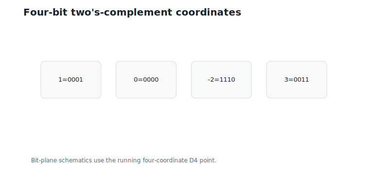
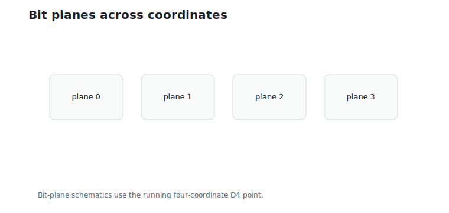
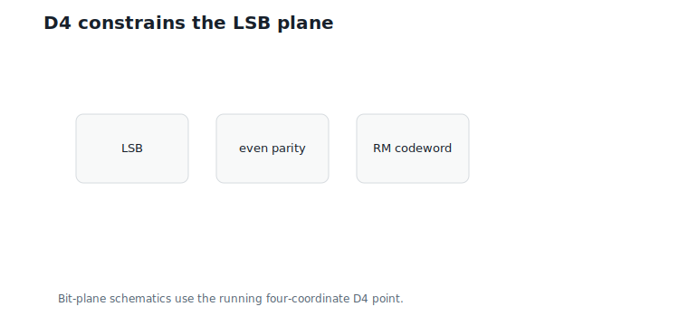
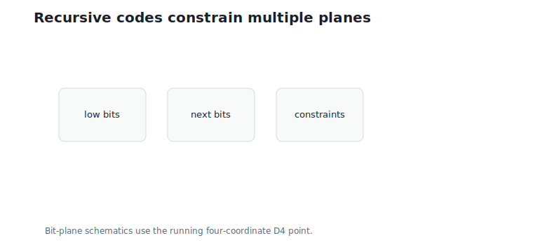
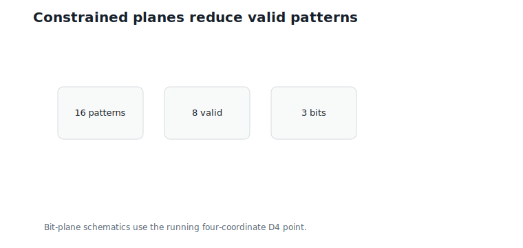

# Bit-Plane Representations

**Question.** What does a lattice point look like in binary?

## Learning Objectives

By the end of this chapter, you should be able to:

- represent signed lattice coordinates with fixed-width two's-complement bits;
- extract bit planes from an integer vector;
- reconstruct signed integers from bit planes;
- identify the `D4` least-significant-bit constraint;
- connect bit planes to Reed-Muller codewords;
- explain compression implications of constrained low bits.

## Prerequisites

This chapter assumes `D4` parity from Chapter 6 and Reed-Muller codewords from Chapter 16.

## Running Example

Use the `D4` point:

$$
u = (1,\;0,\;-2,\;3).
$$

This is the running valid `D4` vector from earlier chapters — an integer point that can be stored as bits.

With four-bit two's-complement encoding:

| Value | Bits |
|---:|---|
| `1` | `0001` |
| `0` | `0000` |
| `-2` | `1110` |
| `3` | `0011` |

## Binary Integers

Two's-complement stores signed integers by wrapping negative values modulo $2^B$, where $B$ is the bit width.

For $B = 4$:

$$
-2 \equiv 14 \pmod {16}.
$$

The stored unsigned pattern for $-2$ is 14, binary `1110`: signed integers wrap around a finite ring, and fixed-width storage is reversible only inside its representable range.

@fig-ch17-binary-expansion shows the four-bit view.

{#fig-ch17-binary-expansion fig-alt="Several signed integers shown with four-bit two's-complement representations."}

## Bit Planes

A bit plane collects one bit position across all coordinates.

For $u = (1,0,-2,3)$, the planes from least significant to most significant are:

| Plane | Bits |
|---:|---|
| 0 | $(1, 0, 0, 1)$ |
| 1 | $(0, 0, 1, 1)$ |
| 2 | $(0, 0, 1, 0)$ |
| 3 | $(0, 0, 1, 0)$ |

@fig-ch17-bit-planes shows the layout.

{#fig-ch17-bit-planes fig-alt="Four coordinates shown as columns and four bit planes shown as rows."}

## D4 Low-Bit Constraint

The least-significant bit plane is:

$$
(1,\;0,\;0,\;1).
$$

Interpretation:

- Verbal: these are the coordinate parities of the `D4` point.
- Geometric: this is the binary signature modulo $2\mathbb{Z}^4$.
- Engineering: the LSB plane must be an even-parity Reed-Muller codeword.

The sum is:

$$
1 + 0 + 0 + 1 = 2.
$$

Interpretation:

- Verbal: the LSB plane has even parity.
- Geometric: it is one of the allowed binary cosets.
- Engineering: this plane is constrained and therefore compressible.

One detail makes this robust: bit 0 of a two's-complement pattern equals the value modulo 2 at *any* bit width, because the wrap offset $2^B$ is even. So the LSB-plane constraint does not depend on how many bits store each coordinate — parity survives the representation.

@fig-ch17-lsb shows the constraint.

{#fig-ch17-lsb fig-alt="LSB plane highlighted as an even-parity codeword."}

## Higher Bit Planes

Higher planes are not arbitrary, but the simple `D4` membership rule constrains the low plane most directly. Recursive lattices such as Barnes-Wall impose additional code constraints across multiple planes.

Chapter 16's Construction A makes the eight-dimensional case concrete. For the lattice $2\mathbb{Z}^8 + RM(1,3)$ — a scaled `E8` — the LSB plane of every point must be one of the 16 codewords of the extended Hamming code, out of $2^8 = 256$ possible eight-bit patterns. Identifying the plane costs $\log_2 16 = 4$ bits instead of 8. Where `D4` saved one bit per plane, `E8` saves four: stronger codes constrain low bits harder, and the constraint is exactly the packing quality.

@fig-ch17-recursive shows the idea.

{#fig-ch17-recursive fig-alt="Stacked bit planes with code constraints drawn across levels."}

This is why bit-plane representations are more than a storage trick: they reveal algebraic structure hidden inside integer coordinates.

## Coefficient Bit Planes Are Hierarchical Nested Lattice Quantization (HNLQ) Digits

One more identification closes a loop opened in Chapter 10. There, the HNLQ encoder wrote the *generator coefficients* $z$ of a lattice point in $M$-digit two's complement, and each digit plane became an index $b_m$. That is precisely this chapter's construction — bit planes with the signed top plane — applied in coefficient space instead of coordinate space:

$$
\text{HNLQ digits} = \text{bit planes of } z,
\qquad
\text{coordinate planes} = \text{bit planes of } u = Gz.
$$

These two sets of planes should not be confused. HNLQ digit planes live in generator-coefficient space; the Reed-Muller constraints discussed above live in coordinate space. The linear map $G$ carries coefficient digit planes to digit representatives $\tilde{c}_b = G\,\mathrm{bits}(b)$ before the weighted sum is formed. After those weighted representatives are added, carries can change the ordinary coordinate bit planes of $u = Gz$.

So the hierarchy of Chapter 10, the quotients of Chapter 9, and the bit planes of this chapter are one structure seen from related but not identical angles: each HNLQ digit is a coset index, each coset index is a coefficient bit plane, and the coordinate bit planes carry the Reed-Muller constraints of Chapter 16. Keeping the two coordinate systems separate is what makes the unification useful rather than misleading.

## Compression Implications

If bit planes were arbitrary, each plane would need to store all four bits independently. But the LSB plane of `D4` has only 8 valid patterns, not 16.

That means:

$$
\log_2 8 = 3
$$

bits identify the LSB plane, instead of 4 bits.

Interpretation:

- Verbal: the parity constraint saves one bit for the low plane of a four-coordinate block.
- Geometric: half the binary signatures are invalid.
- Engineering: code constraints can reduce metadata or enable validation. This is the same bit Chapter 6 promised: `D4` keeps half the integer points, so its blocks carry one less bit of low-plane information.

@fig-ch17-compression shows this count.

{#fig-ch17-compression fig-alt="Sixteen possible low-bit patterns reduced to eight even-parity patterns."}

## Worked Example

Reconstruct `u` from its four planes.

The column bit patterns are:

| Coordinate | Bits | Value |
|---:|---|---:|
| 1 | `0001` | `1` |
| 2 | `0000` | `0` |
| 3 | `1110` | `-2` |
| 4 | `0011` | `3` |

Reading the bits vertically recovers each signed coordinate exactly.

## Algorithms

### Algorithm 17.1: Extract Bit Planes

**Input:** signed integer vector and bit width.

**Output:** bit planes from least significant to most significant.

```text
function bit_planes(u, width):
    for bit from 0 to width - 1:
        plane[bit] = ((u >> bit) & 1) for each coordinate
    return planes
```

**Complexity and implementation notes:**

| Property | Cost |
|---|---|
| Time | $O(B \cdot d)$ for bit width $B$ |
| Memory | $O(B \cdot d)$ |
| Offline preprocessing | None |
| Online inference cost | Bit extraction |
| Parallelism | Coordinates and planes are independent |
| GPU suitability | Good with packed bit operations |
| SIMD suitability | Excellent |
| Possible optimization | Store planes already packed |

### Algorithm 17.2: Check D4 LSB Constraint

**Input:** bit planes of a four-coordinate vector.

**Output:** whether the LSB plane is an even-parity codeword.

```text
function d4_lsb_valid(planes):
    return sum(planes[0]) is even
```

**Complexity and implementation notes:**

| Property | Cost |
|---|---|
| Time | $O(d)$ |
| Memory | $O(1)$ |
| Offline preprocessing | None |
| Online inference cost | One parity reduction over the LSB plane |
| Parallelism | Blocks are independent |
| GPU suitability | Excellent |
| SIMD suitability | Excellent; a popcount on the packed plane suffices |
| Possible optimization | Validate many packed planes per instruction |

The executable reference implementation is in `code/python/chapter_17_bit_planes.py`.

## Engineering Insight

Bit planes expose constraints that ordinary integer arrays hide. For `D4`, the LSB plane is a Reed-Muller codeword. For richer lattices, multiple planes can carry nested code constraints.

This matters for compression and validation. A bitstream can store constrained planes more compactly, and a decoder can reject impossible patterns early.

## Historical Note and Further Reading

Bit-plane representations are common in compression and hardware design. The lattice-specific point is that planes are not independent: code-lattice constructions impose algebraic constraints across them.

## Exercises

### Conceptual Exercises

1. Why does the LSB plane of a `D4` point have even parity?
2. Why is sign handling necessary for bit-plane reconstruction?
3. How can constraints reduce storage?

### Worked Numerical Exercises

1. Extract four-bit planes for $(1,0,-2,3)$.
2. Extract the LSB plane of $(2,-2,2,0)$.
3. Count valid even-parity low-bit patterns in length 4.

### Programming Exercises

1. Run `python code/python/chapter_17_bit_planes.py`.
2. Add support for eight-bit two's-complement values.
3. Pack each bit plane into one integer.

### Research Questions

1. Can bit-plane constraints accelerate HNLQ decoding?
2. Which planes of `E8` carry useful code constraints?
3. How should bit-plane data be laid out for GPU kernels?

## Common Mistakes

- Losing sign information by using unsigned binary without a convention.
- Treating bit planes as independent.
- Forgetting that Python's display of negative integers is not fixed-width.
- Checking `D4` parity on the wrong plane.

## Summary

A `D4` lattice point has a constrained least-significant bit plane. For $(1,0,-2,3)$, the LSB plane is $(1,0,0,1)$, an even-parity Reed-Muller codeword. Bit planes expose binary structure that generator-matrix notation hides.

## Preview of Next Chapter

The final chapter asks whether computation itself can use these structured binary representations directly, and clearly separates established facts from research directions.
