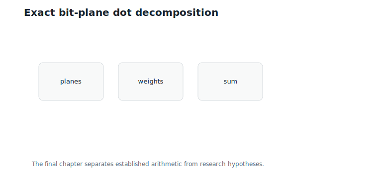
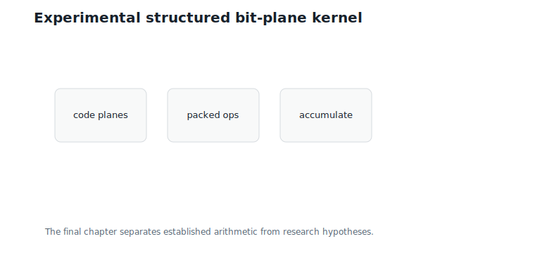
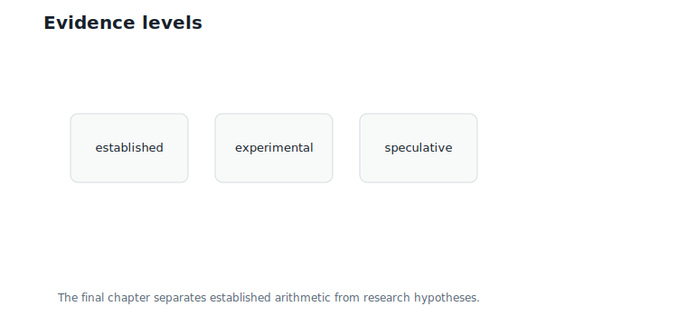
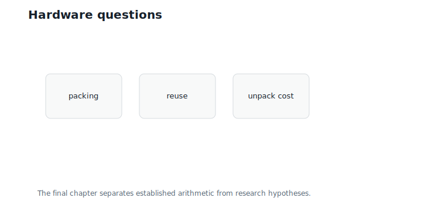
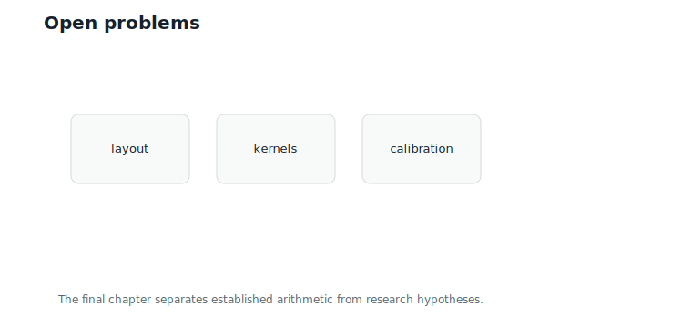

# Toward Binary-Domain Computation

**Question.** Can computation itself happen directly on structured binary representations?

## Learning Objectives

By the end of this chapter, you should be able to:

- separate representation savings from compute savings;
- compute a toy dot product from bit planes;
- distinguish established arithmetic identities from speculative hardware ideas;
- explain how Hierarchical Nested Lattice Quantization (HNLQ), lookup tables, and bit planes might interact;
- identify open problems for binary-domain GEMM.

## Prerequisites

This chapter assumes one-sided lookup tables from Chapter 11 and bit-plane representations from Chapter 17.

## Running Example

Use the `D4` point:

$$
u = (1,\;0,\;-2,\;3)
$$

and activation block:

$$
x_1 = (2,\;1,\;-1,\;3).
$$

Interpretation:

- Verbal: this is one integer lattice block and one activation block.
- Geometric: their dot product is a projection.
- Engineering: we will compute the same dot product from bit planes.

The ordinary dot product is:

$$
u^\top x_1 = 13.
$$

This is the value any binary-domain method must reproduce or approximate.

## Established: Bit-Plane Dot Decomposition

For four-bit two's-complement integers, the bit weights are:

$$
1,\;2,\;4,\;-8.
$$

The most significant bit is the sign bit; the planes combine as signed weighted layers, exactly as in standard fixed-width integer arithmetic.

The bit-plane dot product is:

$$
u^\top x
=
1\langle p_0,x\rangle
+2\langle p_1,x\rangle
+4\langle p_2,x\rangle
-8\langle p_3,x\rangle.
$$

Interpretation:

- Verbal: dot each bit plane with the activation vector, then combine with bit weights.
- Geometric: the integer vector is a weighted sum of binary planes.
- Engineering: this identity is established and exact for fixed-width two's-complement values.

For the running block, the plane contributions are:

| Plane | Bits | Plane dot | Weight | Contribution |
|---:|---|---:|---:|---:|
| 0 | $(1, 0, 0, 1)$ | 5 | 1 | 5 |
| 1 | $(0, 0, 1, 1)$ | 2 | 2 | 4 |
| 2 | $(0, 0, 1, 0)$ | -1 | 4 | -4 |
| 3 | $(0, 0, 1, 0)$ | -1 | -8 | 8 |

The sum is:

$$
5 + 4 - 4 + 8 = 13.
$$

Interpretation:

- Verbal: bit-plane accumulation matches the ordinary dot product.
- Geometric: the weighted planes reconstruct the same vector before projection.
- Engineering: this is a correct toy binary accumulation path.

@fig-ch18-bitplane-dot shows the decomposition.

{#fig-ch18-bitplane-dot fig-alt="Bit planes dotted with activations and weighted by two's-complement bit weights."}

## Established: The HNLQ Identity Is the Same Identity

Chapter 11 gave a second established identity — the HNLQ lookup dot product:

$$
x^\top \hat{w}
=
\frac{1}{\beta}
\left(
T_x(b_0) + q\,T_x(b_1) + \cdots + q^{M-2}\,T_x(b_{M-2}) - q^{M-1}\,T_x(b_{M-1})
\right).
$$

Look at the weights: $1, 2, 4, -8$. They are the *same* two's-complement weights as the bit-plane decomposition above, and that is no accident. Chapter 17 showed that HNLQ digits are bit planes of the generator coefficients $z$. The coordinate bit planes in this chapter are bit planes of the already-formed vector $u = Gz$; they need not equal $G$ applied plane-by-plane to the coefficient bits, because carries happen after the weighted sum. The shared point is the arithmetic identity: both methods expand an integer vector into signed binary layers before taking a dot product.

The HNLQ lookup identity is the coefficient-space version:

- in coordinate space, the coordinate planes are dotted with $x$ directly;
- in coefficient space, the coefficient planes are looked up through $T_x(b) = x^\top \tilde{c}_b = x^\top G\,\mathrm{bits}(b)$, which applies $G$ before accumulation.

This is the unification the book promised: quotients (each digit is a coset index), hierarchy (digits at $M$ scales), lookup inference (digits drive tables), and coefficient bit planes (digits *are* planes) — one structure, four vocabularies. All of it is established, exact arithmetic.

What is *not* yet established is turning this structure into faster kernels than the lookup-domain path of Chapters 11 and 12. The identities still consume floating-point activations; only the weight side is binary.

## Experimental: Structured Bit-Plane Kernels

A plausible next step is to combine both views:

1. Store lattice representatives as constrained bit planes.
2. Use code constraints to compress or validate planes.
3. Accumulate plane contributions without forming integer coordinates.

One established observation makes this idea concrete. Chapter 17 showed the LSB plane of a `D4` point is one of only 8 Reed-Muller codewords. So the plane dot $\langle p_0, x \rangle$ takes at most 8 distinct values for a given activation block — it can come from an 8-entry lookup table, half the size an unconstrained bit pattern would need. This is Chapter 11's one-sided-table trick applied *per bit plane*, with the code constraint shrinking the table. Whether stacking such per-plane tables beats the per-level tables of Chapter 11 is precisely the experimental question.

@fig-ch18-structured-kernel sketches the idea.

{#fig-ch18-structured-kernel fig-alt="Pipeline from constrained bit planes to plane accumulations and output."}

This is experimental. The arithmetic identity is established, but the systems advantage depends on packing, memory layout, activation reuse, and hardware support.

## Speculative: Binary-Domain GEMM

A stronger claim would be:

> HNLQ bit-plane structure enables faster GEMM directly in the binary domain.

That is speculative in this book. It might become true with the right hardware or kernel design, but it is not established by the mathematics alone.

@fig-ch18-evidence-levels marks the evidence levels.

{#fig-ch18-evidence-levels fig-alt="Three tiers labeled established, experimental, and speculative."}

Compression does not automatically imply faster computation. A compressed representation can be smaller but harder to compute with.

## Hardware Implications

Binary-domain computation would need answers to practical questions:

- Are bit planes packed in a coalesced layout?
- Can activation products be reused across many rows?
- Do popcount-like operations help when activations are not binary?
- Does unpacking cost erase the memory savings?
- Can code constraints be checked or exploited cheaply?

@fig-ch18-hardware shows the bottlenecks.

{#fig-ch18-hardware fig-alt="Diagram of memory packing, binary operations, activation interaction, and output accumulation."}

These are systems questions, not just lattice questions.

## Worked Example

The toy binary accumulation path is:

1. Extract bit planes from $(1,0,-2,3)$.
2. Dot each plane with $x_1$.
3. Weight by $1, 2, 4, -8$.
4. Sum.

@fig-ch18-open-problems lists the remaining research questions.

{#fig-ch18-open-problems fig-alt="Open problems including layout, kernels, calibration, and hardware support."}

The result is exact for this small integer vector. Extending the idea to HNLQ, real activations, matrix multiplication, and high-performance kernels is open work.

## Algorithms

### Algorithm 18.1: Bit-Plane Dot Product

**Input:** signed integer vector, activation vector, bit width.

**Output:** exact dot product.

```text
function bitplane_dot(u, x, width):
    planes = extract_bit_planes(u, width)
    weights = [1, 2, 4, ..., -2^(width-1)]
    total = 0
    for each plane and weight:
        total += weight * dot(plane, x)
    return total
```

**Complexity and implementation notes:**

| Property | Cost |
|---|---|
| Time | $O(B \cdot d)$ for bit width $B$ |
| Memory | $O(B \cdot d)$ if planes are materialized |
| Offline preprocessing | Bit packing can be done offline for weights |
| Online inference cost | Plane dot products and weighted accumulation |
| Parallelism | Planes and coordinates are parallelizable |
| GPU suitability | Depends on packing and activation reuse |
| SIMD suitability | Good with packed bit operations |
| Possible optimization | Avoid materializing planes; operate on packed words |

### Algorithm 18.2: Evidence Labeling

**Input:** proposed binary-domain technique.

**Output:** evidence label.

```text
function label_claim(claim):
    if claim is exact arithmetic identity:
        return established
    if claim has prototype measurements only:
        return experimental
    return speculative
```

The executable reference implementation is in `code/python/chapter_18_binary_domain.py`.

## Engineering Insight

The safest conclusion is precise: structured binary representations are useful, but binary-domain computation is not automatic. Bit-plane arithmetic is exact. Lookup-table HNLQ dot products are exact for a chosen reconstruction. High-performance binary-domain GEMM is a research target.

Good research starts by labeling which part is proven, which part is measured, and which part is still a hypothesis.

## Historical Note and Further Reading

Binary arithmetic, bit slicing, and lookup-table computation have long histories in efficient computing. The lattice-specific opportunity is to combine those tools with code-constrained bit planes. This book stops at the boundary between established construction and future systems research.

## Exercises

### Conceptual Exercises

1. Why does compression not automatically imply faster computation?
2. Which part of the bit-plane dot product is established?
3. What would make binary-domain GEMM experimental rather than speculative?

### Worked Numerical Exercises

1. Verify the plane contributions $5$, $4$, $-4$, and $8$.
2. Compute the bit-plane dot product for $(2,-2,2,0)$.
3. Change the bit width to 5 and explain what changes.

### Programming Exercises

1. Run `python code/python/chapter_18_binary_domain.py`.
2. Modify the code to avoid materializing bit planes.
3. Pack the LSB plane into one integer and compute its contribution.

### Research Questions

1. Can Reed-Muller constraints reduce bit-plane storage in real HNLQ weights?
2. What GPU layout minimizes unpacking overhead?
3. Can specialized hardware combine lookup accumulation and bit-plane operations?

## Common Mistakes

- Presenting speculative computation as established.
- Assuming a smaller representation always computes faster.
- Losing sign information in bit-plane arithmetic.
- Ignoring activation precision.
- Confusing lookup-domain computation with fully binary-domain computation.

## Summary

Bit-plane dot products are exact arithmetic identities. HNLQ lookup dot products are also exact for a chosen reconstruction. Combining lattice bit-plane structure with high-performance binary-domain GEMM is a promising but open research direction.

This completes the planned manuscript arc: geometry, finite codebooks, hierarchy, lookup inference, recursive lattices, binary codes, bit planes, and future computation.

## Preview

This is the final chapter of the planned manuscript.
